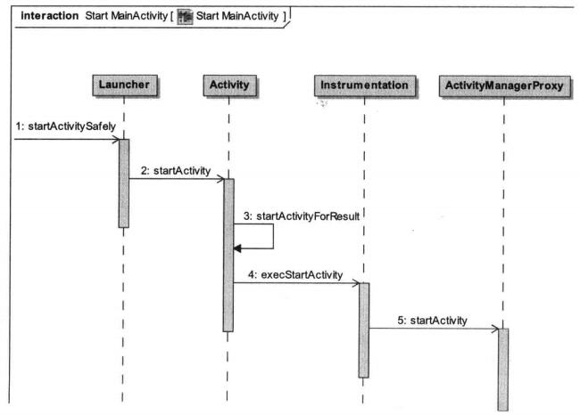
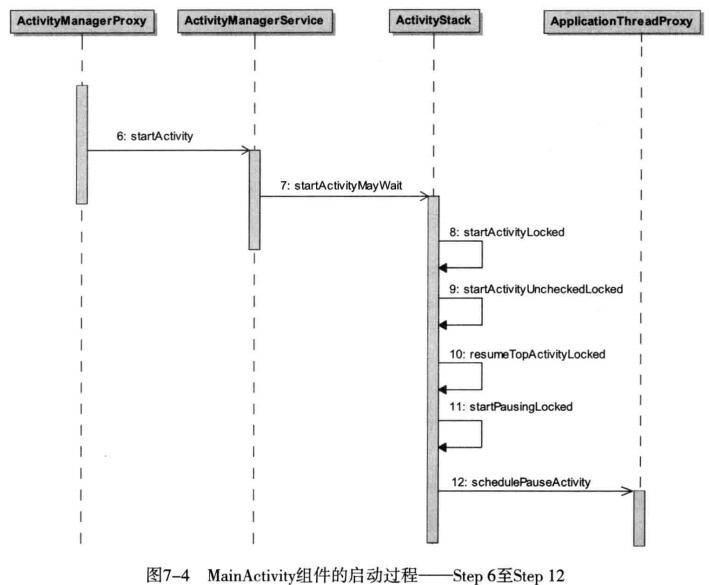
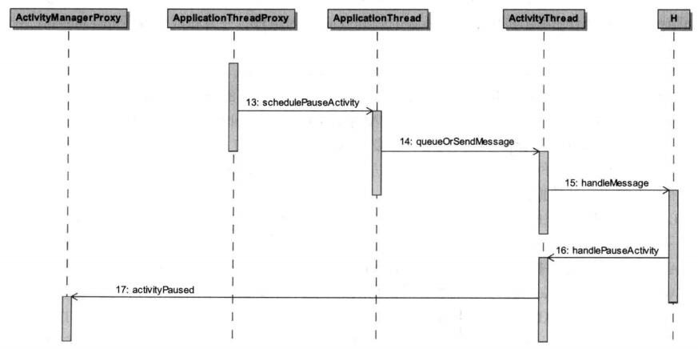
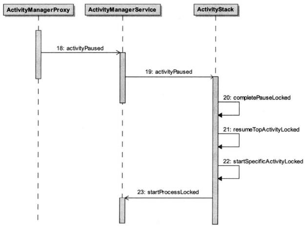
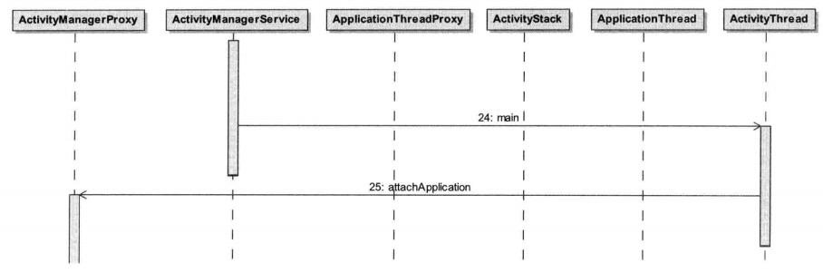
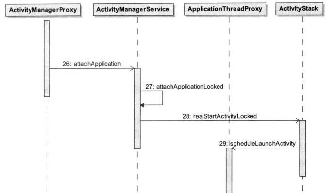
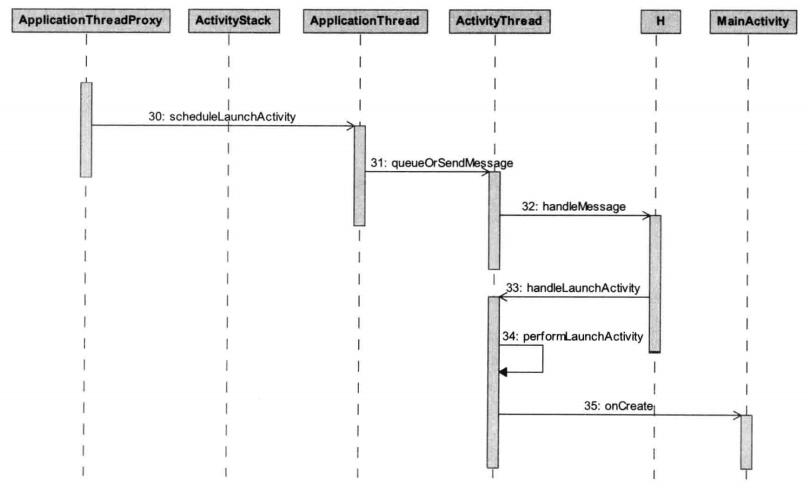

#                Android应用程序启动过程

​		在Android系统中，应用程序是由Activity组成的，因此，应用程序的启动过程实际上就是应用程序中的默认Activity的启动过程，本文将详细分析应用程序框架层的源代码，了解Android应用程序的启动过程。

​		在Android系统中，有两种操作会引发Activity的启动，一种用户点击应用程序图标时，Launcher会为我们启动应用程序的主Activity；应用程序的默认Activity启动起来后，它又可以在内部通过调用startActvity接口启动新的Activity。本文以通过点击Launcher上应用图标来启动应用，即MainActivity的启动过程。


##  Step 1. Launcher.startActivitySafely

​		Launcher本身也是一个应用程序，其它的应用程序安装后，就会Launcher的界面上出现一个相应的图标，点击这个图标时，Launcher就会把对应的应用程序启动起来。MainActivity是由Launcher启动的，而Launcher又是通过AMS来启动MainActivity。由于MainActivity、Launcher、AMS是运行在不同的进程，因此，应用的启动过程就涉及三个进程它们是通过Binder进程间通信机制来完成启动过程的。



​		Launcher向AMS发送一个启动MainActivity的进程间通信请求。

```java
//packages/apps/Launcher2/src/com/android/launcher2/Launcher.java
    /**
     * Launches the intent referred by the clicked shortcut.
     *
     * @param v The view representing the clicked shortcut.
     */
    public void onClick(View v) {
        // Make sure that rogue clicks don't get through while allapps is launching, or after the
        // view has detached (it's possible for this to happen if the view is removed mid touch).
        if (v.getWindowToken() == null) {
            return;
        }

        if (!mWorkspace.isFinishedSwitchingState()) {
            return;
        }

        Object tag = v.getTag();
        if (tag instanceof ShortcutInfo) {
            // Open shortcut
            final Intent intent = ((ShortcutInfo) tag).intent;
            int[] pos = new int[2];
            v.getLocationOnScreen(pos);
            intent.setSourceBounds(new Rect(pos[0], pos[1],
                    pos[0] + v.getWidth(), pos[1] + v.getHeight()));

            boolean success = startActivitySafely(v, intent, tag);

            if (success && v instanceof BubbleTextView) {
                mWaitingForResume = (BubbleTextView) v;
                mWaitingForResume.setStayPressed(true);
            }
        } else if (tag instanceof FolderInfo) {
            if (v instanceof FolderIcon) {
                FolderIcon fi = (FolderIcon) v;
                handleFolderClick(fi);
            }
        } else if (v == mAllAppsButton) {
            if (isAllAppsVisible()) {
                showWorkspace(true);
            } else {
                onClickAllAppsButton(v);
            }
        }
    }
```

```java
	boolean startActivitySafely(View v, Intent intent, Object tag) {
        boolean success = false;
        try {
            success = startActivity(v, intent, tag);
        } catch (ActivityNotFoundException e) {
            Toast.makeText(this, R.string.activity_not_found, Toast.LENGTH_SHORT).show();
            Log.e(TAG, "Unable to launch. tag=" + tag + " intent=" + intent, e);
        }
        return success;
    }
```

​		当我们在应用启动器Launcher界面点击一个应用图标时，Launcher的onClick中会调用startActivitySafely来启动这个应用的根Activity，其中，要启动的根Activity包含在参数intent中。例如当应用的MainActivity被Launcher启动时，参数intent包含的activity组件的信息：

```xml
action="android.intent.action.MAIN"
category="android.intent.category.LAUNCHER"
cmp = "com.android.activity.MainActivity"
```

​		Launcher组件是如何获取这些信息的呢？系统在启动时，会启动PackageManagerService，并且通过它来安装系统中的应用程序。PMS在安装应用的过程中，会对它的配置文件AndroidManifest.xml进行解析，从而得到它里面的组件信息。系统在启动完成之后，就会将Launcher组件启动。Launcher在启动过程中，会向PMS查询所有Action名称等于"intent.action.MAIN"，并且category等于"intent.category.LAUNCHER"的activity组件，最后为每一个activity组件创建一个快捷图标，并且将它们的信息与各自的快捷图标关联起来，一遍用户点击它们时可以将对应的Activity启动。

​	在startActivitySafely中，调用startActivity方法：

```java
    boolean startActivity(View v, Intent intent, Object tag) {
        intent.addFlags(Intent.FLAG_ACTIVITY_NEW_TASK);

        try {
            // Only launch using the new animation if the shortcut has not opted out (this is a
            // private contract between launcher and may be ignored in the future).
            boolean useLaunchAnimation = (v != null) &&
                    !intent.hasExtra(INTENT_EXTRA_IGNORE_LAUNCH_ANIMATION);
            if (useLaunchAnimation) {
                ActivityOptions opts = ActivityOptions.makeScaleUpAnimation(v, 0, 0,
                        v.getMeasuredWidth(), v.getMeasuredHeight());

                startActivity(intent, opts.toBundle());
            } else {
                startActivity(intent);
            }
            return true;
        } catch (SecurityException e) {
            Toast.makeText(this, R.string.activity_not_found, Toast.LENGTH_SHORT).show();
            Log.e(TAG, "Launcher does not have the permission to launch " + intent +
                    ". Make sure to create a MAIN intent-filter for the corresponding activity " +
                    "or use the exported attribute for this activity. "
                    + "tag="+ tag + " intent=" + intent, e);
        }
        return false;
    }
```

​		在startActivity中，先将要启动的activity组件的启动标志设置为Intent.FLAG_ACTIVITY_NEW_TASK，一遍它可以在一个新的任务中启动，然后是否展示启动动画。因为Launcher继承于Activity类，而Activity类实现了startActivity函数，因此，这里就调用了父类Activity.startActivity函数。

## Step 2. Activity.startActivity

```java
//frameworks/base/core/java/android/app/Activity.java
    /**
     * Same as {@link #startActivity(Intent, Bundle)} with no options
     * specified.
     *
     * @param intent The intent to start.
     *
     * @throws android.content.ActivityNotFoundException
     *
     * @see {@link #startActivity(Intent, Bundle)}
     * @see #startActivityForResult
     */
    @Override
    public void startActivity(Intent intent) {
        startActivity(intent, null);
    }

    /**
     * Launch a new activity.  You will not receive any information about when
     * the activity exits.  This implementation overrides the base version,
     * providing information about
     * the activity performing the launch.  Because of this additional
     * information, the {@link Intent#FLAG_ACTIVITY_NEW_TASK} launch flag is not
     * required; if not specified, the new activity will be added to the
     * task of the caller.
     * 
     * <p>This method throws {@link android.content.ActivityNotFoundException}
     * if there was no Activity found to run the given Intent.
     * 
     * @param intent The intent to start. 
     * @param options Additional options for how the Activity should be started.
     * See {@link android.content.Context#startActivity(Intent, Bundle)
     * Context.startActivity(Intent, Bundle)} for more details.
     * 
     * @throws android.content.ActivityNotFoundException
     *
     * @see {@link #startActivity(Intent)}
     * @see #startActivityForResult 
     */
    @Override
    public void startActivity(Intent intent, Bundle options) {
        if (options != null) {
            startActivityForResult(intent, -1, options);
        } else {
            // Note we want to go through this call for compatibility with
            // applications that may have overridden the method.
            startActivityForResult(intent, -1);
        }
    }
```

​		startActivity调用startActivityForResult来进一步处理intent所描述的activity组件，第二个参数传入-1表示不需要知道即将启动的Actvity结束后的执行结果。

## Step 3. Activity.startActivityForResult

```java
    /**
     * Same as calling {@link #startActivityForResult(Intent, int, Bundle)}
     * with no options.
     *
     * @param intent The intent to start.
     * @param requestCode If >= 0, this code will be returned in
     *                    onActivityResult() when the activity exits.
     *
     * @throws android.content.ActivityNotFoundException
     *
     * @see #startActivity 
     */
    public void startActivityForResult(Intent intent, int requestCode) {
        startActivityForResult(intent, requestCode, null);
    }

    /**
     * Launch an activity for which you would like a result when it finished.
     * When this activity exits, your
     * onActivityResult() method will be called with the given requestCode. 
     * Using a negative requestCode is the same as calling 
     * {@link #startActivity} (the activity is not launched as a sub-activity).
     *
     * <p>Note that this method should only be used with Intent protocols
     * that are defined to return a result.  In other protocols (such as
     * {@link Intent#ACTION_MAIN} or {@link Intent#ACTION_VIEW}), you may
     * not get the result when you expect.  For example, if the activity you
     * are launching uses the singleTask launch mode, it will not run in your
     * task and thus you will immediately receive a cancel result.
     *
     * <p>As a special case, if you call startActivityForResult() with a requestCode 
     * >= 0 during the initial onCreate(Bundle savedInstanceState)/onResume() of your
     * activity, then your window will not be displayed until a result is 
     * returned back from the started activity.  This is to avoid visible 
     * flickering when redirecting to another activity. 
     *
     * <p>This method throws {@link android.content.ActivityNotFoundException}
     * if there was no Activity found to run the given Intent.
     *
     * @param intent The intent to start.
     * @param requestCode If >= 0, this code will be returned in
     *                    onActivityResult() when the activity exits.
     * @param options Additional options for how the Activity should be started.
     * See {@link android.content.Context#startActivity(Intent, Bundle)
     * Context.startActivity(Intent, Bundle)} for more details.
     *
     * @throws android.content.ActivityNotFoundException
     *
     * @see #startActivity 
     */
    public void startActivityForResult(Intent intent, int requestCode, Bundle options) {
        if (mParent == null) {
            Instrumentation.ActivityResult ar =
                mInstrumentation.execStartActivity(
                    this, mMainThread.getApplicationThread(), mToken, this,
                    intent, requestCode, options);
            if (ar != null) {
                mMainThread.sendActivityResult(
                    mToken, mEmbeddedID, requestCode, ar.getResultCode(),
                    ar.getResultData());
            }
            if (requestCode >= 0) {
                // If this start is requesting a result, we can avoid making
                // the activity visible until the result is received.  Setting
                // this code during onCreate(Bundle savedInstanceState) or onResume() will keep the
                // activity hidden during this time, to avoid flickering.
                // This can only be done when a result is requested because
                // that guarantees we will get information back when the
                // activity is finished, no matter what happens to it.
                mStartedActivity = true;
            }

            final View decor = mWindow != null ? mWindow.peekDecorView() : null;
            if (decor != null) {
                decor.cancelPendingInputEvents();
            }
            // TODO Consider clearing/flushing other event sources and events for child windows.
        } else {
            if (options != null) {
                mParent.startActivityFromChild(this, intent, requestCode, options);
            } else {
                // Note we want to go through this method for compatibility with
                // existing applications that may have overridden it.
                mParent.startActivityFromChild(this, intent, requestCode);
            }
        }
    }
```

​		  这里的mInstrumentation是Activity类的成员变量，它的类型是Intrumentation，它用来监控应用程序和系统的交互操作。由于启动Activity组件是应用程序与系统之间的一个交互操作，因此调用execStartActivity来代为执行启动Activity组件的操作，一遍它可以监控这个交互过程。

​		Activity类的成员变量mMainThread的类型是ActivityThread，它代表的是应用程序的主线程，用来描述一个应用程序进程。系统每当启动一个应用程序进程时，都会在它里面加载一个ActivityThread类实例，并且会将这个ActivityThread类实例保存在每一个在该进程中启动的Activity组件的父类Activity的成员变量mMainThread中。这里通过ActivityThread的成员函数getApplicationThread来获得它内部的一个类型为ApplicationThread的Binder本地对象。将Launcher所运行在的应用程序进程的ApplicationThread对象作为参数传递给成员变量mInstrumentation的成员函数execStartActivity，以便可以将它传递给AMS，这样AMS接下来就可以通过它来通知Launcher进入Paused状态了。

    注意，这里的mMainThread代表的是Launcher应用程序运行的进程。
Activity类的成员变量mToken的类型是IBinder，它是一个Binder代理对象，指向了AMS中一个类型为ActivityRecord的Binder本地对象。

    每一个已经启动的Activity组件在AMS中都有一个对应的ActivityRecord对象，用来维护对应的Activity组件的运行状态以及信息。

execStartActivity中将Launcher的成员变量mToken作为参数传入，以便可以将它传递给AMS，这样AMS接下来就可以获得Launcher的详细信息了。

##  Step 4. Instrumentation.execStartActivity

```java
//frameworks/base/core/java/android/app/Instrumentation.java
    /**
     * Execute a startActivity call made by the application.  The default 
     * implementation takes care of updating any active {@link ActivityMonitor}
     * objects and dispatches this call to the system activity manager; you can
     * override this to watch for the application to start an activity, and 
     * modify what happens when it does. 
     *  
     * <p>This method returns an {@link ActivityResult} object, which you can 
     * use when intercepting application calls to avoid performing the start 
     * activity action but still return the result the application is 
     * expecting.  To do this, override this method to catch the call to start 
     * activity so that it returns a new ActivityResult containing the results 
     * you would like the application to see, and don't call up to the super 
     * class.  Note that an application is only expecting a result if 
     * <var>requestCode</var> is &gt;= 0.
     *  
     * <p>This method throws {@link android.content.ActivityNotFoundException}
     * if there was no Activity found to run the given Intent.
     * 
     * @param who The Context from which the activity is being started.
     * @param contextThread The main thread of the Context from which the activity
     *                      is being started.
     * @param token Internal token identifying to the system who is starting 
     *              the activity; may be null.
     * @param target Which activity is performing the start (and thus receiving 
     *               any result); may be null if this call is not being made
     *               from an activity.
     * @param intent The actual Intent to start.
     * @param requestCode Identifier for this request's result; less than zero 
     *                    if the caller is not expecting a result.
     * @param options Addition options.
     * 
     * @return To force the return of a particular result, return an 
     *         ActivityResult object containing the desired data; otherwise
     *         return null.  The default implementation always returns null.
     *  
     * @throws android.content.ActivityNotFoundException
     * 
     * @see Activity#startActivity(Intent)
     * @see Activity#startActivityForResult(Intent, int)
     * @see Activity#startActivityFromChild
     * 
     * {@hide}
     */
    public ActivityResult execStartActivity(
            Context who, IBinder contextThread, IBinder token, Activity target,
            Intent intent, int requestCode, Bundle options) {
        IApplicationThread whoThread = (IApplicationThread) contextThread;
        if (mActivityMonitors != null) {
            synchronized (mSync) {
                final int N = mActivityMonitors.size();
                for (int i=0; i<N; i++) {
                    final ActivityMonitor am = mActivityMonitors.get(i);
                    if (am.match(who, null, intent)) {
                        am.mHits++;
                        if (am.isBlocking()) {
                            return requestCode >= 0 ? am.getResult() : null;
                        }
                        break;
                    }
                }
            }
        }
        try {
            intent.migrateExtraStreamToClipData();
            intent.prepareToLeaveProcess();
            int result = ActivityManagerNative.getDefault()
                .startActivity(whoThread, who.getBasePackageName(), intent,
                        intent.resolveTypeIfNeeded(who.getContentResolver()),
                        token, target != null ? target.mEmbeddedID : null,
                        requestCode, 0, null, null, options);
            checkStartActivityResult(result, intent);
        } catch (RemoteException e) {
        }
        return null;
    }
```

​		这里调用ActivityManagerNative.getDefault返回ActivityManagerService的一个代理对象，即ActivityManagerProxy接口，接着在调用它的成员函数startActivity来通知AMS将一个Activity组件启动起来。

```java
public abstract class ActivityManagerNative extends Binder implements IActivityManager
{
    /**
     * Cast a Binder object into an activity manager interface, generating
     * a proxy if needed.
     */
    static public IActivityManager asInterface(IBinder obj) {
        if (obj == null) {
            return null;
        }
        IActivityManager in =
            (IActivityManager)obj.queryLocalInterface(descriptor);
        if (in != null) {
            return in;
        }

        return new ActivityManagerProxy(obj);
    }

    /**
     * Retrieve the system's default/global activity manager.
     */
    static public IActivityManager getDefault() {
        return gDefault.get();
    }
    
    private static final Singleton<IActivityManager> gDefault = new Singleton<IActivityManager>() {
        protected IActivityManager create() {
            IBinder b = ServiceManager.getService("activity");
            if (false) {
                Log.v("ActivityManager", "default service binder = " + b);
            }
            IActivityManager am = asInterface(b);
            if (false) {
                Log.v("ActivityManager", "default service = " + am);
            }
            return am;
        }
    }
```

​		第一次调用ActivityManagerNative类的静态成员函数gDefault时，它会通过ServiceManager来获取一个"activity"的java服务代理对象，即获取一个引用了ActivityManagerService的代理对象。接着调用静态成员函数asInterface将这个代理对象封装成一个类型为ActivityManagerProxy的代理对象，最后将它保存在静态成员变量gDefault中。这样，以后再调用ActivityManagerNative类的静态成员函数gDefault时，就可以直接获取ActivityManagerService的代理对象。
​		这里的intent.resolveTypeIfNeeded返回这个intent的MIME类型，如果AndroidManifest.xml没有设置MainActivity的MIME类型，因此，这里返回null。

​	回到Instrumentation的成员函数execStartActivity，接下来就调用ActivityManagerProxy类的成员函数startActivity通知AMS启动一个Activity组件。

## Step 5. ActivityManagerProxy.startActivity

```java
//frameworks/base/core/java/android/app/ActivityManagerNative.java
   public int startActivity(IApplicationThread caller, String callingPackage, Intent intent,
            String resolvedType, IBinder resultTo, String resultWho, int requestCode,
            int startFlags, String profileFile,
            ParcelFileDescriptor profileFd, Bundle options) throws RemoteException {
        Parcel data = Parcel.obtain();
        Parcel reply = Parcel.obtain();
        data.writeInterfaceToken(IActivityManager.descriptor);
        data.writeStrongBinder(caller != null ? caller.asBinder() : null);
        data.writeString(callingPackage);
        intent.writeToParcel(data, 0);
        data.writeString(resolvedType);
        data.writeStrongBinder(resultTo);
        data.writeString(resultWho);
        data.writeInt(requestCode);
        data.writeInt(startFlags);
        data.writeString(profileFile);
        if (profileFd != null) {
            data.writeInt(1);
            profileFd.writeToParcel(data, Parcelable.PARCELABLE_WRITE_RETURN_VALUE);
        } else {
            data.writeInt(0);
        }
        if (options != null) {
            data.writeInt(1);
            options.writeToParcel(data, 0);
        } else {
            data.writeInt(0);
        }
        mRemote.transact(START_ACTIVITY_TRANSACTION, data, reply, 0);
        reply.readException();
        int result = reply.readInt();
        reply.recycle();
        data.recycle();
        return result;
    }
```

​		从上面的调用可以知道，这里的参数resolvedType、grantedUriPermissions和resultWho均为null；参数caller为指向Launcher所运行在的应用进程的ApplicationThread对象；参数resultTo为指向AMS内部一个ActivityRecord对象，它保存了Launcher的详细信息；参数intent包含了即将要启动的MainActivity的信息；参数参数grantedMode为0，我们也先不关注它；参数requestCode为-1；参数onlyIfNeeded和debug均空false。

​		这里先将传进来的参数写入Parcel对象data中，接着再通过ActivityManagerProxy类的内部一个Binder代理对象mRemote向AMS发送一个类型为START_ACTIVITY_TRANSACTION的进程间通信请求。

​		以上5步是在Launcher中执行的，接下来的6-12步是在AMS中执行的，主要是用来处理Launcher发出的类型为START_ACTIVITY_TRANSACTION的进程间通信请求，如果图所示：



## Step 6. ActivityManagerService.startActivity

​		ActivityManagerService的startActivity用来处理类型为START_ACTIVITY_TRANSACTION的进程间通信请求。上一步Step 5通过Binder驱动程序就进入到ActivityManagerService的startActivity函数来了。

```java
@Override
public final int startActivity(IApplicationThread caller, String callingPackage,
            Intent intent, String resolvedType, IBinder resultTo,
            String resultWho, int requestCode, int startFlags,
            String profileFile, ParcelFileDescriptor profileFd, Bundle options) {
        return startActivityAsUser(caller, callingPackage, intent, resolvedType, resultTo,
                resultWho, requestCode,
                startFlags, profileFile, profileFd, options, UserHandle.getCallingUserId());
    }
```

```java
@Override
public final int startActivityAsUser(IApplicationThread caller, String callingPackage,
            Intent intent, String resolvedType, IBinder resultTo,
            String resultWho, int requestCode, int startFlags,
            String profileFile, ParcelFileDescriptor profileFd, Bundle options, int userId) {
        enforceNotIsolatedCaller("startActivity");
        userId = handleIncomingUser(Binder.getCallingPid(), Binder.getCallingUid(), userId,
                false, true, "startActivity", null);
        // TODO: Switch to user app stacks here.

        boolean isWhiteListApk = false;
        String apkControlMode = SystemProperties.get("persist.sys.ca.access.switch", "none");
        PackageManager mPm = mContext.getPackageManager();
        ResolveInfo info = mPm.resolveActivity(intent, PackageManager.GET_DISABLED_COMPONENTS);
        String packageName = (info != null) ? info.activityInfo.applicationInfo.packageName : null;
        Log.d(TAG, "apkControlMode=" + apkControlMode + "start package name is " + packageName );
        
        if (apkControlMode.equals("whitelist")) {

            if (mAppBlackoutWhitelist.size()==0){
                readApkWhiteFilter();
            }
        
            isWhiteListApk = PackageinBlackoutWhiteFilter(packageName);
            if (isWhiteListApk == true) {
                Message msg = Message.obtain();
                msg.what = SHOW_APKWITELIST_MSG;
                mHandler.sendMessage(msg);
                return -1;
            }
        }
        
        return mStackSupervisor.startActivityMayWait(caller, -1, callingPackage, intent, resolvedType,
                resultTo, resultWho, requestCode, startFlags, profileFile, profileFd,
                null, null, options, userId);
    }
```

​		ActivityManagerService有一个类型为ActivityStackSupervisor的成员变量mStackSupervisor，用来描述一个Activity组件堆栈。然后调用它的startActivityMayWait来执行一个启动Activity的操作。

##  Step 7. ActivityStack.startActivityMayWait

```java
//frameworks/base/services/java/com/android/server/am/ActivityStack.java
    final int startActivityMayWait(IApplicationThread caller, int callingUid,
            String callingPackage, Intent intent, String resolvedType, IBinder resultTo,
            String resultWho, int requestCode, int startFlags, String profileFile,
            ParcelFileDescriptor profileFd, WaitResult outResult, Configuration config,
            Bundle options, int userId) {
        // Refuse possible leaked file descriptors
        if (intent != null && intent.hasFileDescriptors()) {
            throw new IllegalArgumentException("File descriptors passed in Intent");
        }
        boolean componentSpecified = intent.getComponent() != null;

        // Don't modify the client's object!
        intent = new Intent(intent);

        // Collect information about the target of the Intent.
        ActivityInfo aInfo = resolveActivity(intent, resolvedType, startFlags,
                profileFile, profileFd, userId);

        synchronized (mService) {
            int callingPid;
            if (callingUid >= 0) {
                callingPid = -1;
            } else if (caller == null) {
                callingPid = Binder.getCallingPid();
                callingUid = Binder.getCallingUid();
            } else {
                callingPid = callingUid = -1;
            }

            final ActivityStack stack = getFocusedStack();
            stack.mConfigWillChange = config != null
                    && mService.mConfiguration.diff(config) != 0;
            if (DEBUG_CONFIGURATION) Slog.v(TAG,
                    "Starting activity when config will change = " + stack.mConfigWillChange);

            final long origId = Binder.clearCallingIdentity();

            if (aInfo != null &&
                    (aInfo.applicationInfo.flags&ApplicationInfo.FLAG_CANT_SAVE_STATE) != 0) {
                // This may be a heavy-weight process!  Check to see if we already
                // have another, different heavy-weight process running.
                if (aInfo.processName.equals(aInfo.applicationInfo.packageName)) {
                    if (mService.mHeavyWeightProcess != null &&
                            (mService.mHeavyWeightProcess.info.uid != aInfo.applicationInfo.uid ||
                            !mService.mHeavyWeightProcess.processName.equals(aInfo.processName))) {
                        int realCallingUid = callingUid;
                        if (caller != null) {
                            ProcessRecord callerApp = mService.getRecordForAppLocked(caller);
                            if (callerApp != null) {
                                realCallingUid = callerApp.info.uid;
                            } else {
                                Slog.w(TAG, "Unable to find app for caller " + caller
                                      + " (pid=" + callingPid + ") when starting: "
                                      + intent.toString());
                                ActivityOptions.abort(options);
                                return ActivityManager.START_PERMISSION_DENIED;
                            }
                        }

                        IIntentSender target = mService.getIntentSenderLocked(
                                ActivityManager.INTENT_SENDER_ACTIVITY, "android",
                                realCallingUid, userId, null, null, 0, new Intent[] { intent },
                                new String[] { resolvedType }, PendingIntent.FLAG_CANCEL_CURRENT
                                | PendingIntent.FLAG_ONE_SHOT, null);

                        Intent newIntent = new Intent();
                        if (requestCode >= 0) {
                            // Caller is requesting a result.
                            newIntent.putExtra(HeavyWeightSwitcherActivity.KEY_HAS_RESULT, true);
                        }
                        newIntent.putExtra(HeavyWeightSwitcherActivity.KEY_INTENT,
                                new IntentSender(target));
                        if (mService.mHeavyWeightProcess.activities.size() > 0) {
                            ActivityRecord hist = mService.mHeavyWeightProcess.activities.get(0);
                            newIntent.putExtra(HeavyWeightSwitcherActivity.KEY_CUR_APP,
                                    hist.packageName);
                            newIntent.putExtra(HeavyWeightSwitcherActivity.KEY_CUR_TASK,
                                    hist.task.taskId);
                        }
                        newIntent.putExtra(HeavyWeightSwitcherActivity.KEY_NEW_APP,
                                aInfo.packageName);
                        newIntent.setFlags(intent.getFlags());
                        newIntent.setClassName("android",
                                HeavyWeightSwitcherActivity.class.getName());
                        intent = newIntent;
                        resolvedType = null;
                        caller = null;
                        callingUid = Binder.getCallingUid();
                        callingPid = Binder.getCallingPid();
                        componentSpecified = true;
                        try {
                            ResolveInfo rInfo =
                                AppGlobals.getPackageManager().resolveIntent(
                                        intent, null,
                                        PackageManager.MATCH_DEFAULT_ONLY
                                        | ActivityManagerService.STOCK_PM_FLAGS, userId);
                            aInfo = rInfo != null ? rInfo.activityInfo : null;
                            aInfo = mService.getActivityInfoForUser(aInfo, userId);
                        } catch (RemoteException e) {
                            aInfo = null;
                        }
                    }
                }
            }

            int res = startActivityLocked(caller, intent, resolvedType,
                    aInfo, resultTo, resultWho, requestCode, callingPid, callingUid,
                    callingPackage, startFlags, options, componentSpecified, null);

            Binder.restoreCallingIdentity(origId);

            if (stack.mConfigWillChange) {
                // If the caller also wants to switch to a new configuration,
                // do so now.  This allows a clean switch, as we are waiting
                // for the current activity to pause (so we will not destroy
                // it), and have not yet started the next activity.
                mService.enforceCallingPermission(android.Manifest.permission.CHANGE_CONFIGURATION,
                        "updateConfiguration()");
                stack.mConfigWillChange = false;
                if (DEBUG_CONFIGURATION) Slog.v(TAG,
                        "Updating to new configuration after starting activity.");
                mService.updateConfigurationLocked(config, null, false, false);
            }

            if (outResult != null) {
                outResult.result = res;
                if (res == ActivityManager.START_SUCCESS) {
                    mWaitingActivityLaunched.add(outResult);
                    do {
                        try {
                            mService.wait();
                        } catch (InterruptedException e) {
                        }
                    } while (!outResult.timeout && outResult.who == null);
                } else if (res == ActivityManager.START_TASK_TO_FRONT) {
                    ActivityRecord r = stack.topRunningActivityLocked(null);
                    if (r.nowVisible) {
                        outResult.timeout = false;
                        outResult.who = new ComponentName(r.info.packageName, r.info.name);
                        outResult.totalTime = 0;
                        outResult.thisTime = 0;
                    } else {
                        outResult.thisTime = SystemClock.uptimeMillis();
                        mWaitingActivityVisible.add(outResult);
                        do {
                            try {
                                mService.wait();
                            } catch (InterruptedException e) {
                            }
                        } while (!outResult.timeout && outResult.who == null);
                    }
                }
            }

            return res;
        }
    }
```

​		从Step 6传下来的参数outResult和config均为null，表达式(aInfo.applicationInfo.flags&ApplicationInfo.FLAG_CANT_SAVE_STATE) != 0为false。
下面语句对参数intent的内容进行解析，得到MainActivity的相关信息，保存在aInfo变量中：

```java
try {
	ResolveInfo rInfo = AppGlobals.getPackageManager().resolveIntent( intent, null,
		PackageManager.MATCH_DEFAULT_ONLY| ActivityManagerService.STOCK_PM_FLAGS, 			userId);
    aInfo = rInfo != null ? rInfo.activityInfo : null;
    aInfo = mService.getActivityInfoForUser(aInfo, userId);
}
```

​		函数开始的地方调用intent.getComponent()函数的返回值不为null，因此，这里的componentSpecified变量为true。接下去就调用startActivityLocked进一步处理了。

## Step 8. ActivityStack.startActivityLocked

```java
public class ActivityStack {
	......
	final int startActivityLocked(IApplicationThread caller,
		    Intent intent, String resolvedType,
		    Uri[] grantedUriPermissions,
		    int grantedMode, ActivityInfo aInfo, IBinder resultTo,
	            String resultWho, int requestCode,
		    int callingPid, int callingUid, boolean onlyIfNeeded,
		    boolean componentSpecified) {
	        int err = START_SUCCESS;
 
		ProcessRecord callerApp = null;
		if (caller != null) {
			callerApp = mService.getRecordForAppLocked(caller);
			if (callerApp != null) {
				callingPid = callerApp.pid;
				callingUid = callerApp.info.uid;
			} else {
				......
			}
		}
 		......
		ActivityRecord sourceRecord = null;
		ActivityRecord resultRecord = null;
		if (resultTo != null) {
			int index = indexOfTokenLocked(resultTo);
			......
			if (index >= 0) {
				sourceRecord = (ActivityRecord)mHistory.get(index);
				if (requestCode >= 0 && !sourceRecord.finishing) {
					......
				}
			}
		}
 
		int launchFlags = intent.getFlags();
 
		if ((launchFlags&Intent.FLAG_ACTIVITY_FORWARD_RESULT) != 0
			&& sourceRecord != null) {
			......
		}
 
		if (err == START_SUCCESS && intent.getComponent() == null) {
			......
		}
 
		if (err == START_SUCCESS && aInfo == null) {
			......
		}
 
		if (err != START_SUCCESS) {
			......
		}
		......
		ActivityRecord r = new ActivityRecord(mService, this, callerApp, callingUid,
			intent, resolvedType, aInfo, mService.mConfiguration,
			resultRecord, resultWho, requestCode, componentSpecified);
		......
		return startActivityUncheckedLocked(r, sourceRecord,
			grantedUriPermissions, grantedMode, onlyIfNeeded, true);
	}
	......
}
```

​		在AMS中，每一个应用程序进程都使用一个ProcessRecord对象来描述，并且保存在AMS内部。ActivityStack类的成员变量mService指向了AMS。通过调用它的getRecordForAppLocked来获得与参数caller对应的一个ProcessRecord对象callerApp。参数caller指向的是Launcher所运行在的应用程序进程的一个ApplicationThread对象，因此callerApp实际上指向了Launcher所运行在的应用程序进程。接着获取Launcher所运行在的应用程序进程的PID和UID，保存在callingPid和callingUid中。

​		再来看23-34行，在sourceRecord = isInAnyStackLocked(resultTo)中，ActivityStack类的成员变量mStacks用来描述系统的Activity组件堆栈。在这个堆栈中，每一个已经启动的Activity组件都使用一个ActivityRecord对象来描述。

```java
    ActivityRecord isInAnyStackLocked(IBinder token) {
        for (int stackNdx = mStacks.size() - 1; stackNdx >= 0; --stackNdx) {
            final ActivityRecord r = mStacks.get(stackNdx).isInStackLocked(token);
            if (r != null) {
                return r;
            }
        }
        return null;
    }
```

​		前面说过，参数resultTo指向的是Launcher在AMS中的一个ActivityRecord对象，通过它可以获得Launcher这个Activity的相关信息，保存在sourceRecord变量中。因此，第23-34行实际上就是再Activity堆栈mStacks中找到用来描述Launcher的一个ActivityRecord对象，保存在变量sourceRecord中。
​    再接下来55-57行创建一个ActivityRecord对象r来描述即将要启动的Activity的相关信息，即MainActivity。

```java
ActivityRecord r = new ActivityRecord(mService, this, callerApp, callingUid,
	intent, resolvedType, aInfo, mService.mConfiguration,
	resultRecord, resultWho, requestCode, componentSpecified);
```

 		现在，ActivityStack类就得到了请求AMS执行启动Activity操作的源Activity，以及要启动的目标Activity的信息了，它们分别保存在ActivityRecord对象sourceRecord和r中。最后，以它们为参数来调用成员函数startActivityUncheckedLocked进一步执行启动目标Activity的操作。

## Step 9. ActivityStack.startActivityUncheckedLocked

```java
    final int startActivityUncheckedLocked(ActivityRecord r,
            ActivityRecord sourceRecord, int startFlags, boolean doResume,
            Bundle options) {
        final Intent intent = r.intent;
        final int callingUid = r.launchedFromUid;

        int launchFlags = intent.getFlags();

        // We'll invoke onUserLeaving before onPause only if the launching
        // activity did not explicitly state that this is an automated launch.
        mUserLeaving = (launchFlags&Intent.FLAG_ACTIVITY_NO_USER_ACTION) == 0;
		......
        ActivityInfo newTaskInfo = null;
        Intent newTaskIntent = null;
        final ActivityStack sourceStack;
        if (sourceRecord != null) {
            if (sourceRecord.finishing) {
                if ((launchFlags&Intent.FLAG_ACTIVITY_NEW_TASK) == 0) {
                    launchFlags |= Intent.FLAG_ACTIVITY_NEW_TASK;
                    newTaskInfo = sourceRecord.info;
                    newTaskIntent = sourceRecord.task.intent;
                }
                sourceRecord = null;
                sourceStack = null;
            } else {
                sourceStack = sourceRecord.task.stack;
            }
        } else {
            sourceStack = null;
        }

        if (r.resultTo != null && (launchFlags&Intent.FLAG_ACTIVITY_NEW_TASK) != 0) {
            r.resultTo.task.stack.sendActivityResultLocked(-1,
                    r.resultTo, r.resultWho, r.requestCode,
                Activity.RESULT_CANCELED, null);
            r.resultTo = null;
        }

        boolean addingToTask = false;
        ......
        // Should this be considered a new task?
        if (r.resultTo == null && !addingToTask
        ......

        mService.grantUriPermissionFromIntentLocked(callingUid, r.packageName,
                intent, r.getUriPermissionsLocked());
        ActivityStack.logStartActivity(EventLogTags.AM_CREATE_ACTIVITY, r, r.task);
        targetStack.mLastPausedActivity = null;
        targetStack.startActivityLocked(r, newTask, doResume, keepCurTransition, options);
        mService.setFocusedActivityLocked(r);
        return ActivityManager.START_SUCCESS;
    }
```

​		函数首先获得目标Activity的启动标志位（intent的标志值），保存在launchFlags变量中。在前面Step 1知道，在变量launchFlags中，只有Intent.FLAG_ACTIVITY_NEW_TASK被设置为1，其他位均等于0。 这个intent的标志值的位Intent.FLAG_ACTIVITY_NO_USER_ACTION没有置位，因此成员变量mUserLeaving的值为true。Intent.FLAG_ACTIVITY_PREVIOUS_IS_TOP也没有置位，因此，变量notTop的值为null。

```java
mUserLeaving = (launchFlags&Intent.FLAG_ACTIVITY_NO_USER_ACTION) == 0;
```

然后检查变量launchFlags的Intent.FLAG_ACTIVITY_NO_USER_ACTION是否等于1.如果等于1，那么就表示目标Activity不是用户手动启动的。如果目标Activity是由用户手动启动的，那么用来启动它的源Activity就会获得一个用户离开事件通知。由于目标Activity是用户在Launcher中启动的，因此launchFlags的Intent.FLAG_ACTIVITY_NO_USER_ACTION等于0，因此，mUserLeaving等于true，表示后面要向源Activity发送一个用户离开事件通知。

​		在默认情况下，目标Activity是与源Activity运行在同一个任务中的。然而，如果源Activity将目标Activity的启动标志位的Intent.FLAG_ACTIVITY_NEW_TASK置为1，并且源Activity不需要知道目标Activity的运行结果，那么AMS就会运行在另一个不同的任务中。这个不同的任务可能是一个新创建的任务，也可能是一个已经存在的任务。Activity有一个Android:taskAffinity属性，用来描述它的一个专属任务。当AMS决定要将目标Activity运行在一个不同的任务中时，AMS就会检查目标Activity的专属任务是否已经存在。如果已经存在，那么AMS就会直接将目标Activity添加到它的里面去执行；否则，就会先创建这个专属任务，然后再将目标Activity添加到它里面去执行。

​		addingToTask的初始值为false，表示要为目标Activity创建一个专属任务，实际上函数接着会检查这个专属任务是否已经存在。如果已经存在，那么就将变量addingToTask设为true。

​		一般如果应用的AndroidManifest.xml文件中，MainActivity没有配置launchMode属值，那么r.launchMode为默认值0，表示以标准（Standard，或者称为ActivityInfo.LAUNCH_MULTIPLE）的方式来启动这个Activity。Activity的启动方式有四种，其余三种分别是ActivityInfo.LAUNCH_SINGLE_INSTANCE、ActivityInfo.LAUNCH_SINGLE_TASK和ActivityInfo.LAUNCH_SINGLE_TOP。

​		  由于这个intent的标志值的位Intent.FLAG_ACTIVITY_NEW_TASK被置位，而且Intent.FLAG_ACTIVITY_MULTIPLE_TASK 没有置位，因此，下面的if语句会被执行：

```java
if (((launchFlags&Intent.FLAG_ACTIVITY_NEW_TASK) != 0 &&
	(launchFlags&Intent.FLAG_ACTIVITY_MULTIPLE_TASK) == 0)
	|| r.launchMode == ActivityInfo.LAUNCH_SINGLE_TASK
	|| r.launchMode == ActivityInfo.LAUNCH_SINGLE_INSTANCE) {
		// If bring to front is requested, and no result is requested, and
		// we can find a task that was started with this same
		// component, then instead of launching bring that one to the front.
		if (r.resultTo == null) {
			// See if there is a task to bring to the front.  If this is
			// a SINGLE_INSTANCE activity, there can be one and only one
			// instance of it in the history, and it is always in its own
			// unique task, so we do a special search.
			ActivityRecord taskTop = r.launchMode != ActivityInfo.LAUNCH_SINGLE_INSTANCE
				? findTaskLocked(intent, r.info)
				: findActivityLocked(intent, r.info);
			if (taskTop != null) {
				......
			}
		}
    }
```

​		这段代码的逻辑是查看一下，当前有没有Task可以用来执行这个Activity。由于r.launchMode的值不为ActivityInfo.LAUNCH_SINGLE_INSTANCE，因此，它通过findTaskLocked函数来查找存不存这样的Task，这里返回的结果是null，即taskTop为null，因此，需要创建一个新的Task来启动这个Activity。

 接着往下看：

```java
if (r.packageName != null) {
	// If the activity being launched is the same as the one currently
	// at the top, then we need to check if it should only be launched once.
    ActivityStack topStack = getFocusedStack();
	ActivityRecord top = topRunningNonDelayedActivityLocked(notTop);
	if (top != null && r.resultTo == null) {
		if (top.realActivity.equals(r.realActivity)) {
			......
		}
	}
} 
```

​		这段代码的逻辑是看一下，当前在堆栈顶端的Activity是否就是即将要启动的Activity，有些情况下，如果即将要启动的Activity就在堆栈的顶端，那么，就不会重新启动这个Activity的别一个实例了。现在处理堆栈顶端的Activity是Launcher，与我们即将要启动的MainActivity不是同一个Activity，因此，这里不用进一步处理上述介绍的情况。执行到这里，我们知道，要在一个新的Task里面来启动这个Activity了，于是新创建一个Task。

​		从Step 2可以知道，源Activity是不需要知道目标Activity的执行结果的，即参数r的成员变量 r.resultTo为null，表示Launcher不需要等这个即将要启动的MainActivity的执行结果。综合前面得到的变量launchFlags和addingToTask，可以知道下面的if语句为true，因此，将为目标Activity创建一个专属任务，并且将它保存在参数r的成员变量task中。

```java
if (r.resultTo == null && !addingToTask
	&& (launchFlags&Intent.FLAG_ACTIVITY_NEW_TASK) != 0) {
	// todo: should do better management of integers.
	mService.mCurTask++;
	if (mService.mCurTask <= 0) {
		mService.mCurTask = 1;
	}
	r.task = new TaskRecord(mService.mCurTask, r.info, intent,
		(r.info.flags&ActivityInfo.FLAG_CLEAR_TASK_ON_LAUNCH) != 0);
	......
	newTask = true;
	if (mMainStack) {
		mService.addRecentTaskLocked(r.task);
	}
}
```

​		接着继续将newTask设为true，并且将新创建的专属任务交给AMS管理。

​		最后就进入startActivityLocked(r, newTask, doResume)进一步处理了:

```java
//frameworks/base/services/java/com/android/server/am/ActivityStack.java
final void startActivityLocked(ActivityRecord r, boolean newTask,
            boolean doResume, boolean keepCurTransition, Bundle options) {
        TaskRecord rTask = r.task;
        final int taskId = rTask.taskId;
        if (taskForIdLocked(taskId) == null || newTask) {
        // Last activity in task had been removed or ActivityManagerService is reusing task.
            // Insert or replace.
            // Might not even be in.
            insertTaskAtTop(rTask);
            mWindowManager.moveTaskToTop(taskId);
        }
        TaskRecord task = null;
        if (!newTask) {
            // If starting in an existing task, find where that is...
            boolean startIt = true;
            for (int taskNdx = mTaskHistory.size() - 1; taskNdx >= 0; --taskNdx) {
                task = mTaskHistory.get(taskNdx);
                if (task == r.task) {
                    // Here it is!  Now, if this is not yet visible to the
                    // user, then just add it without starting; it will
                    // get started when the user navigates back to it.
                    if (!startIt) {
                        if (DEBUG_ADD_REMOVE) Slog.i(TAG, "Adding activity " + r + " to task "
                                + task, new RuntimeException("here").fillInStackTrace());
                        task.addActivityToTop(r);
                        r.putInHistory();
                        mWindowManager.addAppToken(task.mActivities.indexOf(r), r.appToken,
                                r.task.taskId, mStackId, r.info.screenOrientation, r.fullscreen,
                                (r.info.flags & ActivityInfo.FLAG_SHOW_ON_LOCK_SCREEN) != 0,
                                r.userId, r.info.configChanges);
                        if (VALIDATE_TOKENS) {
                            validateAppTokensLocked();
                        }
                        ActivityOptions.abort(options);
                        return;
                    }
                    break;
                } else if (task.numFullscreen > 0) {
                    startIt = false;
                }
            }
        }

        // Place a new activity at top of stack, so it is next to interact
        // with the user.

        // If we are not placing the new activity frontmost, we do not want
        // to deliver the onUserLeaving callback to the actual frontmost
        // activity
        if (task == r.task && mTaskHistory.indexOf(task) != (mTaskHistory.size() - 1)) {
            mStackSupervisor.mUserLeaving = false;
        task = r.task;
        task.addActivityToTop(r);

        r.putInHistory();
        r.frontOfTask = newTask;
        if (!isHomeStack() || numActivities() > 0) {
            // We want to show the starting preview window if we are
            // switching to a new task, or the next activity's process is
            // not currently running.
            boolean showStartingIcon = newTask;
            ProcessRecord proc = r.app;
            if (proc == null) {
                proc = mService.mProcessNames.get(r.processName, r.info.applicationInfo.uid);
            }
            if (proc == null || proc.thread == null) {
                showStartingIcon = true;
            }
            if (DEBUG_TRANSITION) Slog.v(TAG,
                    "Prepare open transition: starting " + r);
            if ((r.intent.getFlags()&Intent.FLAG_ACTIVITY_NO_ANIMATION) != 0) {
                mWindowManager.prepareAppTransition(AppTransition.TRANSIT_NONE, keepCurTransition);
                mNoAnimActivities.add(r);
            } else {
                mWindowManager.prepareAppTransition(newTask
                        ? AppTransition.TRANSIT_TASK_OPEN
                        : AppTransition.TRANSIT_ACTIVITY_OPEN, keepCurTransition);
                mNoAnimActivities.remove(r);
            }
            r.updateOptionsLocked(options);
            mWindowManager.addAppToken(task.mActivities.indexOf(r),
                    r.appToken, r.task.taskId, mStackId, r.info.screenOrientation, r.fullscreen,
                    (r.info.flags & ActivityInfo.FLAG_SHOW_ON_LOCK_SCREEN) != 0, r.userId,
                    r.info.configChanges);
            boolean doShow = true;
            if (newTask) {
                // Even though this activity is starting fresh, we still need
                // to reset it to make sure we apply affinities to move any
                // existing activities from other tasks in to it.
                // If the caller has requested that the target task be
                // reset, then do so.
                if ((r.intent.getFlags()
                        &Intent.FLAG_ACTIVITY_RESET_TASK_IF_NEEDED) != 0) {
                    resetTaskIfNeededLocked(r, r);
                    doShow = topRunningNonDelayedActivityLocked(null) == r;
                }
            }
            if (SHOW_APP_STARTING_PREVIEW && doShow) {
                // Figure out if we are transitioning from another activity that is
                // "has the same starting icon" as the next one.  This allows the
                // window manager to keep the previous window it had previously
                // created, if it still had one.
                ActivityRecord prev = mResumedActivity;
                if (prev != null) {
                    // We don't want to reuse the previous starting preview if:
                    // (1) The current activity is in a different task.
                    if (prev.task != r.task) {
                        prev = null;
                    }
                    // (2) The current activity is already displayed.
                    else if (prev.nowVisible) {
                        prev = null;
                    }
                }
                mWindowManager.setAppStartingWindow(
                        r.appToken, r.packageName, r.theme,
                        mService.compatibilityInfoForPackageLocked(
                                r.info.applicationInfo), r.nonLocalizedLabel,
                        r.labelRes, r.icon, r.logo, r.windowFlags,
                        prev != null ? prev.appToken : null, showStartingIcon);
            }
        } else {
            // If this is the first activity, don't do any fancy animations,
            // because there is nothing for it to animate on top of.
            mWindowManager.addAppToken(task.mActivities.indexOf(r), r.appToken,
                    r.task.taskId, mStackId, r.info.screenOrientation, r.fullscreen,
                    (r.info.flags & ActivityInfo.FLAG_SHOW_ON_LOCK_SCREEN) != 0, r.userId,
                    r.info.configChanges);
            ActivityOptions.abort(options);
        }
        if (VALIDATE_TOKENS) {
            validateAppTokensLocked();
        }

        if (doResume) {
            mStackSupervisor.resumeTopActivitiesLocked();
        }
    }
```

​		先将目标Activity保存到ActivityStack类的成员变量所描述的Activity堆栈中。当目标Activity是在一个新创建的任务中启动时，即参数newTask等于true时，ActivityStack就需要将它放在Activity堆栈的最上面。

​		从Step 8可以知道，这里传进来的参数doResume为true，于是调用resumeTopActivityLocked将Activity堆栈顶端的Activity激活，这个Activity就正好是即将要启动的MainActivity，因为前面已经将它放在了堆栈顶端。

## Step 10. Activity.resumeTopActivityLocked

```java
boolean resumeTopActivitiesLocked() {
        return resumeTopActivitiesLocked(null, null, null);
    }

boolean resumeTopActivitiesLocked(ActivityStack targetStack, ActivityRecord target,
            Bundle targetOptions) {
        if (targetStack == null) {
            targetStack = getFocusedStack();
        }
        boolean result = false;
        for (int stackNdx = mStacks.size() - 1; stackNdx >= 0; --stackNdx) {
            final ActivityStack stack = mStacks.get(stackNdx);
            if (isFrontStack(stack)) {
                if (stack == targetStack) {
                    result = stack.resumeTopActivityLocked(target, targetOptions);
                } else {
                    stack.resumeTopActivityLocked(null);
                }
            }
        }
        return result;
    }
```

​		先找到堆栈顶端的activity，然后调用ActivityStack的resumeTopActivityLocked：

```java
    /**
     * Ensure that the top activity in the stack is resumed.
     *
     * @param prev The previously resumed activity, for when in the process
     * of pausing; can be null to call from elsewhere.
     *
     * @return Returns true if something is being resumed, or false if
     * nothing happened.
     */
    final boolean resumeTopActivityLocked(ActivityRecord prev) {
        return resumeTopActivityLocked(prev, null);
    }

    final boolean resumeTopActivityLocked(ActivityRecord prev, Bundle options) {
        if (ActivityManagerService.DEBUG_LOCKSCREEN) mService.logLockScreen("");

        // Find the first activity that is not finishing.
        ActivityRecord next = topRunningActivityLocked(null);

        // Remember how we'll process this pause/resume situation, and ensure
        // that the state is reset however we wind up proceeding.
        final boolean userLeaving = mStackSupervisor.mUserLeaving;
        mStackSupervisor.mUserLeaving = false;
		......
        // If the top activity is the resumed one, nothing to do.
        if (mResumedActivity == next && next.state == ActivityState.RESUMED &&
                    mStackSupervisor.allResumedActivitiesComplete()&&mWindowManager.isAppVisbilityInScreen) {
            return false;
        }

        ......

        // If we are sleeping, and there is no resumed activity, and the top
        // activity is paused, well that is the state we want.
        if (mService.isSleepingOrShuttingDown()
                && mLastPausedActivity == next
                && mStackSupervisor.allPausedActivitiesComplete()) {
            ......
            return false;
        }

       ......

        // If we are currently pausing an activity, then don't do anything
        // until that is done.
        if (!mStackSupervisor.allPausedActivitiesComplete()) {
            ......
            return false;
        }

      	......

        // We need to start pausing the current activity so the top one
        // can be resumed...
        boolean pausing = mStackSupervisor.pauseBackStacks(userLeaving);
        if (mResumedActivity != null) {
            pausing = true;
            startPausingLocked(userLeaving, false);
        }
        if (pausing) {
            if (next.app != null && next.app.thread != null) {
                mService.updateLruProcessLocked(next.app, true, null);
            }
            return true;
        }
		......
        return true;
    }
```

​		先调用成员函数topRunningActivityLocked来获取当前Activity堆栈最上面一个不是出于结束状态的Activity。前面Step 9已经将MainActivity保存在当前Activity组件堆栈的顶端，并且它是正在等待启动的，即它不是处于结束状态的，因此这里得到的ActivityRecord对象的next变量就是即将要启动的MainActivity。

​		接下来把ActivityStack的成员变量mUserLeaving保存在本地变量userLeaving中，然后StackSupervisor.mUserLeaving重新设置为false，因为接下来通过变量userLeaving就可以知道是否需要向源Activity发送一个用户离开事件通知了。在上面的Step 9中，mUserLeaving的值为true，因此，这里的userLeaving为true。

   ActivityStack有三个成员变量mResumedActivity、mLastPausedActivity、mPausingActivity，它们的类型都是ActivityStack，分别用来描述系统当前激活的Activity、上一次被中止的Activity、以及正在被中止的Activity。这里的mResumedActivity为Launcher，因为Launcher是当前正被执行的Activity。当我们处理休眠状态时，mLastPausedActivity保存堆栈顶端的Activity，因为当前不是休眠状态，所以mLastPausedActivity为null。

```java
	// If the top activity is the resumed one, nothing to do.
    if (mResumedActivity == next && next.state == ActivityState.RESUMED) {
	......
    }
 
    // If we are sleeping, and there is no resumed activity, and the top
    // activity is paused, well that is the state we want.
    if ((mService.mSleeping || mService.mShuttingDown)
	&& mLastPausedActivity == next && next.state == ActivityState.PAUSED) {
	......
    }
```
​		它首先检查要启动的Activity是否就是当前被激活的（处理Resumed状态）的Activity，如果是的话，并且它的状态为resumed，那就什么都不用做，直接返回就可以了，因为要启动的Activity本身已经启动和激活了。否则再看一下系统当前是否休眠或者关机状态，如果是的话，再看看要启动的Activity是否就是当前处于堆栈顶端的Activity，如果是的话，也是什么都不用做，因为这时启动是没有意义的。

​		上面两个条件都不满足，因此，在继续往下执行之前，首先要把当处于Resumed状态的Activity推入Paused状态，然后才可以启动新的Activity。但是在将当前这个Resumed状态的Activity推入Paused状态之前，首先要看一下当前是否有Activity正在进入Pausing状态，如果有的话，当前这个Resumed状态的Activity就要稍后才能进入Paused状态了，这样就保证了所有需要进入Paused状态的Activity串行处理。

​		由于系统当前正在激活的Activity是Launcher，即ActivityStack类的成员变量mResumedActivity指向了Launcher，又因为这里没有处于Pausing状态的Activity，即mPausingActivity为null，而且mResumedActivity也不为null，于是就调用startPausingLocked函数把Launcher推入Paused状态去了。

## Step 11. ActivityStack.startPausingLocked

```java
    final void startPausingLocked(boolean userLeaving, boolean uiSleeping) {
        if (mPausingActivity != null) {
            Slog.e(TAG, "Trying to pause when pause is already pending for "
                  + mPausingActivity, new RuntimeException("here").fillInStackTrace());
        }
        ActivityRecord prev = mResumedActivity;
        if (prev == null) {
            Slog.e(TAG, "Trying to pause when nothing is resumed",
                    new RuntimeException("here").fillInStackTrace());
            mStackSupervisor.resumeTopActivitiesLocked();
            return;
        }
        if (DEBUG_STATES) Slog.v(TAG, "Moving to PAUSING: " + prev);
        else if (DEBUG_PAUSE) Slog.v(TAG, "Start pausing: " + prev);
        mResumedActivity = null;
        mPausingActivity = prev;
        mLastPausedActivity = prev;
        mLastNoHistoryActivity = (prev.intent.getFlags() & Intent.FLAG_ACTIVITY_NO_HISTORY) != 0
                || (prev.info.flags & ActivityInfo.FLAG_NO_HISTORY) != 0 ? prev : null;
        prev.state = ActivityState.PAUSING;
        prev.task.touchActiveTime();
        clearLaunchTime(prev);
        final ActivityRecord next = mStackSupervisor.topRunningActivityLocked();
        if (next == null || next.task != prev.task) {
            prev.updateThumbnail(screenshotActivities(prev), null);
        }
        stopFullyDrawnTraceIfNeeded();

        mService.updateCpuStats();

        if (prev.app != null && prev.app.thread != null) {
            if (DEBUG_PAUSE) Slog.v(TAG, "Enqueueing pending pause: " + prev);
            try {
                EventLog.writeEvent(EventLogTags.AM_PAUSE_ACTIVITY,
                        prev.userId, System.identityHashCode(prev),
                        prev.shortComponentName);
                mService.updateUsageStats(prev, false);
                prev.app.thread.schedulePauseActivity(prev.appToken, prev.finishing,
                        userLeaving, prev.configChangeFlags);
            } catch (Exception e) {
                // Ignore exception, if process died other code will cleanup.
                Slog.w(TAG, "Exception thrown during pause", e);
                mPausingActivity = null;
                mLastPausedActivity = null;
                mLastNoHistoryActivity = null;
            }
        } else {
            mPausingActivity = null;
            mLastPausedActivity = null;
            mLastNoHistoryActivity = null;
        }

        // If we are not going to sleep, we want to ensure the device is
        // awake until the next activity is started.
        if (!mService.isSleepingOrShuttingDown()) {
            mStackSupervisor.acquireLaunchWakelock();
        }

        if (mPausingActivity != null) {
            // Have the window manager pause its key dispatching until the new
            // activity has started.  If we're pausing the activity just because
            // the screen is being turned off and the UI is sleeping, don't interrupt
            // key dispatch; the same activity will pick it up again on wakeup.
            if (!uiSleeping) {
                prev.pauseKeyDispatchingLocked();
            } else {
                if (DEBUG_PAUSE) Slog.v(TAG, "Key dispatch not paused for screen off");
            }

            // Schedule a pause timeout in case the app doesn't respond.
            // We don't give it much time because this directly impacts the
            // responsiveness seen by the user.
            Message msg = mHandler.obtainMessage(PAUSE_TIMEOUT_MSG);
            msg.obj = prev;
            prev.pauseTime = SystemClock.uptimeMillis();
            mHandler.sendMessageDelayed(msg, PAUSE_TIMEOUT);
            if (DEBUG_PAUSE) Slog.v(TAG, "Waiting for pause to complete...");
        } else {
            // This activity failed to schedule the
            // pause, so just treat it as being paused now.
            if (DEBUG_PAUSE) Slog.v(TAG, "Activity not running, resuming next.");
            mStackSupervisor.getFocusedStack().resumeTopActivityLocked(null);
        }
    }
```

​		函数首先把mResumedActivity保存在本地变量prev中。然后将prev、ActivityStack类的mResumedActivity和mLastPausedActivity指向即将要进入Paused状态的Launcher组件，并且将mResumedActivity设为null。

​		ActivityRecord类有一个成员变量app，它的类型为ProcessRecord，用来描述一个Activity所运行在的应用程序进程，而ProcessRecord类又有一个成员变量thread，它的类型为IApplicationThread，用来描述一个Binder代理对象，引用的是一个类型为ApplicationThread的Binder本地对象。，因此，这里把Launcher进程中的ApplicationThread对象取出来，通过它来通知Launcher这个Activity它要进入Paused状态了。当然，这里的prev.app.thread是一个ApplicationThread对象的远程接口，通过调用这个远程接口的schedulePauseActivity来通知Launcher进入Paused状态。

​		由于ActivityRecord对象prev指向的是即将要进入Paused状态的Launcher，因此，下面的代码实际上是向Launcher所运行在的应用组件进程发送一个中止Lanucher的通知，以便Launcher有机会执行一些数据保存操作。

```java
prev.app.thread.schedulePauseActivity(prev.appToken, prev.finishing,
                        userLeaving, prev.configChangeFlags);
```

​		Launcher处理完AMS给它发送的中断通知后，必须再向AMS发送一个启动MainActivity的通知，以便AMS可以将位于Activity堆栈顶端的MainActivity启动起来。但是AMS不能无限德等待，因此73-76行向AMS所运行在的线程的消息队列发送一个类型为PAUSE_TIMEOUT_MSG的消息，并且指定这个消息在PAUSE_TIMEOUT毫秒之后处理。如果Launcher不能在PAUSE_TIMEOUT毫秒内再向AMS发送一个启动MainActivity的通知，那么AMS就会认为它没有响应了。

​		接下来，继续分析schedulePauseActivity。

## Step 12. ApplicationThreadProxy.schedulePauseActivity

```java
//frameworks/base/core/java/android/app/ApplicationThreadNative.java
public final void schedulePauseActivity(IBinder token, boolean finished,
            boolean userLeaving, int configChanges) throws RemoteException {
        Parcel data = Parcel.obtain();
        data.writeInterfaceToken(IApplicationThread.descriptor);
        data.writeStrongBinder(token);
        data.writeInt(finished ? 1 : 0);
        data.writeInt(userLeaving ? 1 :0);
        data.writeInt(configChanges);
        mRemote.transact(SCHEDULE_PAUSE_ACTIVITY_TRANSACTION, data, null,
                IBinder.FLAG_ONEWAY);
        data.recycle();
    }
```

​		这里将前面传进来的参数写入到Parcel对象data中，然后通过ApplicationThreadProxy类内部的一个Binder代理对象mRemote向Launcher所在的应用程序进程发送一个类型为SCHEDULE_PAUSE_ACTIVITY_TRANSACTION的进程间通信请求。这个函数通过Binder进程间通信机制进入到ApplicationThread.schedulePauseActivity函数中。

-  这个进程间通信请求是异步的，因此AMS将它发送出去后，就马上返回了。

  以上7步都是在AMS中执行，接下来的13-17步是在应用程序Launcher中执行的，主要是用来处理AMS发出的SCHEDULE_PAUSE_ACTIVITY_TRANSACTION进程间通信请求：



## Step 13. ApplicationThread.schedulePauseActivity

```java
//frameworks/base/core/java/android/app/ActivityThread.java
public final void schedulePauseActivity(IBinder token, boolean finished,
                boolean userLeaving, int configChanges) {
	sendMessage(finished ? H.PAUSE_ACTIVITY_FINISHING : H.PAUSE_ACTIVITY, token,
				(userLeaving ? 1 : 0), configChanges);
}
```

​		ApplicationThread是ActivityThread的内部类，ApplicationThread类的成员函数schedulePauseActivity用来处理类型为SCHEDULE_PAUSE_ACTIVITY_TRANSACTION进程间通信请求。

​		从前面的传进来的参数finished和userLeaving分别为false和true，而参数token是一个Binder代理对象，指向了AMS中与Launcher对应的一个ActivityRecord对象。这里调用外部类ActivityThread的成员函数sendMessage来向应用Launcher的主线程的消息队列发送一个类型为PAUSE_ACTIVITY的消息。

## Step 14. ActivityThread.sendMessage

```java
private void sendMessage(int what, Object obj, int arg1, int arg2) {
        sendMessage(what, obj, arg1, arg2, false);
    }

    private void sendMessage(int what, Object obj, int arg1, int arg2, boolean async) {
        if (DEBUG_MESSAGES) Slog.v(
            TAG, "SCHEDULE " + what + " " + mH.codeToString(what)
            + ": " + arg1 + " / " + obj);
        Message msg = Message.obtain();
        msg.what = what;
        msg.obj = obj;
        msg.arg1 = arg1;
        msg.arg2 = arg2;
        if (async) {
            msg.setAsynchronous(true);
        }
        mH.sendMessage(msg);
    }
```

​		ActivityThread类的成员变量mH是用来处理应用程序进程的主线程的消息的，mH的类型是H，继承于Handler类，是ActivityThread的内部类。然后调用它的成员函数sendMessage来向应用进程的主线程的消息队列发送一个消息，这个消息最后由应用进程的主线程调用它的成员函数H.handleMessage来处理。

​		代理首先将前面Step13传进来的一个Binder代理对象封装成一个Message对象msg，接着调用ActivityThread类的成员函数mH向应用Launcher的主线程的消息队列发送一个类型为PAUSE_ACTIVITY的消息，以便可以在Launcher的主线程中执行中止Launcher的操作。

注意：应用Launcher为啥不直接向当前线程中执行中止Launcher的操作？一方面是因为当前线程需要尽快返回到Binder线程池中去出路其他进程间通信请求；另一方面是因为在中止Launcher的过程中，可能涉及用户界面相关的操作，因此就需要将它放在主线程中执行。

## Step 15. H.handleMessage

```java
 private class H extends Handler {
 	public void handleMessage(Message msg) {
		switch (msg.what) {
			case PAUSE_ACTIVITY:
				Trace.traceBegin(Trace.TRACE_TAG_ACTIVITY_MANAGER, "activityPause");
				handlePauseActivity((IBinder)msg.obj, false, msg.arg1 != 0, msg.arg2);
                maybeSnapshot();
                Trace.traceEnd(Trace.TRACE_TAG_ACTIVITY_MANAGER);
                break;
         }
	}
 }
```

 这里msg.obj是一个ActivityRecord对象的引用，它代表的是Launcher这个Activity。首先将Message对象的成员变量obj强制转换成一个IBinder接口，因为它指向的是一个Binder代理对象，接着再调用ActivityThread.handlePauseActivity来处理这个类型为PAUSE_ACTIVITY的消息

## Step 16. ActivityThread.handlePauseActivity

```java
    private void handlePauseActivity(IBinder token, boolean finished,
            boolean userLeaving, int configChanges) {
        ActivityClientRecord r = mActivities.get(token);
        if (r != null) {
            //Slog.v(TAG, "userLeaving=" + userLeaving + " handling pause of " + r);
            if (userLeaving) {
                performUserLeavingActivity(r);
            }

            r.activity.mConfigChangeFlags |= configChanges;
            performPauseActivity(token, finished, r.isPreHoneycomb());

            // Make sure any pending writes are now committed.
            if (r.isPreHoneycomb()) {
                QueuedWork.waitToFinish();
            }

            // Tell the activity manager we have paused.
            try {
                ActivityManagerNative.getDefault().activityPaused(token);
            } catch (RemoteException ex) {
            }
        }
    }
```

​		在应用程序进程中启动的每一个Activity都使用一个ActivityClientRecord对象来描述，这些ActivityClientRecord对象对应于AMS中的ActivityRecord对象，并且保存在ActivityThread类的成员变量mActivities中。

​		从前面的调用过程可以知道，参数token指向的是AMS中与Launcher对应的一个ActivityRecord对象，因此第3行可以根据它的值在ActivityThread类的成员变量mActivities中找到一个用来描述Launcher的ActivityClientRecord对象。

​		获得了要中止的目标Activity之后，ActivityThread类的成员函数handlePauseActivity接下来做了3件事：

（1）调用performUserLeavingActivity向Launcher发送一个用户离开事件通知，即调用它的成员函数Activity.onUserLeaveHint；

（2）调用performPauseActivity向Launcher发送一个中止事件通知，即调用Activity.onPause函数。我们知道，在Activity的生命周期中，当它要让位于其它的Activity时，系统就会调用它的onPause函数；

（3）调用QueuedWork类的静态成员函数waitToFinish()等待完成前面的一些数据写入操作。如将数据写入到磁盘的操作。由于现在Laucher即将要进入Paused状态了，因此就要保证它前面的所有数据写入操作都处理完成；否则，等它重新进入Resumed状态时，就无法恢复之前所保存的一些状态数据。

​		执行完这三件事后，ActivityThread类的成员函数handlePauseActivity就处理完成AMS给它发送的中止Launcher的进程间通信请求了。

​		接下来调用ActivityManagerNative类的静态成员函数getDefault来获取AMS的一个代理对象，然后再调用这个代理对象activityPaused来通知AMS，Launcher已经进入Paused状态了，因此，它就可以将MainActivity启动起来了。

##  Step 17. ActivityManagerProxy.activityPaused

```java
//frameworks/base/core/java/android/app/ActivityManagerNative.java
public void activityPaused(IBinder token) throws RemoteException
    {
        Parcel data = Parcel.obtain();
        Parcel reply = Parcel.obtain();
        data.writeInterfaceToken(IActivityManager.descriptor);
        data.writeStrongBinder(token);
        mRemote.transact(ACTIVITY_PAUSED_TRANSACTION, data, reply, 0);
        reply.readException();
        data.recycle();
        reply.recycle();
    }
```

这里通过Binder进程间通信机制就进入到ActivityManagerService.activityPaused函数中去了。

​		以上5步都是在Launcher中执行的，接着第18到23步是在AMS中执行的，主要是用来处理Launcher发出的类型为ACTIVITY_PAUSED_TRANSACTION的进程间通信请求，如图：



## Step 18. ActivityManagerService.activityPaused

```java
//frameworks/base/services/java/com/android/server/am/ActivityManagerService.java
@Override
public final void activityPaused(IBinder token) {
        final long origId = Binder.clearCallingIdentity();
        synchronized(this) {
            ActivityStack stack = ActivityRecord.getStackLocked(token);
            if (stack != null) {
                stack.activityPausedLocked(token, false);
            }
        }
        Binder.restoreCallingIdentity(origId);
}
```

 AMS类的activityPaused来处理Launcher发出的类型为ACTIVITY_PAUSED_TRANSACTION的进程间通信请求。

​		前面穿进来的参数token指向了AMS中与Launcher对应的一个ActivityRecord对象。然后AMS的成员变量stack的activityPausedLocked继续执行启动MainActivity的操作。

##  Step 19. ActivityStack.activityPausedLocked

```java
   final void activityPausedLocked(IBinder token, boolean timeout) {
        if (DEBUG_PAUSE) Slog.v(
            TAG, "Activity paused: token=" + token + ", timeout=" + timeout);

        final ActivityRecord r = isInStackLocked(token);
        if (r != null) {
            mHandler.removeMessages(PAUSE_TIMEOUT_MSG, r);
            if (mPausingActivity == r) {
                ......
                r.state = ActivityState.PAUSED;
                completePauseLocked();
            } else {
                ......
            }
        }
    }
```

​		首先通过参数token在Activity堆栈mTaskHistory列表中得到与Launcher对象的ActivityRecord（这个ActivityRecord代表的是Launcher这个Activity）。然后第4行删除AMS所运行在的线程的消息队列中PAUSE_TIMEOUT_MSG消息，因为Launcher已经在规定的时间内处理完AMS给它发送的中断通知了。

​		在Step 11中，将ActivityStack类的成员变量mPausingActivity指向了与Launcher对应的ActivityRecord对象，因此第8行的if语句就为true。接下来第10行将这个ActivityRecord对象的成员变量state设为ActivityState.PAUSED，表示Launcher已经进入Paused状态了。最后第11行执行completePauseLocked来执行启动MainActivity的操作。

## Step 20. ActivityStack.completePauseLocked

```java
    private void completePauseLocked() {
        ActivityRecord prev = mPausingActivity;
        if (DEBUG_PAUSE) Slog.v(TAG, "Complete pause: " + prev);

        if (prev != null) {
            if (prev.finishing) {
                if (DEBUG_PAUSE) Slog.v(TAG, "Executing finish of activity: " + prev);
                prev = finishCurrentActivityLocked(prev, FINISH_AFTER_VISIBLE, false);
            } else if (prev.app != null) {
                if (DEBUG_PAUSE) Slog.v(TAG, "Enqueueing pending stop: " + prev);
                if (prev.waitingVisible) {
                    prev.waitingVisible = false;
                    mStackSupervisor.mWaitingVisibleActivities.remove(prev);
                    if (DEBUG_SWITCH || DEBUG_PAUSE) Slog.v(
                            TAG, "Complete pause, no longer waiting: " + prev);
                }
                if (prev.configDestroy) {
                    // The previous is being paused because the configuration
                    // is changing, which means it is actually stopping...
                    // To juggle the fact that we are also starting a new
                    // instance right now, we need to first completely stop
                    // the current instance before starting the new one.
                    if (DEBUG_PAUSE) Slog.v(TAG, "Destroying after pause: " + prev);
                    destroyActivityLocked(prev, true, false, "pause-config");
                } else {
                    mStackSupervisor.mStoppingActivities.add(prev);
                    if (mStackSupervisor.mStoppingActivities.size() > 3 ||
                            prev.frontOfTask && mTaskHistory.size() <= 1) {
                        // If we already have a few activities waiting to stop,
                        // then give up on things going idle and start clearing
                        // them out. Or if r is the last of activity of the last task the stack
                        // will be empty and must be cleared immediately.
                        if (DEBUG_PAUSE) Slog.v(TAG, "To many pending stops, forcing idle");
                        mStackSupervisor.scheduleIdleLocked();
                    } else {
                        mStackSupervisor.checkReadyForSleepLocked();
                    }
                }
            } else {
                if (DEBUG_PAUSE) Slog.v(TAG, "App died during pause, not stopping: " + prev);
                prev = null;
            }
            mPausingActivity = null;
        }

        final ActivityStack topStack = mStackSupervisor.getFocusedStack();
        if (!mService.isSleepingOrShuttingDown()) {
            mStackSupervisor.resumeTopActivitiesLocked(topStack, prev, null);
        } else {
            mStackSupervisor.checkReadyForSleepLocked();
            ActivityRecord top = topStack.topRunningActivityLocked(null);
            if (top == null || (prev != null && top != prev)) {
                // If there are no more activities available to run,
                // do resume anyway to start something.  Also if the top
                // activity on the stack is not the just paused activity,
                // we need to go ahead and resume it to ensure we complete
                // an in-flight app switch.
                mStackSupervisor.resumeTopActivitiesLocked(topStack, null, null);
            }
        }

        if (prev != null) {
            prev.resumeKeyDispatchingLocked();

            if (prev.app != null && prev.cpuTimeAtResume > 0
                    && mService.mBatteryStatsService.isOnBattery()) {
                long diff;
                synchronized (mService.mProcessCpuThread) {
                    diff = mService.mProcessCpuTracker.getCpuTimeForPid(prev.app.pid)
                            - prev.cpuTimeAtResume;
                }
                if (diff > 0) {
                    BatteryStatsImpl bsi = mService.mBatteryStatsService.getActiveStatistics();
                    synchronized (bsi) {
                        BatteryStatsImpl.Uid.Proc ps =
                                bsi.getProcessStatsLocked(prev.info.applicationInfo.uid,
                                        prev.info.packageName);
                        if (ps != null) {
                            ps.addForegroundTimeLocked(diff);
                        }
                    }
                }
            }
            prev.cpuTimeAtResume = 0; // reset it
        }
    }
```

​		函数首先将ActivityRecord对象prev指向了ActivityStack类的成员变量mPausingActivity，接着讲mPausingActivity设为null，表示系统当前正在中止的Activity已经进入Paused状态了。

​		然后检查系统当前是不是正在进入睡眠或关闭状态。如果不是，就调用mStackSupervisor.resumeTopActivitiesLocked来启动位于Activity堆栈顶端的Activity。

```java
    boolean resumeTopActivitiesLocked(ActivityStack targetStack, ActivityRecord target,
            Bundle targetOptions) {
        if (targetStack == null) {
            targetStack = getFocusedStack();
        }
        boolean result = false;
        for (int stackNdx = mStacks.size() - 1; stackNdx >= 0; --stackNdx) {
            final ActivityStack stack = mStacks.get(stackNdx);
            if (isFrontStack(stack)) {
                if (stack == targetStack) {
                    result = stack.resumeTopActivityLocked(target, targetOptions);
                } else {
                    stack.resumeTopActivityLocked(null);
                }
            }
        }
        return result;
    }
```

## Step 21. ActivityStack.resumeTopActivityLocked

```java
	/**
     * Ensure that the top activity in the stack is resumed.
     *
     * @param prev The previously resumed activity, for when in the process
     * of pausing; can be null to call from elsewhere.
     *
     * @return Returns true if something is being resumed, or false if
     * nothing happened.
     */
    final boolean resumeTopActivityLocked(ActivityRecord prev) {
        return resumeTopActivityLocked(prev, null);
    }

	final boolean resumeTopActivityLocked(ActivityRecord prev) {
		......
		// Find the first activity that is not finishing.
		ActivityRecord next = topRunningActivityLocked(null);
 
		// Remember how we'll process this pause/resume situation, and ensure
		// that the state is reset however we wind up proceeding.
		final boolean userLeaving = mUserLeaving;
		mUserLeaving = false;
		......
		next.delayedResume = false;
		// If the top activity is the resumed one, nothing to do.
		if (mResumedActivity == next && next.state == ActivityState.RESUMED) {
			......
			return false;
		}
 
		// If we are sleeping, and there is no resumed activity, and the top
		// activity is paused, well that is the state we want.
		if ((mService.mSleeping || mService.mShuttingDown)
			&& mLastPausedActivity == next && next.state == ActivityState.PAUSED) {
			......
			return false;
		}
		.......
		// We need to start pausing the current activity so the top one
		// can be resumed...
		if (mResumedActivity != null) {
			pausing = true;
			startPausingLocked(userLeaving, false);
		}
		......
		if (next.app != null && next.app.thread != null) {
			......
		} else {
			......
			startSpecificActivityLocked(next, true, true);
		}
 
		return true;
	}
```

​		在前面的Step 10中，AMS已经调用过它的resumeTopActivityLocked来试图启动MainActivity了，但是由于那时Launcher尚未进入Paused状态，即ActivityStack类的成员变量mResumedActivity不等于null，因此，就先调用成员函数startPausingLocked来执行中止Launcher的操作。

​		在前面Step 11中，AMS在向Launcher发送中止通知之前，已经将ActivityRecord类的成员变量mResumedActivity设为null了，因此，这时就会跳过下面的if语句块。

```java
if (mResumedActivity != null) {
	pausing = true;
	startPausingLocked(userLeaving, false);
}
```

​		topRunningActivityLocked获取的是位于Activity堆栈顶端的，与即将启动的MainActivity对应的一个ActivityRecord对象next。之前最后一个Resumed状态的Activity，即Launcher，到了这里已经处于Paused状态了，因此，mResumedActivity为null。前面我们为MainActivity创建了ActivityRecord后，由于这时候MainActivity尚未被启动起来，因此，它的成员变量app就会等于null，接着调用startSpecificActivityLocked将启动起来。

## Step 22. ActivityStack.startSpecificActivityLocked

```java
    void startSpecificActivityLocked(ActivityRecord r,
            boolean andResume, boolean checkConfig) {
        // Is this activity's application already running?
        ProcessRecord app = mService.getProcessRecordLocked(r.processName,
                r.info.applicationInfo.uid, true);

        r.task.stack.setLaunchTime(r);

        if (app != null && app.thread != null) {
            try {
                if ((r.info.flags&ActivityInfo.FLAG_MULTIPROCESS) == 0
                        || !"android".equals(r.info.packageName)) {
                    // Don't add this if it is a platform component that is marked
                    // to run in multiple processes, because this is actually
                    // part of the framework so doesn't make sense to track as a
                    // separate apk in the process.
                    app.addPackage(r.info.packageName, mService.mProcessStats);
                }
                realStartActivityLocked(r, app, andResume, checkConfig);
                return;
            } catch (RemoteException e) {
                Slog.w(TAG, "Exception when starting activity "
                        + r.intent.getComponent().flattenToShortString(), e);
            }

            // If a dead object exception was thrown -- fall through to
            // restart the application.
        }

       mService.startProcessLocked(r.processName, r.info.applicationInfo, true, 0,
                "activity", r.intent.getComponent(), false, false, true);
    }
```

> ​		在AMS中，每一个Activity都有一个用户ID和一个进程名称，其中，用户ID是在安装该Activity组件时由PackageManagerService分配的，而用户名称则是由该Activity组件的android:process属性来决定的。AMS在启动一个Activity组件时，首先会以它的用户ID和进程名称来检查系统中是否存在一个对应的应用程序进程。如果存在，就会直接通知这个应用程序进程将该Activity启动起来；否则，就会先以这个用户ID和进程名称来创建一个应用程序进程，然后再通知这个应用程序进程将该Activity启动起来。
>
> ​		在Activity应用程序中的AndroidManifest.xml配置文件中，我们没有指定Application标签的process属性，系统就会默认使用package的名称。每一个应用程序都有自己的uid，因此，这里uid + process的组合就可以为每一个应用程序创建一个ProcessRecord。当然，我们可以配置两个应用程序具有相同的uid和package，或者在AndroidManifest.xml配置文件的application标签或者activity标签中显式指定相同的process属性值，这样，不同的应用程序也可以在同一个进程中启动。

​		在第4-5行，在AMS中检查与ActivityRecord对象r对应的Activity组件所需要的应用进程是否已经存在。如果存在，第19行就直接调用realStartActivityLocked来启动该Activity；否则，第30行先调用startProcessLocked来为该Activity创建一个应用进程，然后再将它启动起来。

> **注意，这里由于MainActivity是第一次启动**

即这个时候，系统中是不可能存在私所需要的的应用进程的，因此接下来就会调用AMS类的成员函数startProcessLocked来为MainActivity创建一个应用进程。

## Step 23. ActivityManagerService.startProcessLocked

 详见[Android应用程序进程(Process)启动过程.md](Android应用程序进程(Process)启动过程.md) 

​		在调用Process类的start来启动一个新应用进程时，指定该进程的入口函数为android.app.ActivityThread类的main，因此接下来分析新的应用进程的启动过程，如图：




## Step 24. ActivityThread.main

```java
//frameworks/base/core/java/android/app/ActivityThread.java
    public static void main(String[] args) {
        SamplingProfilerIntegration.start();

        // CloseGuard defaults to true and can be quite spammy.  We
        // disable it here, but selectively enable it later (via
        // StrictMode) on debug builds, but using DropBox, not logs.
        CloseGuard.setEnabled(false);

        Environment.initForCurrentUser();

        // Set the reporter for event logging in libcore
        EventLogger.setReporter(new EventLoggingReporter());

        Security.addProvider(new AndroidKeyStoreProvider());

        Process.setArgV0("<pre-initialized>");

        Looper.prepareMainLooper();

        ActivityThread thread = new ActivityThread();
        thread.attach(false);

        if (sMainThreadHandler == null) {
            sMainThreadHandler = thread.getHandler();
        }

        AsyncTask.init();

        if (false) {
            Looper.myLooper().setMessageLogging(new
                    LogPrinter(Log.DEBUG, "ActivityThread"));
        }

        Looper.loop();

        throw new RuntimeException("Main thread loop unexpectedly exited");
    }
```

新应用进程启动时，主要做了两件事情：

（1）在进程中创建一个ActivityThread对象，并调用它的成员函数attach向AMS发送一个启动完成通知。

（2）调用Looper类的静态成员函数prepareMainLooper创建一个消息循环，并且在向AMS发送启动完成通知后，使得当前进程进入到这个消息循环中。

​		我们主要关注新应用进程是如何向AMS发送一个启动完成通知的。

​		第21行在创建ActivityThread对象thread时，会同时在它们内部创建一个ApplicationThread对象mAppThread。前面提到，ActivityThread对象内部的ApplicationThread对象是一个Binder本地对象，AMS就是通过它来和应用进程通信的。

```java
    private void attach(boolean system) {
        sCurrentActivityThread = this;
        mSystemThread = system;
        if (!system) {
            ViewRootImpl.addFirstDrawHandler(new Runnable() {
                @Override
                public void run() {
                    ensureJitEnabled();
                }
            });
            android.ddm.DdmHandleAppName.setAppName("<pre-initialized>",
                                                    UserHandle.myUserId());
            RuntimeInit.setApplicationObject(mAppThread.asBinder());
            IActivityManager mgr = ActivityManagerNative.getDefault();
            try {
                mgr.attachApplication(mAppThread);
            } catch (RemoteException ex) {
                // Ignore
            }
        } else {
            // Don't set application object here -- if the system crashes,
            // we can't display an alert, we just want to die die die.
            android.ddm.DdmHandleAppName.setAppName("system_process",
                                                    UserHandle.myUserId());
            try {
                mInstrumentation = new Instrumentation();
                ContextImpl context = new ContextImpl();
                context.init(getSystemContext().mPackageInfo, null, this);
                Application app = Instrumentation.newApplication(Application.class, context);
                mAllApplications.add(app);
                mInitialApplication = app;
                app.onCreate();
            } catch (Exception e) {
                throw new RuntimeException(
                        "Unable to instantiate Application():" + e.toString(), e);
            }
        }

        // add dropbox logging to libcore
        DropBox.setReporter(new DropBoxReporter());

        ViewRootImpl.addConfigCallback(new ComponentCallbacks2() {
            @Override
            public void onConfigurationChanged(Configuration newConfig) {
                synchronized (mResourcesManager) {
                    // We need to apply this change to the resources
                    // immediately, because upon returning the view
                    // hierarchy will be informed about it.
                    if (mResourcesManager.applyConfigurationToResourcesLocked(newConfig, null)) {
                        // This actually changed the resources!  Tell
                        // everyone about it.
                        if (mPendingConfiguration == null ||
                                mPendingConfiguration.isOtherSeqNewer(newConfig)) {
                            mPendingConfiguration = newConfig;
                            
                            sendMessage(H.CONFIGURATION_CHANGED, newConfig);
                        }
                    }
                }
            }
            @Override
            public void onLowMemory() {
            }
            @Override
            public void onTrimMemory(int level) {
            }
        });
    }
```

​		在ActivityThread类的成员函数attach中，首先调用ActivityManagerNative.getDefault来获得AMS的一个代理对象，然后再调用它的成员函数attachApplication向AMS发送一个进程间通信请求，并且将前面所创建的ApplicationThread对象传递给AMS。

​		AMS代理对象的类型为ActivityManagerProxy，因此，接下来就会调用ActivityManagerProxy类的成员函数向AMS发送一个进程间通信请求。

## Step 25. ActivityManagerProxy.attachApplication

```java
//frameworks/base/core/java/android/app/ActivityManagerNative.java
public void attachApplication(IApplicationThread app) throws RemoteException
    {
        Parcel data = Parcel.obtain();
        Parcel reply = Parcel.obtain();
        data.writeInterfaceToken(IActivityManager.descriptor);
        data.writeStrongBinder(app.asBinder());
        mRemote.transact(ATTACH_APPLICATION_TRANSACTION, data, reply, 0);
        reply.readException();
        data.recycle();
        reply.recycle();
    }
```

​		这里通过ActivityManagerProxy类内部的一个Binder代理对象mRemote向AMS发送一个类型为ATTACH_APPLICATION_TRANSACTION的进程间通信请求。

以上2步都是在新应用进程中进行的，接下来第26-29步是在AMS中执行的，主要是用来处理新应用进程发送的ATTACH_APPLICATION_TRANSACTION的进程间通信请求，如图：



## Step 26. ActivityManagerService.attachApplication

```java
//frameworks/base/services/java/com/android/server/am/ActivityManagerService.java
    @Override
    public final void attachApplication(IApplicationThread thread) {
        synchronized (this) {
            int callingPid = Binder.getCallingPid();
            final long origId = Binder.clearCallingIdentity();
            attachApplicationLocked(thread, callingPid);
            Binder.restoreCallingIdentity(origId);
        }
    }
```

​		AMS类的成员函数attachApplication接收到新的应用进程发送过来的类型为ATTACH_APPLICATION_TRANSACTION的进程间通信请求之后，它就知道新的应用进程已经启动完成了。因此，接下来就调用attachApplicationLocked来继续执行启动MainActivity的操作。

## Step 27. ActivityManagerService.attachApplicationLocked

```java
private final boolean attachApplicationLocked(IApplicationThread thread,
			int pid) {
		// Find the application record that is being attached...  either via
		// the pid if we are running in multiple processes, or just pull the
		// next app record if we are emulating process with anonymous threads.
		ProcessRecord app;
		if (pid != MY_PID && pid >= 0) {
			synchronized (mPidsSelfLocked) {
				app = mPidsSelfLocked.get(pid);
			}
		} else if (mStartingProcesses.size() > 0) {
			......
		} else {
			......
		}
 
		if (app == null) {
			......
			return false;
		}
 
		......
 
		String processName = app.processName;
		try {
			thread.asBinder().linkToDeath(new AppDeathRecipient(
				app, pid, thread), 0);
		} catch (RemoteException e) {
			......
			return false;
		}
 
		......
 
		app.thread = thread;
		app.curAdj = app.setAdj = -100;
		app.curSchedGroup = Process.THREAD_GROUP_DEFAULT;
		app.setSchedGroup = Process.THREAD_GROUP_BG_NONINTERACTIVE;
		app.forcingToForeground = null;
		app.foregroundServices = false;
		app.debugging = false;
    
    	mHandler.removeMessages(PROC_START_TIMEOUT_MSG, app);
		......
 
		boolean normalMode = mProcessesReady || isAllowedWhileBooting(app.info);
 
		......
 
		boolean badApp = false;
		boolean didSomething = false;
 
		// See if the top visible activity is waiting to run in this process...
        if (normalMode) {
            try {
                if (mStackSupervisor.attachApplicationLocked(app, mHeadless)) {
                    didSomething = true;
                }
            } catch (Exception e) {
                badApp = true;
            }
        }
 
		......
 
		return true;
	}
```

​		参数pid指向了前面所创建的应用进程的PID。在前面的Step 23中，AMS以这个PID为关键字将一个ProcessRecord对象保存在了成员变量mPidsSelfLocked中。因此，第7-10行就可以通过参数pid将这个ProcessRecord对象取出来，并保存在变量app中。

​		前面得到的ProcessRecord对象app就是用来描述新创建的应用进程的。现在既然这个应用进程已经启动起来了，第35-41行就是继续对ProcessRecord对象app进行初始化，其中，最重要的是将它的成员变量thread设为参数thread所指向的一个ApplicationThread代理对象。这样，AMS以后就可以通过这个Applicationthread代理对象和新应用进程进行通信了。

​		然后第43行删除AMS所运行在的线程的消息队列中的PROC_START_TIMEOUT_MSG消息，因为新的应用进程已经在规定的时间内启动起来了。

​		然后第56行调用attachApplicationLocked进一步处理：

```java
    boolean attachApplicationLocked(ProcessRecord app, boolean headless) throws Exception {
        boolean didSomething = false;
        final String processName = app.processName;
        for (int stackNdx = mStacks.size() - 1; stackNdx >= 0; --stackNdx) {
            final ActivityStack stack = mStacks.get(stackNdx);
            if (!isFrontStack(stack)) {
                continue;
            }
            ActivityRecord hr = stack.topRunningActivityLocked(null);
            if (hr != null) {
                if (hr.app == null && app.uid == hr.info.applicationInfo.uid
                        && processName.equals(hr.processName)) {
                    try {
                        if (headless) {
                            Slog.e(TAG, "Starting activities not supported on headless device: "
                                    + hr);
                        } else if (realStartActivityLocked(hr, app, true, true)) {
                            didSomething = true;
                        }
                    } catch (Exception e) {
                        Slog.w(TAG, "Exception in new application when starting activity "
                              + hr.intent.getComponent().flattenToShortString(), e);
                        throw e;
                    }
                }
            }
        }
        if (!didSomething) {
            ensureActivitiesVisibleLocked(null, 0);
        }
        return didSomething;
    }
```

​		第9行得到位于Activity堆栈顶端的一个ActivityRecord对象hr，与它对应的Activity就是即将要启动的MainActivity，接着第11行的if语句检查这个Activity的用户ID和进程名称是否与ProcessRecord对象app所描述的应用进程的用户ID和进程名称一致。如果一致，那么就说明ActivityRecord对象hr所描述的Activity是应该在ProcessRecord对象app所描述的应用进程中启动的。因此第17行调用ActivityStack的realStartActivityLocked来请求应用进程启动一个Activity组件。

## Step 28. ActivityStack.realStartActivityLocked

```java
    final boolean realStartActivityLocked(ActivityRecord r,
            ProcessRecord app, boolean andResume, boolean checkConfig)
            throws RemoteException {

        r.startFreezingScreenLocked(app, 0)
        // schedule launch ticks to collect information about slow apps.
        r.startLaunchTickingLocked();

        ......

        r.app = app;
        app.waitingToKill = null;
        r.launchCount++;
        r.lastLaunchTime = SystemClock.uptimeMillis();

        if (localLOGV) Slog.v(TAG, "Launching: " + r);

        int idx = app.activities.indexOf(r);
        if (idx < 0) {
            app.activities.add(r);
        }
        mService.updateLruProcessLocked(app, true, null);
        mService.updateOomAdjLocked();

        final ActivityStack stack = r.task.stack;
        try {
            if (app.thread == null) {
                throw new RemoteException();
            }
            List<ResultInfo> results = null;
            List<Intent> newIntents = null;
            if (andResume) {
                results = r.results;
                newIntents = r.newIntents;
            }
            .....
                
            app.forceProcessStateUpTo(ActivityManager.PROCESS_STATE_TOP);
            app.thread.scheduleLaunchActivity(new Intent(r.intent), r.appToken,
                    System.identityHashCode(r), r.info,
                    new Configuration(mService.mConfiguration), r.compat,
                    app.repProcState, r.icicle, results, newIntents, !andResume,
                    mService.isNextTransitionForward(), profileFile, profileFd,
                    profileAutoStop);

            ......

        return true;
    }
```

​		第11行首先将参数r的成员变量app设为参数app，表示它描述的Activity是在参数app所描述的应用进程中启动的，接着第20行又将该Activity添加到参数app所描述的应用进程的Activity列表中。

​		完成前面的一些准备工作之后，最后第39-44行就调用参数app的成员变量thread的成员函数scheduleLaunchActivity来通知前面创建的应用进程启动由参数r所描述的一个Activity，即MainActivity。

​		参数app的成员变量thread是一个类型为ApplicationThreadProxy的Binder代理对象，因此，接下来就会调用ApplicationThreadProxy类的成员函数scheduleLaunchActivity来向前面创建的应用进程发送一个进程间通信请求。

## Step 29. ApplicationThreadProxy.scheduleLaunchActivity

```java
//frameworks/base/core/java/android/app/ActivityThread.java
public final void scheduleLaunchActivity(Intent intent, IBinder token, int ident,
            ActivityInfo info, Configuration curConfig, CompatibilityInfo compatInfo,
            int procState, Bundle state, List<ResultInfo> pendingResults,
    		List<Intent> pendingNewIntents, boolean notResumed, boolean isForward,
    		String profileName, ParcelFileDescriptor profileFd, boolean autoStopProfiler)
    		throws RemoteException {
        Parcel data = Parcel.obtain();
        data.writeInterfaceToken(IApplicationThread.descriptor);
        intent.writeToParcel(data, 0);
        data.writeStrongBinder(token);
        data.writeInt(ident);
        info.writeToParcel(data, 0);
        curConfig.writeToParcel(data, 0);
        compatInfo.writeToParcel(data, 0);
        data.writeInt(procState);
        data.writeBundle(state);
        data.writeTypedList(pendingResults);
        data.writeTypedList(pendingNewIntents);
        data.writeInt(notResumed ? 1 : 0);
        data.writeInt(isForward ? 1 : 0);
        data.writeString(profileName);
        if (profileFd != null) {
            data.writeInt(1);
            profileFd.writeToParcel(data, Parcelable.PARCELABLE_WRITE_RETURN_VALUE);
        } else {
            data.writeInt(0);
        }
        data.writeInt(autoStopProfiler ? 1 : 0);
        mRemote.transact(SCHEDULE_LAUNCH_ACTIVITY_TRANSACTION, data, null,
                IBinder.FLAG_ONEWAY);
        data.recycle();
    }
```

​		函数通过ApplicationThreadProxy类内部的一个Binder代理对象mRemote向前面创建的应用进程发送一个类型为SCHEDULE_LAUNCH_ACTIVITY_TRANSACTION的进程间通信请求。

​		以上4步都是在AMS中执行的，接下来的30-35步是在前面创建的应用进程中执行的，主要是用来处理AMS发出的类型为SCHEDULE_LAUNCH_ACTIVITY_TRANSACTION的进程间通信请求。如图：




##  Step 30. ApplicationThread.scheduleLaunchActivity

```java
//frameworks/base/core/java/android/app/ActivityThread.java
        // we use token to identify this activity without having to send the
        // activity itself back to the activity manager. (matters more with ipc)
        public final void scheduleLaunchActivity(Intent intent, IBinder token, int ident,
                ActivityInfo info, Configuration curConfig, CompatibilityInfo compatInfo,
                int procState, Bundle state, List<ResultInfo> pendingResults,
                List<Intent> pendingNewIntents, boolean notResumed, boolean isForward,
                String profileName, ParcelFileDescriptor profileFd, boolean autoStopProfiler) {

            updateProcessState(procState, false);

            ActivityClientRecord r = new ActivityClientRecord();

            r.token = token;
            r.ident = ident;
            r.intent = intent;
            r.activityInfo = info;
            r.compatInfo = compatInfo;
            r.state = state;

            r.pendingResults = pendingResults;
            r.pendingIntents = pendingNewIntents;

            r.startsNotResumed = notResumed;
            r.isForward = isForward;

            r.profileFile = profileName;
            r.profileFd = profileFd;
            r.autoStopProfiler = autoStopProfiler;

            updatePendingConfiguration(curConfig);

            sendMessage(H.LAUNCH_ACTIVITY, r);
        }
```

​		ApplicationThread类的成员函数scheduleLaunchActivity用来处理类型为SCHEDULE_LAUNCH_ACTIVITY_TRANSACTION的进程间通信请求，它主要是将要启动的Activity的信息封装成一个ActivityClientRecord对象，然后再以这个ActivityClientRecord对象为参数来调用ActivityThread类的成员函数sendMessage，以便可以往新创建的应用进程的主线程的消息队列发送一个类型为LAUNCH_ACTIVITY的消息。

```java
private void sendMessage(int what, Object obj) {
        sendMessage(what, obj, 0, 0, false);
}

private void sendMessage(int what, Object obj, int arg1, int arg2, boolean async) {
        if (DEBUG_MESSAGES) Slog.v(
            TAG, "SCHEDULE " + what + " " + mH.codeToString(what)
            + ": " + arg1 + " / " + obj);
        Message msg = Message.obtain();
        msg.what = what;
        msg.obj = obj;
        msg.arg1 = arg1;
        msg.arg2 = arg2;
        if (async) {
            msg.setAsynchronous(true);
        }
        mH.sendMessage(msg);
    }
```

​		第9-13行将前面Step 30传进来的一个ActivityClientRecord对象封装成的一个Message对象msg，接着第17行调用ActivityThread类的成员变量mH的成员函数sendMessage向应用进程的主线程的消息队列发送一个类型为LAUNCH_ACTIVITY的消息，以便它可以执行启动MainActivity的操作。这个消息最终是在ActivityThread类的成员变量mH的成员函数handleMessage中处理。

##  Step 32. H.handleMessage

```java
//frameworks/base/core/java/android/app/ActivityThread.java
public void handleMessage(Message msg) {
	switch (msg.what) {
            ......
            case LAUNCH_ACTIVITY: {
                    Trace.traceBegin(Trace.TRACE_TAG_ACTIVITY_MANAGER, "activityStart");
                    ActivityClientRecord r = (ActivityClientRecord)msg.obj;

                    r.packageInfo = getPackageInfoNoCheck(
                            r.activityInfo.applicationInfo, r.compatInfo);
                    handleLaunchActivity(r, null);
                    Trace.traceEnd(Trace.TRACE_TAG_ACTIVITY_MANAGER);
                } break;
            ......
}
```

​		首先将Message对象msg的成员变量obj转换成一个ActivityClientRecord对象r，然后调用ActivityThread类的成员函数getPackageInfoNoCheck来获取一个LoadedApk对象，并保存在ActivityClientRecord对象r的成员变量packageInfo中。

> 我们知道，每一个Android应用都是打包在一个Apk文件中。一个Apk文件包含了一个Android应用的所有资源，应用进程在启动一个Activity组件时，需要将它所属的Apk文件加载进来，以便可以访问它里面的资源。在ActivityThread类内部，就使用一个LoadedApk对象来描述一个已加载的Apk文件。

​		最后调用ActivityThread类的handleLaunchActivity函数来启动由ActivityClientRecord对象r所描述的一个Activity，即MainActivity。

## Step 33. ActivityThread.handleLaunchActivity

```
    private void handleLaunchActivity(ActivityClientRecord r, Intent customIntent) {
        ......
        // Make sure we are running with the most recent config.
        handleConfigurationChanged(null, null);

        if (localLOGV) Slog.v(TAG, "Handling launch of " + r);
        Activity a = performLaunchActivity(r, customIntent);

        if (a != null) {
            r.createdConfig = new Configuration(mConfiguration);
            Bundle oldState = r.state;
            handleResumeActivity(r.token, false, r.isForward,
                    !r.activity.mFinished && !r.startsNotResumed);
			......
        } else {
            // If there was an error, for any reason, tell the activity
            // manager to stop us.
            try {
                ActivityManagerNative.getDefault()
                    .finishActivity(r.token, Activity.RESULT_CANCELED, null);
            } catch (RemoteException ex) {
                // Ignore
            }
        }
    }
```

​		首先调用performLaunchActivity函数将MainActivity启动起来，然后调用handleResumeActivity函数来使这个MainActivity进入Resumed状态（状态设置为Resumed，表示它是系统当前激活的Activity组件），即会调用这个Activity的onResume函数，这是遵循Activity的生命周期的。

​		接下来主要关注MainActivity的启动过程，即ActivityThread的成员函数performLaunchActivity：

## Step 34. ActivityThread.performLaunchActivity

```java
    private Activity performLaunchActivity(ActivityClientRecord r, Intent customIntent) {
        // System.out.println("##### [" + System.currentTimeMillis() + "] ActivityThread.performLaunchActivity(" + r + ")");

        ActivityInfo aInfo = r.activityInfo;
        if (r.packageInfo == null) {
            r.packageInfo = getPackageInfo(aInfo.applicationInfo, r.compatInfo,
                    Context.CONTEXT_INCLUDE_CODE);
        }

        ComponentName component = r.intent.getComponent();
        if (component == null) {
            component = r.intent.resolveActivity(
                mInitialApplication.getPackageManager());
            r.intent.setComponent(component);
        }

        if (r.activityInfo.targetActivity != null) {
            component = new ComponentName(r.activityInfo.packageName,
                    r.activityInfo.targetActivity);
        }

        Activity activity = null;
        try {
            java.lang.ClassLoader cl = r.packageInfo.getClassLoader();
            activity = mInstrumentation.newActivity(
                    cl, component.getClassName(), r.intent);
            StrictMode.incrementExpectedActivityCount(activity.getClass());
            r.intent.setExtrasClassLoader(cl);
            if (r.state != null) {
                r.state.setClassLoader(cl);
            }
        } catch (Exception e) {
            if (!mInstrumentation.onException(activity, e)) {
                throw new RuntimeException(
                    "Unable to instantiate activity " + component
                    + ": " + e.toString(), e);
            }
        }

        try {
            Application app = r.packageInfo.makeApplication(false, mInstrumentation);

            if (localLOGV) Slog.v(TAG, "Performing launch of " + r);
            if (localLOGV) Slog.v(
                    TAG, r + ": app=" + app
                    + ", appName=" + app.getPackageName()
                    + ", pkg=" + r.packageInfo.getPackageName()
                    + ", comp=" + r.intent.getComponent().toShortString()
                    + ", dir=" + r.packageInfo.getAppDir());

            if (activity != null) {
                Context appContext = createBaseContextForActivity(r, activity);
                CharSequence title = r.activityInfo.loadLabel(appContext.getPackageManager());
                Configuration config = new Configuration(mCompatConfiguration);
                if (DEBUG_CONFIGURATION) Slog.v(TAG, "Launching activity "
                        + r.activityInfo.name + " with config " + config);
                activity.attach(appContext, this, getInstrumentation(), r.token,
                        r.ident, app, r.intent, r.activityInfo, title, r.parent,
                        r.embeddedID, r.lastNonConfigurationInstances, config);

                if (customIntent != null) {
                    activity.mIntent = customIntent;
                }
                r.lastNonConfigurationInstances = null;
                activity.mStartedActivity = false;
                int theme = r.activityInfo.getThemeResource();
                if (theme != 0) {
                    activity.setTheme(theme);
                }

                activity.mCalled = false;
                mInstrumentation.callActivityOnCreate(activity, r.state);
                if (!activity.mCalled) {
                    throw new SuperNotCalledException(
                        "Activity " + r.intent.getComponent().toShortString() +
                        " did not call through to super.onCreate()");
                }
                r.activity = activity;
                r.stopped = true;
                if (!r.activity.mFinished) {
                    activity.performStart();
                    r.stopped = false;
                }
                if (!r.activity.mFinished) {
                    if (r.state != null) {
                        mInstrumentation.callActivityOnRestoreInstanceState(activity, r.state);
                    }
                }
                if (!r.activity.mFinished) {
                    activity.mCalled = false;
                    mInstrumentation.callActivityOnPostCreate(activity, r.state);
                    if (!activity.mCalled) {
                        throw new SuperNotCalledException(
                            "Activity " + r.intent.getComponent().toShortString() +
                            " did not call through to super.onPostCreate()");
                    }
                }
            }
            r.paused = true;

            mActivities.put(r.token, r);

        } catch (SuperNotCalledException e) {
            throw e;

        } catch (Exception e) {
            if (!mInstrumentation.onException(activity, e)) {
                throw new RuntimeException(
                    "Unable to start activity " + component
                    + ": " + e.toString(), e);
            }
        }

        return activity;
    }
```

​		函数首先获得要启动的Activity的包名以及类名，它们使用一个ComponentName对象component来描述，主要package和component信息：

```java
		ActivityInfo aInfo = r.activityInfo;
        if (r.packageInfo == null) {
            r.packageInfo = getPackageInfo(aInfo.applicationInfo, r.compatInfo,
                    Context.CONTEXT_INCLUDE_CODE);
        }

        ComponentName component = r.intent.getComponent();
        if (component == null) {
            component = r.intent.resolveActivity(
                mInitialApplication.getPackageManager());
            r.intent.setComponent(component);
        }

        if (r.activityInfo.targetActivity != null) {
            component = new ComponentName(r.activityInfo.packageName,
                    r.activityInfo.targetActivity);
        }
```


。接着讲它的类文件加载到内存中，

函数前面是收集要启动的Activity的相关信息，主要package和component信息：

## Step 35. MainActivity.onCreate


