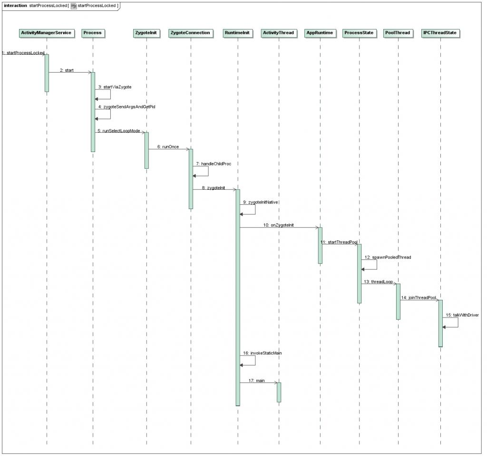
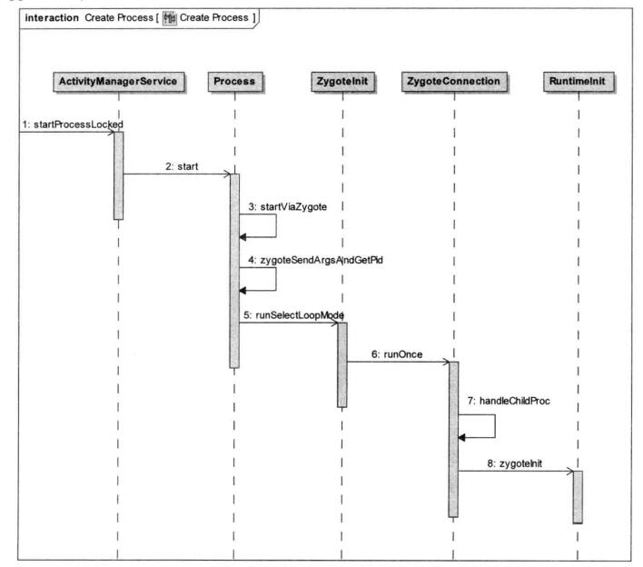
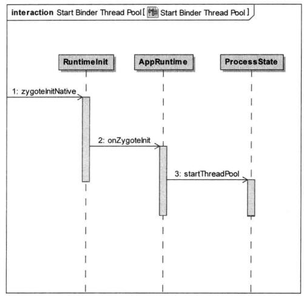
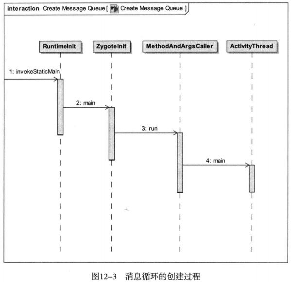

# Android应用程序进程(Process)启动过程

​		Android应用程序框架层创建的应用程序进程具有两个特点，一是进程的入口函数是ActivityThread.main，二是进程天然支持Binder进程间通信机制；这两个特点都是在进程的初始化过程中实现的，本文将详细分析Android应用程序进程创建过程中是如何实现这两个特点的。

​		Android应用程序框架层创建的应用程序进程的入口函数是ActivityThread.main比较好理解，即进程创建完成之后，Android应用程序框架层就会在这个进程中将ActivityThread类加载进来，然后执行它的main函数，这个main函数就是进程执行消息循环的地方了。Android应用程序框架层创建的应用程序进程天然支持Binder进程间通信机制这个特点应该怎么样理解呢？Android系统的Binder进程间通信机制，它具有四个组件，分别是驱动程序、守护进程、Client以及Server，其中Server组件在初始化时必须进入一个循环中不断地与Binder驱动程序进行到交互，以便获得Client组件发送的请求，但是，当我们在Android应用程序中实现Server组件的时候，我们并没有让进程进入一个循环中去等待Client组件的请求，然而，当Client组件得到这个Server组件的远程接口时，却可以顺利地和Server组件进行进程间通信，这就是因为Android应用程序进程在创建的时候就已经启动了一个线程池来支持Server组件和Binder驱动程序之间的交互了，这样，极大地方便了在Android应用程序中创建Server组件。

​		在Android应用程序框架层中，是由ActivityManagerService组件负责为Android应用程序创建新的进程的，它本来也是运行在一个独立的进程之中，不过这个进程是在系统启动的过程中创建的。ActivityManagerService组件一般会在什么情况下会为应用程序创建一个新的进程呢？当系统决定要在一个新的进程中启动一个Activity或者Service时，它就会创建一个新的进程了，然后在这个新的进程中启动这个Activity或者Service。
​		 ActivityManagerService启动新的进程是从其成员函数startProcessLocked开始的，在深入分析这个过程之前，我们先来看一下进程创建过程的序列图，然后再详细分析每一个步骤。



​		每当AMS需要创建一个新的应用进程来去启动一个应用层很程序组件时，它会调用AMS的startProcessLocked向Zygote进程发送一个创建应用程序进程的请求。

# 1、应用程序进程的创建过程



##  Step 1. ActivityManagerService.startProcessLocked

```java
//frameworks/base/services/java/com/android/server/am/ActivityManagerService.java
public final class ActivityManagerService extends ActivityManagerNative  
        implements Watchdog.Monitor, BatteryStatsImpl.BatteryCallback {  
    ......  
    private final void startProcessLocked(ProcessRecord app,  
                String hostingType, String hostingNameStr) {  
        ......  
        try {  
            int uid = app.info.uid;  
            int[] gids = null;  
            try {  
                gids = mContext.getPackageManager().getPackageGids(  
                    app.info.packageName);  
            } catch (PackageManager.NameNotFoundException e) {  
                ......  
            }   
            ......  
            int debugFlags = 0;  
            ......  
            int pid = Process.start("android.app.ActivityThread",  
                mSimpleProcessManagement ? app.processName : null, uid, uid,  
                gids, debugFlags, null);   
            ......  
          } catch (RuntimeException e) {    
            ......  
        }  
    }  
    ......  
}
```

 		它首先获取要创建应用进程的UID和用户组GID，接着调用了Process.start函数开始为应用程序创建新的进程，注意，它传入一个第一个参数为"android.app.ActivityThread"，这就是进程初始化时要加载的Java类了，把这个类加载到进程之后，就会把它里面的静态成员函数main作为进程的入口点，后面我们会看到。

##  Step 2. Process.start 

```java
//frameworks/base/core/java/android/os/Process.java
public class Process {
	......
	public static final ProcessStartResult start(final String processClass,
                                   final String niceName,
                                   int uid, int gid, int[] gids,
                                   int debugFlags, int mountExternal,
                                   int targetSdkVersion,
                                   String seInfo,
                                   String[] zygoteArgs)
	{
		try {
             return startViaZygote(processClass, niceName, uid, gid, gids,
                      debugFlags, mountExternal, targetSdkVersion, seInfo, zygoteArgs);
         } catch (ZygoteStartFailedEx ex) {
             Log.e(LOG_TAG,
                     "Starting VM process through Zygote failed");
             throw new RuntimeException(
                     "Starting VM process through Zygote failed", ex);
        }
}
```

## Step 3. Process.startViaZygote

```java
//frameworks/base/core/java/android/os/Process.java
public class Process {
	......
	private static ProcessStartResult startViaZygote(final String processClass,
                                   final String niceName,
                                   final int uid, final int gid,
                                   final int[] gids,
                                   int debugFlags, int mountExternal,
                                   int targetSdkVersion,
                                   String seInfo,
                                   String[] extraArgs)
                                   throws ZygoteStartFailedEx
		int pid;
 
		synchronized(Process.class) {
			ArrayList<String> argsForZygote = new ArrayList<String>();
 
			// --runtime-init, --setuid=, --setgid=,
			// and --setgroups= must go first
			argsForZygote.add("--runtime-init");
			argsForZygote.add("--setuid=" + uid);
			argsForZygote.add("--setgid=" + gid);
			if ((debugFlags & Zygote.DEBUG_ENABLE_SAFEMODE) != 0) {
				argsForZygote.add("--enable-safemode");
			}
			if ((debugFlags & Zygote.DEBUG_ENABLE_DEBUGGER) != 0) {
				argsForZygote.add("--enable-debugger");
			}
			if ((debugFlags & Zygote.DEBUG_ENABLE_CHECKJNI) != 0) {
				argsForZygote.add("--enable-checkjni");
			}
			if ((debugFlags & Zygote.DEBUG_ENABLE_ASSERT) != 0) {
				argsForZygote.add("--enable-assert");
			}
 
			//TODO optionally enable debuger
			//argsForZygote.add("--enable-debugger");
 
			// --setgroups is a comma-separated list
			if (gids != null && gids.length > 0) {
				StringBuilder sb = new StringBuilder();
				sb.append("--setgroups=");
 
				int sz = gids.length;
				for (int i = 0; i < sz; i++) {
					if (i != 0) {
						sb.append(',');
					}
					sb.append(gids[i]);
				}
 
				argsForZygote.add(sb.toString());
			}
			if (niceName != null) {
				argsForZygote.add("--nice-name=" + niceName);
			}
			argsForZygote.add(processClass);
 
			if (extraArgs != null) {
				for (String arg : extraArgs) {
					argsForZygote.add(arg);
				}
			}
            return zygoteSendArgsAndGetResult(argsForZygote);
		}
	}
	......
}
```

 		这个函数将创建进程的参数放到argsForZygote列表中去，然后调用zygoteSendArgsAndGetResult函数进一步操作。在启动参数中有一个重要参数"--runtime-init"，表示要在新创建的应用程序进程中初始化运行时库，以及启动binder线程池。

## Step 4. Process.zygoteSendArgsAndGetResult

```java
//frameworks/base/core/java/android/os/Process.java
public class Process {
	......
  /**
     * Sends an argument list to the zygote process, which starts a new child
     * and returns the child's pid. Please note: the present implementation
     * replaces newlines in the argument list with spaces.
     * @param args argument list
     * @return An object that describes the result of the attempt to start the process.
     * @throws ZygoteStartFailedEx if process start failed for any reason
     */
    private static ProcessStartResult zygoteSendArgsAndGetResult(ArrayList<String> args)
            throws ZygoteStartFailedEx {
        openZygoteSocketIfNeeded();

        try {
            // Throw early if any of the arguments are malformed. This means we can
            // avoid writing a partial response to the zygote.
            int sz = args.size();
            for (int i = 0; i < sz; i++) {
                if (args.get(i).indexOf('\n') >= 0) {
                    throw new ZygoteStartFailedEx("embedded newlines not allowed");
                }
            }

            /**
             * See com.android.internal.os.ZygoteInit.readArgumentList()
             * Presently the wire format to the zygote process is:
             * a) a count of arguments (argc, in essence)
             * b) a number of newline-separated argument strings equal to count
             *
             * After the zygote process reads these it will write the pid of
             * the child or -1 on failure, followed by boolean to
             * indicate whether a wrapper process was used.
             */

            sZygoteWriter.write(Integer.toString(args.size()));
            sZygoteWriter.newLine();

            for (int i = 0; i < sz; i++) {
                String arg = args.get(i);
                sZygoteWriter.write(arg);
                sZygoteWriter.newLine();
            }

            sZygoteWriter.flush();

            // Should there be a timeout on this?
            ProcessStartResult result = new ProcessStartResult();
            // Always read the entire result from the input stream to avoid leaving
            // bytes in the stream for future process starts to accidentally stumble
            // upon.
            result.pid = sZygoteInputStream.readInt();
            result.usingWrapper = sZygoteInputStream.readBoolean();

            if (result.pid < 0) {
                throw new ZygoteStartFailedEx("fork() failed");
            }
            return result;
        } catch (IOException ex) {
            try {
                if (sZygoteSocket != null) {
                    sZygoteSocket.close();
                }
            } catch (IOException ex2) {
                // we're going to fail anyway
                Log.e(LOG_TAG,"I/O exception on routine close", ex2);
            }

            sZygoteSocket = null;

            throw new ZygoteStartFailedEx(ex);
        }
    }
 
	......
}
```

​		首先调用静态成员函数openZygoteSocketIfNeeded来创建一个连接到Zygote进程的LocalSocket对象，接着创建应用进程的启动参数写入到这个LocalSocket中，以便可以将它们传递给Zygote进程。Zygote进程收到这些数据后就会创建一个新的应用进程，并且将这个新创建的进程的PID返回给AMS。

​	这里的sZygoteWriter是一个Socket写入流，是由openZygoteSocketIfNeeded函数打开的：

```java
	static boolean sPreviousZygoteOpenFailed;
	static LocalSocket sZygoteSocket;
	static BufferedWriter sZygoteWriter;
	static DataInputStream sZygoteInputStream;
	/**
     * Tries to open socket to Zygote process if not already open. If
     * already open, does nothing.  May block and retry.
     */
    private static void openZygoteSocketIfNeeded() 
            throws ZygoteStartFailedEx {

        int retryCount;

        if (sPreviousZygoteOpenFailed) {
            /*
             * If we've failed before, expect that we'll fail again and
             * don't pause for retries.
             */
            retryCount = 0;
        } else {
            retryCount = 10;            
        }

        /*
         * See bug #811181: Sometimes runtime can make it up before zygote.
         * Really, we'd like to do something better to avoid this condition,
         * but for now just wait a bit...
         */
        for (int retry = 0
                ; (sZygoteSocket == null) && (retry < (retryCount + 1))
                ; retry++ ) {

            if (retry > 0) {
                try {
                    Log.i("Zygote", "Zygote not up yet, sleeping...");
                    Thread.sleep(ZYGOTE_RETRY_MILLIS);
                } catch (InterruptedException ex) {
                    // should never happen
                }
            }

            try {
                sZygoteSocket = new LocalSocket();

                sZygoteSocket.connect(new LocalSocketAddress(ZYGOTE_SOCKET, 
                        LocalSocketAddress.Namespace.RESERVED));

                sZygoteInputStream
                        = new DataInputStream(sZygoteSocket.getInputStream());

                sZygoteWriter =
                    new BufferedWriter(
                            new OutputStreamWriter(
                                    sZygoteSocket.getOutputStream()),
                            256);

                Log.i("Zygote", "Process: zygote socket opened");

                sPreviousZygoteOpenFailed = false;
                break;
            } catch (IOException ex) {
                if (sZygoteSocket != null) {
                    try {
                        sZygoteSocket.close();
                    } catch (IOException ex2) {
                        Log.e(LOG_TAG,"I/O exception on close after exception",
                                ex2);
                    }
                }

                sZygoteSocket = null;
            }
        }

        if (sZygoteSocket == null) {
            sPreviousZygoteOpenFailed = true;
            throw new ZygoteStartFailedEx("connect failed");                 
        }
    }
```

​		Process类有一个类型为LocalSocket的静态成员变量sZygoteSocket，它是用来与Zygote进程中一个名为“zygote”的Socket建立连接的。Zygote进程在启动时，会在内部创建一个名为“zygote”的Socket，这个Socket是与设备文件/dev/socket/zygote绑定在一起的。

​		连接成功之后，首先获得LocalSocket对象sZygoteSocket的一个输入流，并且保存在Process类的静态变量sZygoteInputStream中，以便获得Zygote进程发送过来的通信数据；接着又获得LocalSocket对象sZygoteSocket的一个输入流，并且保存在Process类的静态变量sZygoteWriter中，以便可以向Zygote进程发送通信数据。

​		Zygote进程在启动完成之后，会在一个名为“zygote”的Socket上等待AMS向它发送新的应用程序进程的请求。因此，这一步执行完成之后，Zygote进程就会在ZygoteInit类的静态成员函数runSelectMode中接收一个创建新应用程序进程的请求。

##  Step 5. ZygoteInit.runSelectLoop

```java
//frameworks/base/core/java/com/android/internal/os/ZygoteInit.java
	/**
     * Runs the zygote process's select loop. Accepts new connections as
     * they happen, and reads commands from connections one spawn-request's
     * worth at a time.
     *
     * @throws MethodAndArgsCaller in a child process when a main() should
     * be executed.
     */
    private static void runSelectLoop() throws MethodAndArgsCaller {
        ArrayList<FileDescriptor> fds = new ArrayList<FileDescriptor>();
        ArrayList<ZygoteConnection> peers = new ArrayList<ZygoteConnection>();
        FileDescriptor[] fdArray = new FileDescriptor[4];

        fds.add(sServerSocket.getFileDescriptor());
        peers.add(null);

        int loopCount = GC_LOOP_COUNT;
        while (true) {
            int index;

            /*
             * Call gc() before we block in select().
             * It's work that has to be done anyway, and it's better
             * to avoid making every child do it.  It will also
             * madvise() any free memory as a side-effect.
             *
             * Don't call it every time, because walking the entire
             * heap is a lot of overhead to free a few hundred bytes.
             */
            if (loopCount <= 0) {
                gc();
                loopCount = GC_LOOP_COUNT;
            } else {
                loopCount--;
            }


            try {
                fdArray = fds.toArray(fdArray);
                index = selectReadable(fdArray);
            } catch (IOException ex) {
                throw new RuntimeException("Error in select()", ex);
            }

            if (index < 0) {
                throw new RuntimeException("Error in select()");
            } else if (index == 0) {
                ZygoteConnection newPeer = acceptCommandPeer();
                peers.add(newPeer);
                fds.add(newPeer.getFileDesciptor());
            } else {
                boolean done;
                done = peers.get(index).runOnce();

                if (done) {
                    peers.remove(index);
                    fds.remove(index);
                }
            }
        }
    }
```

​		当Step 4将数据通过Socket接口发送出去后，就会执行下面这个语句，调用ZygoteConnection类的成员函数runOnce来处理这个请求。

```java
done = peers.get(index).runOnce();
```

 		这里从peers.get(index)得到的是一个ZygoteConnection对象，表示一个Socket连接，因此，接下来就是调用ZygoteConnection.runOnce函数进一步处理了。

## Step 6. ZygoteConnection.runOnce

```java
//frameworks/base/core/java/com/android/internal/os/ZygoteConnection.java
	/**
     * Reads one start command from the command socket. If successful,
     * a child is forked and a {@link ZygoteInit.MethodAndArgsCaller}
     * exception is thrown in that child while in the parent process,
     * the method returns normally. On failure, the child is not
     * spawned and messages are printed to the log and stderr. Returns
     * a boolean status value indicating whether an end-of-file on the command
     * socket has been encountered.
     *
     * @return false if command socket should continue to be read from, or
     * true if an end-of-file has been encountered.
     * @throws ZygoteInit.MethodAndArgsCaller trampoline to invoke main()
     * method in child process
     */
    boolean runOnce() throws ZygoteInit.MethodAndArgsCaller {

        String args[];
        Arguments parsedArgs = null;
        FileDescriptor[] descriptors;

        try {
            args = readArgumentList();
            descriptors = mSocket.getAncillaryFileDescriptors();
        } catch (IOException ex) {
            Log.w(TAG, "IOException on command socket " + ex.getMessage());
            closeSocket();
            return true;
        }

        if (args == null) {
            // EOF reached.
            closeSocket();
            return true;
        }

        /** the stderr of the most recent request, if avail */
        PrintStream newStderr = null;

        if (descriptors != null && descriptors.length >= 3) {
            newStderr = new PrintStream(
                    new FileOutputStream(descriptors[2]));
        }

        int pid = -1;
        FileDescriptor childPipeFd = null;
        FileDescriptor serverPipeFd = null;

        try {
            parsedArgs = new Arguments(args);

            applyUidSecurityPolicy(parsedArgs, peer, peerSecurityContext);
            applyRlimitSecurityPolicy(parsedArgs, peer, peerSecurityContext);
            applyCapabilitiesSecurityPolicy(parsedArgs, peer, peerSecurityContext);
            applyInvokeWithSecurityPolicy(parsedArgs, peer, peerSecurityContext);
            applyseInfoSecurityPolicy(parsedArgs, peer, peerSecurityContext);

            applyDebuggerSystemProperty(parsedArgs);
            applyInvokeWithSystemProperty(parsedArgs);

            int[][] rlimits = null;

            if (parsedArgs.rlimits != null) {
                rlimits = parsedArgs.rlimits.toArray(intArray2d);
            }

            if (parsedArgs.runtimeInit && parsedArgs.invokeWith != null) {
                FileDescriptor[] pipeFds = Libcore.os.pipe();
                childPipeFd = pipeFds[1];
                serverPipeFd = pipeFds[0];
                ZygoteInit.setCloseOnExec(serverPipeFd, true);
            }

            pid = Zygote.forkAndSpecialize(parsedArgs.uid, parsedArgs.gid, parsedArgs.gids,
                    parsedArgs.debugFlags, rlimits, parsedArgs.mountExternal, parsedArgs.seInfo,
                    parsedArgs.niceName);
        } catch (IOException ex) {
            logAndPrintError(newStderr, "Exception creating pipe", ex);
        } catch (ErrnoException ex) {
            logAndPrintError(newStderr, "Exception creating pipe", ex);
        } catch (IllegalArgumentException ex) {
            logAndPrintError(newStderr, "Invalid zygote arguments", ex);
        } catch (ZygoteSecurityException ex) {
            logAndPrintError(newStderr,
                    "Zygote security policy prevents request: ", ex);
        }

        try {
            if (pid == 0) {
                // in child
                IoUtils.closeQuietly(serverPipeFd);
                serverPipeFd = null;
                handleChildProc(parsedArgs, descriptors, childPipeFd, newStderr);

                // should never get here, the child is expected to either
                // throw ZygoteInit.MethodAndArgsCaller or exec().
                return true;
            } else {
                // in parent...pid of < 0 means failure
                IoUtils.closeQuietly(childPipeFd);
                childPipeFd = null;
                return handleParentProc(pid, descriptors, serverPipeFd, parsedArgs);
            }
        } finally {
            IoUtils.closeQuietly(childPipeFd);
            IoUtils.closeQuietly(serverPipeFd);
        }
    }
```

​		首先调用成员函数readArgumentList来获得即将要创建的应用程序进程的启动参数，并保存在一个Arguments 对象parsedArgs中，接着调用Zygote类的静态成员函数forkAndSpecialize来创建这个应用进程。因此，真正创建进程的地方就是在这里了：

```java
pid = Zygote.forkAndSpecialize(parsedArgs.uid, parsedArgs.gid,	parsedArgs.gids, parsedArgs.debugFlags, rlimits);
```

forkAndSpecialize最终是通过函数fork在当前进程中创建一个子进程的，因此，当它返回值等于0时，表示在新创建的子进程中执行的，这时ZygoteConnection类就会调用handleChildProc来启动这个子进程。

## Step 7. ZygoteConnection.handleChildProc

```java
/**
     * Handles post-fork setup of child proc, closing sockets as appropriate,
     * reopen stdio as appropriate, and ultimately throwing MethodAndArgsCaller
     * if successful or returning if failed.
     *
     * @param parsedArgs non-null; zygote args
     * @param descriptors null-ok; new file descriptors for stdio if available.
     * @param pipeFd null-ok; pipe for communication back to Zygote.
     * @param newStderr null-ok; stream to use for stderr until stdio
     * is reopened.
     *
     * @throws ZygoteInit.MethodAndArgsCaller on success to
     * trampoline to code that invokes static main.
     */
    private void handleChildProc(Arguments parsedArgs,
            FileDescriptor[] descriptors, FileDescriptor pipeFd, PrintStream newStderr)
            throws ZygoteInit.MethodAndArgsCaller {

        closeSocket();
        ZygoteInit.closeServerSocket();

        if (descriptors != null) {
            try {
                ZygoteInit.reopenStdio(descriptors[0],
                        descriptors[1], descriptors[2]);

                for (FileDescriptor fd: descriptors) {
                    IoUtils.closeQuietly(fd);
                }
                newStderr = System.err;
            } catch (IOException ex) {
                Log.e(TAG, "Error reopening stdio", ex);
            }
        }

        if (parsedArgs.niceName != null) {
            Process.setArgV0(parsedArgs.niceName);
        }

        if (parsedArgs.runtimeInit) {
            if (parsedArgs.invokeWith != null) {
                WrapperInit.execApplication(parsedArgs.invokeWith,
                        parsedArgs.niceName, parsedArgs.targetSdkVersion,
                        pipeFd, parsedArgs.remainingArgs);
            } else {
                RuntimeInit.zygoteInit(parsedArgs.targetSdkVersion,
                        parsedArgs.remainingArgs);
            }
        } else {
            String className;
            try {
                className = parsedArgs.remainingArgs[0];
            } catch (ArrayIndexOutOfBoundsException ex) {
                logAndPrintError(newStderr,
                        "Missing required class name argument", null);
                return;
            }

            String[] mainArgs = new String[parsedArgs.remainingArgs.length - 1];
            System.arraycopy(parsedArgs.remainingArgs, 1,
                    mainArgs, 0, mainArgs.length);

            if (parsedArgs.invokeWith != null) {
                WrapperInit.execStandalone(parsedArgs.invokeWith,
                        parsedArgs.classpath, className, mainArgs);
            } else {
                ClassLoader cloader;
                if (parsedArgs.classpath != null) {
                    cloader = new PathClassLoader(parsedArgs.classpath,
                            ClassLoader.getSystemClassLoader());
                } else {
                    cloader = ClassLoader.getSystemClassLoader();
                }

                try {
                    ZygoteInit.invokeStaticMain(cloader, className, mainArgs);
                } catch (RuntimeException ex) {
                    logAndPrintError(newStderr, "Error starting.", ex);
                }
            }
        }
    }
```

​		由于在前面的Step 3中，指定了"--runtime-init"参数，表示要为新创建的进程初始化运行时库，因此，这里的parseArgs.runtimeInit值为true，于是就继续执行RuntimeInit.zygoteInit进一步处理了。

## Step 8. RuntimeInit.zygoteInit

```java
//frameworks/base/core/java/com/android/internal/os/RuntimeInit.java	
	/**
     * The main function called when started through the zygote process. This
     * could be unified with main(), if the native code in nativeFinishInit()
     * were rationalized with Zygote startup.<p>
     *
     * Current recognized args:
     * <ul>
     *   <li> <code> [--] &lt;start class name&gt;  &lt;args&gt;
     * </ul>
     *
     * @param targetSdkVersion target SDK version
     * @param argv arg strings
     */
    public static final void zygoteInit(int targetSdkVersion, String[] argv)
            throws ZygoteInit.MethodAndArgsCaller {
        if (DEBUG) Slog.d(TAG, "RuntimeInit: Starting application from zygote");

        redirectLogStreams();

        commonInit();
        nativeZygoteInit();

        applicationInit(targetSdkVersion, argv);
    }
```

​		这里有两个关键的函数调用，nativeZygoteInit 和 applicationInit函数调用，前者就是执行Binder驱动程序初始化的相关工作了(在新创建的应用进程中启动一个Binder线程池)，正是由于执行了这个工作，才使得进程中的Binder对象能够顺利地进行Binder进程间通信，而后一个函数调用，就是执行进程的入口函数，这里就是执行startClass类的main函数了，而这个startClass即是我们在Step 1中传进来的"android.app.ActivityThread"值，表示要执行android.app.ActivityThread类的main函数。

# 2、Binder线程池的启动过程

​		一个新的应用程序进程在创建完成之后，就会调用RuntimeInit的静态成员函数zygoteInitNative来启动一个Binder线程池，如图：



​		我们先来看一下nativeZygoteInit 函数的调用过程，然后再回到RuntimeInit.zygoteInit函数中来，看看它是如何调用android.app.ActivityThread类的main函数的。

## step 9. RuntimeInit.zygoteInitNative

```java
//frameworks/base/core/java/com/android/internal/os/RuntimeInit.java
private static final native void nativeZygoteInit();
```

```c++
static AndroidRuntime* gCurRuntime = NULL;
static void com_android_internal_os_RuntimeInit_nativeZygoteInit(JNIEnv* env, jobject clazz)
{
    gCurRuntime->onZygoteInit();
}
```

这里它调用了全局变量gCurRuntime的onZygoteInit函数，它的类型为AndroidRuntime，它是在AndroidRuntime类的构造函数中初始化的。

```c++
AndroidRuntime::AndroidRuntime() : mExitWithoutCleanup(false)
{
    SkGraphics::Init();
    // this sets our preference for 16bit images during decode
    // in case the src is opaque and 24bit
    SkImageDecoder::SetDeviceConfig(SkBitmap::kRGB_565_Config);
    // This cache is shared between browser native images, and java "purgeable"
    // bitmaps. This globalpool is for images that do not either use the java
    // heap, or are not backed by ashmem. See BitmapFactory.cpp for the key
    // java call site.
    SkImageRef_GlobalPool::SetRAMBudget(512 * 1024);
    // There is also a global font cache, but its budget is specified in code
    // see SkFontHost_android.cpp

    // Pre-allocate enough space to hold a fair number of options.
    mOptions.setCapacity(20);

    assert(gCurRuntime == NULL);        // one per process
    gCurRuntime = this;
}

AndroidRuntime* AndroidRuntime::getRuntime()
{
    return gCurRuntime;
}
```

​		那么这个AndroidRuntime类的构造函数又是什么时候被调用的呢？AndroidRuntime类的声明在frameworks/base/include/android_runtime/AndroidRuntime.h文件中，如果我们打开这个文件会看到，它是一个虚拟类，也就是我们不能直接创建一个AndroidRuntime对象，只能用一个AndroidRuntime类的指针来指向它的某一个子类，这个子类就是AppRuntime了。

​		Zygote进程在启动时，会在进程中创建一个AppRuntime对象，如Step 1.由于AppRuntime类继承了AndroidRuntime类，因此，在创建一个AppRuntime对象时，会导致AndroidRuntime类的构造函数被调用。在调用过程中，全局变量gCurRuntime就会被初始化，它指向的就是正在创建的AppRuntime对象。又由于每一个新创建的应用进程都复制了Zygote进程的地址空间，因此，在一个应用进程中，都会存在一个全局变量gCurRuntime。

```c++
//frameworks/base/cmds/app_process/app_main.cpp
int main(int argc, const char* const argv[])
{
	......
	AppRuntime runtime;
	......
}
```

而AppRuntime类继续了AndroidRuntime类

```c++
class AppRuntime : public AndroidRuntime
{
	......
};
```

​		因此，在前面的com_android_internal_os_RuntimeInit_zygoteInit函数，实际是执行了AppRuntime类的onZygoteInit函数。

## Step 10. AppRuntime.onZygoteInit

```c++
//frameworks/base/cmds/app_process/app_main.cpp	
	virtual void onZygoteInit()
    {
        // Re-enable tracing now that we're no longer in Zygote.
        atrace_set_tracing_enabled(true);

        sp<ProcessState> proc = ProcessState::self();
        ALOGV("App process: starting thread pool.\n");
        proc->startThreadPool();
    }
```

​		这里调用ProcessState::startThreadPool来启动一个Binder线程池，以便使得当前应用进程可以通过Binder进程间通信机制来和其他进程通信，这个线程池中的线程就是用来和Binder驱动程序进行交互的了。

##      Step 11. ProcessState.startThreadPool

```c++
//frameworks/native/libs/binder/ProcessState.cpp
void ProcessState::startThreadPool()
{
    AutoMutex _l(mLock);
    if (!mThreadPoolStarted) {
        mThreadPoolStarted = true;
        spawnPooledThread(true);
    }
}
```

​		ProcessState类有一个成员变量mThreadPoolStarted，它的初始值是false。在Android系统中，每一个支持Binder进程间通信机制的进程内部都有一个唯一的ProcessState对象。但这个ProcessState对象的成员函数startThreadPool第一次被调用时，他就会在当前进程中启动一个Binder线程池，并且将它的成员变量mThreadPoolStarted设置true，避免以后重复执行启动Binder线程池的操作。

​		当ProcessState对象的成员函数startThreadPool执行完成之后，新创建的应用进程就可以支持Binder进程间通信机制了。这意味着以后在应用进程中实现自己的Binder本地对象时，只需要将它启动并且注册到ServiceManager中就可以了，而不必关心它是如何通过BInder线程来接收进程间通信请求的。

​	ProcessState类是Binder进程间通信机制的一个基础组件，这里它调用spawnPooledThread函数进一步处理。

##  Step 12. ProcessState.spawnPooledThread

```c++
void ProcessState::spawnPooledThread(bool isMain)
{
    if (mThreadPoolStarted) {
        String8 name = makeBinderThreadName();
        ALOGV("Spawning new pooled thread, name=%s\n", name.string());
        sp<Thread> t = new PoolThread(isMain);
        t->run(name.string());
    }
}
```

这里它会创建一个PoolThread线程类，然后执行它的run函数，最终会执行PoolThread类的threadLoop函数。

## Step 13. PoolThread.threadLoop

```c++
class PoolThread : public Thread
{
public:
    PoolThread(bool isMain)
        : mIsMain(isMain)
    {
    }
    
protected:
    virtual bool threadLoop()
    {
        IPCThreadState::self()->joinThreadPool(mIsMain);
        return false;
    }
    
    const bool mIsMain;
};
```

​		这里它执行了IPCThreadState::joinThreadPool函数进一步处理。IPCThreadState也是Binder进程间通信机制的一个基础组件.

##  Step 14. IPCThreadState.joinThreadPool

```c++
//frameworks/native/libs/binder/IPCThreadState.cpp
void IPCThreadState::joinThreadPool(bool isMain)
{
    LOG_THREADPOOL("**** THREAD %p (PID %d) IS JOINING THE THREAD POOL\n", (void*)pthread_self(), getpid());

    mOut.writeInt32(isMain ? BC_ENTER_LOOPER : BC_REGISTER_LOOPER);
    
    // This thread may have been spawned by a thread that was in the background
    // scheduling group, so first we will make sure it is in the foreground
    // one to avoid performing an initial transaction in the background.
    set_sched_policy(mMyThreadId, SP_FOREGROUND);
        
    status_t result;
    do {
        processPendingDerefs();
        // now get the next command to be processed, waiting if necessary
        result = getAndExecuteCommand();

        if (result < NO_ERROR && result != TIMED_OUT && result != -ECONNREFUSED && result != -EBADF) {
            ALOGE("getAndExecuteCommand(fd=%d) returned unexpected error %d, aborting",
                  mProcess->mDriverFD, result);
            abort();
        }
        
        // Let this thread exit the thread pool if it is no longer
        // needed and it is not the main process thread.
        if(result == TIMED_OUT && !isMain) {
            break;
        }
    } while (result != -ECONNREFUSED && result != -EBADF);

    LOG_THREADPOOL("**** THREAD %p (PID %d) IS LEAVING THE THREAD POOL err=%p\n",
        (void*)pthread_self(), getpid(), (void*)result);
    
    mOut.writeInt32(BC_EXIT_LOOPER);
    talkWithDriver(false);
}
```

  这个函数首先告诉Binder驱动程序，这条线程要进入循环了：

```cpp
mOut.writeInt32(isMain ? BC_ENTER_LOOPER : BC_REGISTER_LOOPER);
```

 然后在中间的while循环中通过getAndExecuteCommand来获取指令，并执行。

```c++
status_t IPCThreadState::getAndExecuteCommand()
{
    status_t result;
    int32_t cmd;

    result = talkWithDriver();
    if (result >= NO_ERROR) {
        size_t IN = mIn.dataAvail();
        if (IN < sizeof(int32_t)) return result;
        cmd = mIn.readInt32();
        IF_LOG_COMMANDS() {
            alog << "Processing top-level Command: "
                 << getReturnString(cmd) << endl;
        }

        result = executeCommand(cmd);

        // After executing the command, ensure that the thread is returned to the
        // foreground cgroup before rejoining the pool.  The driver takes care of
        // restoring the priority, but doesn't do anything with cgroups so we
        // need to take care of that here in userspace.  Note that we do make
        // sure to go in the foreground after executing a transaction, but
        // there are other callbacks into user code that could have changed
        // our group so we want to make absolutely sure it is put back.
        set_sched_policy(mMyThreadId, SP_FOREGROUND);
    }

    return result;
}
```

通过talkWithDriver不断与Binder驱动程序进行交互，以便获得Client端的进程间调用：

```cpp
result = getAndExecuteCommand();
```

 获得了Client端的进程间调用后，就调用excuteCommand函数来处理这个请求：

```c++
result = executeCommand(cmd);
```

​		最后，joinThreadPool中，线程退出时，也会告诉Binder驱动程序，它退出了，这样Binder驱动程序就不会再在Client端的进程间调用分发给它了：

```c++
mOut.writeInt32(BC_EXIT_LOOPER);
talkWithDriver(false);
```
我们再来看看talkWithDriver函数的实现。

##   Step 15. talkWithDriver

```c++
status_t IPCThreadState::talkWithDriver(bool doReceive)
{
    if (mProcess->mDriverFD <= 0) {
        return -EBADF;
    }
    
    binder_write_read bwr;
    
    // Is the read buffer empty?
    const bool needRead = mIn.dataPosition() >= mIn.dataSize();
    
    // We don't want to write anything if we are still reading
    // from data left in the input buffer and the caller
    // has requested to read the next data.
    const size_t outAvail = (!doReceive || needRead) ? mOut.dataSize() : 0;
    
    bwr.write_size = outAvail;
    bwr.write_buffer = (long unsigned int)mOut.data();

    // This is what we'll read.
    if (doReceive && needRead) {
        bwr.read_size = mIn.dataCapacity();
        bwr.read_buffer = (long unsigned int)mIn.data();
    } else {
        bwr.read_size = 0;
        bwr.read_buffer = 0;
    }

    IF_LOG_COMMANDS() {
        TextOutput::Bundle _b(alog);
        if (outAvail != 0) {
            alog << "Sending commands to driver: " << indent;
            const void* cmds = (const void*)bwr.write_buffer;
            const void* end = ((const uint8_t*)cmds)+bwr.write_size;
            alog << HexDump(cmds, bwr.write_size) << endl;
            while (cmds < end) cmds = printCommand(alog, cmds);
            alog << dedent;
        }
        alog << "Size of receive buffer: " << bwr.read_size
            << ", needRead: " << needRead << ", doReceive: " << doReceive << endl;
    }
    
    // Return immediately if there is nothing to do.
    if ((bwr.write_size == 0) && (bwr.read_size == 0)) return NO_ERROR;

    bwr.write_consumed = 0;
    bwr.read_consumed = 0;
    status_t err;
    do {
        IF_LOG_COMMANDS() {
            alog << "About to read/write, write size = " << mOut.dataSize() << endl;
        }
#if defined(HAVE_ANDROID_OS)
        if (ioctl(mProcess->mDriverFD, BINDER_WRITE_READ, &bwr) >= 0)
            err = NO_ERROR;
        else
            err = -errno;
#else
        err = INVALID_OPERATION;
#endif
        if (mProcess->mDriverFD <= 0) {
            err = -EBADF;
        }
        IF_LOG_COMMANDS() {
            alog << "Finished read/write, write size = " << mOut.dataSize() << endl;
        }
    } while (err == -EINTR);

    IF_LOG_COMMANDS() {
        alog << "Our err: " << (void*)err << ", write consumed: "
            << bwr.write_consumed << " (of " << mOut.dataSize()
                        << "), read consumed: " << bwr.read_consumed << endl;
    }

    if (err >= NO_ERROR) {
        if (bwr.write_consumed > 0) {
            if (bwr.write_consumed < (ssize_t)mOut.dataSize())
                mOut.remove(0, bwr.write_consumed);
            else
                mOut.setDataSize(0);
        }
        if (bwr.read_consumed > 0) {
            mIn.setDataSize(bwr.read_consumed);
            mIn.setDataPosition(0);
        }
        IF_LOG_COMMANDS() {
            TextOutput::Bundle _b(alog);
            alog << "Remaining data size: " << mOut.dataSize() << endl;
            alog << "Received commands from driver: " << indent;
            const void* cmds = mIn.data();
            const void* end = mIn.data() + mIn.dataSize();
            alog << HexDump(cmds, mIn.dataSize()) << endl;
            while (cmds < end) cmds = printReturnCommand(alog, cmds);
            alog << dedent;
        }
        return NO_ERROR;
    }
    
    return err;
}
```

 这个函数的是通过ioctl文件操作函数来和Binder驱动程序交互的了：

```
ioctl(mProcess->mDriverFD, BINDER_WRITE_READ, &bwr)
```

​		有了这个线程池之后，我们在开发Android应用程序的时候，当我们要和其它进程中进行通信时，只要定义自己的Binder对象，然后把这个Binder对象的远程接口通过其它途径传给其它进程后，其它进程就可以通过这个Binder对象的远程接口来调用我们的应用程序进程的函数了，它不像我们在C++层实现Binder进程间通信机制的Server时，必须要手动调用IPCThreadState.joinThreadPool函数来进入一个无限循环中与Binder驱动程序交互以便获得Client端的请求，这样就实现了我们在文章开头处说的Android应用程序进程天然地支持Binder进程间通信机制。

​		细心的读者可能会发现，从Step 1到Step 9，都是在Android应用程序框架层运行的，而从Step 10到Step 15，都是在Android系统运行时库层运行的，这两个层次中的Binder进程间通信机制的接口一个是用Java来实现的，而别一个是用C++来实现的，这两者是如何协作的呢？这就是通过JNI层来实现的了。

# 3、消息循环的创建过程

​		回到Step 8中的RuntimeInit.zygoteInit函数中，在初始化完成Binder进程间通信机制的基础设施后，它接着就要进入进程的入口函数了。



## Step 16. RuntimeInit.invokeStaticMain

```java
//frameworks/base/core/java/com/android/internal/os/RuntimeInit.java 
private static void applicationInit(int targetSdkVersion, String[] argv)
            throws ZygoteInit.MethodAndArgsCaller {
        // If the application calls System.exit(), terminate the process
        // immediately without running any shutdown hooks.  It is not possible to
        // shutdown an Android application gracefully.  Among other things, the
        // Android runtime shutdown hooks close the Binder driver, which can cause
        // leftover running threads to crash before the process actually exits.
        nativeSetExitWithoutCleanup(true);

        // We want to be fairly aggressive about heap utilization, to avoid
        // holding on to a lot of memory that isn't needed.
        VMRuntime.getRuntime().setTargetHeapUtilization(0.75f);
        VMRuntime.getRuntime().setTargetSdkVersion(targetSdkVersion);

        final Arguments args;
        try {
            args = new Arguments(argv);
        } catch (IllegalArgumentException ex) {
            Slog.e(TAG, ex.getMessage());
            // let the process exit
            return;
        }

        // Remaining arguments are passed to the start class's static main
        invokeStaticMain(args.startClass, args.startArgs);
    }
```


```java
//frameworks/base/core/java/com/android/internal/os/RuntimeInit.java
	/**
     * Invokes a static "main(argv[]) method on class "className".
     * Converts various failing exceptions into RuntimeExceptions, with
     * the assumption that they will then cause the VM instance to exit.
     *
     * @param className Fully-qualified class name
     * @param argv Argument vector for main()
     */
    private static void invokeStaticMain(String className, String[] argv)
            throws ZygoteInit.MethodAndArgsCaller {
        Class<?> cl;

        try {
            cl = Class.forName(className);
        } catch (ClassNotFoundException ex) {
            throw new RuntimeException(
                    "Missing class when invoking static main " + className,
                    ex);
        }

        Method m;
        try {
            m = cl.getMethod("main", new Class[] { String[].class });
        } catch (NoSuchMethodException ex) {
            throw new RuntimeException(
                    "Missing static main on " + className, ex);
        } catch (SecurityException ex) {
            throw new RuntimeException(
                    "Problem getting static main on " + className, ex);
        }

        int modifiers = m.getModifiers();
        if (! (Modifier.isStatic(modifiers) && Modifier.isPublic(modifiers))) {
            throw new RuntimeException(
                    "Main method is not public and static on " + className);
        }

        /*
         * This throw gets caught in ZygoteInit.main(), which responds
         * by invoking the exception's run() method. This arrangement
         * clears up all the stack frames that were required in setting
         * up the process.
         */
        throw new ZygoteInit.MethodAndArgsCaller(m, argv);
    }
```

  前面我们说过，这里传进来的参数className字符串值为"android.app.ActivityThread"，它是通过AMS在请求Zygote进程创建一个新的应用进程时指定的。这里通过ClassLoader.loadClass函数将"android.app.ActivityThread"加载到当前应用程序进程中：

```java
cl = Class.forName(className);
```

 然后获得它的静态成员函数main：

```java
m = cl.getMethod("main", new Class[] { String[].class });
```

​		函数最后并没有直接调用这个静态成员函数main，而是通过抛出一个异常ZygoteInit.MethodAndArgsCaller，然后让ZygoteInit.main函数在捕获这个异常的时候再调用android.app.ActivityThread类的main函数。为什么要这样做呢？注释里面已经讲得很清楚了，它是为了清理堆栈的，这样就会让android.app.ActivityThread类的main函数觉得自己是进程的入口函数，而事实上，在执行android.app.ActivityThread类的main函数之前，已经做了大量的工作了。

​		新创建的应用进程复制了Zygote进程的地址空间，因此，当前新创建的应用进程的调用堆栈与Zygote进程的调用堆栈上一致的。Zygote进程最开始执行的是应用程序app_process的入口函数main，接着再调用ZygoteInit类的静态成员函数main，最后进入到ZygoteInit类的静态成员函数runSelectLoop来循环等待AMS发送过来的创建新应用程序进程的请求之后，它就会创建一个新的应用程序进程，并且让这个新的应用进程沿着ZygoteInit类的静态成员函数runSelectLoop一直执行到RuntimeInit类的静态成员函数invokeStaticMain。因此，当RuntimeInit类的静态成员函数invokeStaticMain抛出一个类型为MethodAndArgsCaller异常时，系统就会沿着这个调用完后找到一个合适的代码来捕获它。

​		我们看看ZygoteInit.main函数在捕获到这个异常的时候做了什么事：

```java
public class ZygoteInit {
	......
	public static void main(String argv[]) {
		try {
			......
		} catch (MethodAndArgsCaller caller) {
			caller.run();
		} catch (RuntimeException ex) {
			......
		}
	}
	......
}
```

​		它执行MethodAndArgsCaller的run函数：

```java
	/**
     * Helper exception class which holds a method and arguments and
     * can call them. This is used as part of a trampoline to get rid of
     * the initial process setup stack frames.
     */
    public static class MethodAndArgsCaller extends Exception
            implements Runnable {
        /** method to call */
        private final Method mMethod;

        /** argument array */
        private final String[] mArgs;

        public MethodAndArgsCaller(Method method, String[] args) {
            mMethod = method;
            mArgs = args;
        }
        
		public void run() {
            try {
                mMethod.invoke(null, new Object[] { mArgs });
            } catch (IllegalAccessException ex) {
                throw new RuntimeException(ex);
            } catch (InvocationTargetException ex) {
                Throwable cause = ex.getCause();
                if (cause instanceof RuntimeException) {
                    throw (RuntimeException) cause;
                } else if (cause instanceof Error) {
                    throw (Error) cause;
                }
                throw new RuntimeException(ex);
            }
        }
```

​		这里MethodAndArgsCaller的成员变量mMethod和mArgs都是在前面构造异常对象时传进来的，这里的mMethod就对应android.app.ActivityThread类的main函数，而mArgs对应了新创建的应用进程的启动参数。于是最后就通过下面语句执行这个函数：

```java
mMethod.invoke(null, new Object[] { mArgs });
```

这样，android.app.ActivityThread类的main函数就被执行了。因此，前面抛出一个类型为MethodAndArgsCaller异常的目的就是为了调用AcivityThread类的静态成员函数main。

​	前面提到，AMS请求Zygote进程创建应用进程的入口函数为AcivityThread类的静态成员函数main。但是由于新创建的应用进程一开始就需要在内部初始化运行时库，以及启动Binder线程池，因此，当ActivityThread类的静态成员函数main被调用时，新创建的应用进程实际上已经执行了相当多的代码。为了使得新创建的应用进程觉得它的入口函数就是ActivityThread类的静态成员函数main，系统就不可以在前面直接调用它，而是先抛出一个异常回到ZygoteInit类的静态成员函数main中，然后再间接调用它，这样就可以巧妙的利用Java语言的异常处理机制来清理它前面的调用堆栈了。

## Step 17. ActivityThread.main

```java
public static void main(String[] args) {
        SamplingProfilerIntegration.start();

        // CloseGuard defaults to true and can be quite spammy.  We
        // disable it here, but selectively enable it later (via
        // StrictMode) on debug builds, but using DropBox, not logs.
        CloseGuard.setEnabled(false);

        Environment.initForCurrentUser();

        // Set the reporter for event logging in libcore
        EventLogger.setReporter(new EventLoggingReporter());

        Security.addProvider(new AndroidKeyStoreProvider());

        Process.setArgV0("<pre-initialized>");

        Looper.prepareMainLooper();

        ActivityThread thread = new ActivityThread();
        thread.attach(false);

        if (sMainThreadHandler == null) {
            sMainThreadHandler = thread.getHandler();
        }

        AsyncTask.init();

        if (false) {
            Looper.myLooper().setMessageLogging(new
                    LogPrinter(Log.DEBUG, "ActivityThread"));
        }

        Looper.loop();

        throw new RuntimeException("Main thread loop unexpectedly exited");
    }
```

 		首先调用Looper类的静态成员函数prepareMainLooper在当前应用进程中创建一个消息循环，然后在当前应用进程中创建一个ActivityThread 实例：

```java
ActivityThread thread = new ActivityThread();
```

最后调用Looper类的静态成员函数loop进入前面创建的一个消息循环中。

```java
 Looper.loop();
```

​		这样，我们以后就可以在这个进程中启动Activity或者Service了。
至此，新创建的应用进程的消息循环就创建完了，整个应用进程的启动过程也完成了。从这里可以看出，在Android系统中，每一个应用进程启动完成之后，都会自动进入到一个消息循环中，这样运行在它里面的应用程序组件就可以方便的使用Android系统的消息处理机制来实现自己的业务逻辑。

# 4、总结

​		至此，Android应用程序进程启动过程的源代码就分析完成了，它除了指定新的进程的入口函数是ActivityThread的main函数之外，还为进程内的Binder对象提供了Binder进程间通信机制的基础设施，由此可见，Binder进程间通信机制在Android系统中是何等的重要，而且是无处不在