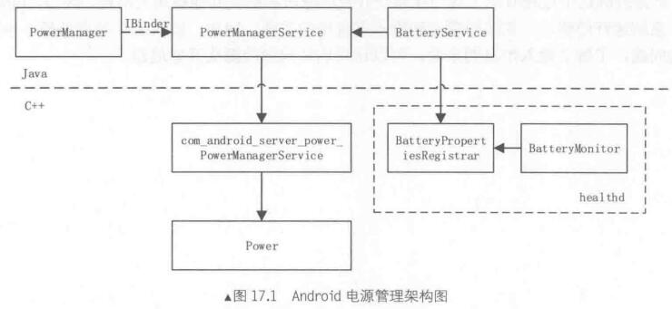

#                          Android电源管理

# 1.电源管理服务--PowerManagerService

​		PowerManagerService提供Android系统的电源管理服务，主要功能是控制系统的待机状态，控制显示屏的开关和亮度调节，以及查询和控制光线传感器和距离传感器等。



## 1.1 初始化过程

​		PowerManagerService是在SystemServer中创建并加入到ServiceManager中的：

```java
Slog.i(TAG, "Power Manager");
power = new PowerManagerService();
ServiceManager.addService(Context.POWER_SERVICE, power);
```

​		PowerManagerService的构造方法：

```java
public PowerManagerService() {
	synchronized (mLock) {
		mWakeLockSuspendBlocker = createSuspendBlockerLocked("PowerManagerService.WakeLocks");
		mDisplaySuspendBlocker = createSuspendBlockerLocked("PowerManagerService.Display");
        mDisplaySuspendBlocker.acquire();
        mHoldingDisplaySuspendBlocker = true;

        mScreenOnBlocker = new ScreenOnBlockerImpl();
        mDisplayBlanker = new DisplayBlankerImpl();
        mWakefulness = WAKEFULNESS_AWAKE; //设置PMS的状态
    }

    nativeInit();
    nativeSetPowerState(true, true);
}
```

​		PowerManagerService的构造方法首先创建了mWakeLockSuspendBlocker、mDisplaySuspendBlocker对象。变量mWakefulness被设置成WAKEFULNESS_AWAKE，它表示PMS的状态，一共有4种定义。

- private static final int WAKEFULNESS_ASLEEP = 0; 表示系统目前处于休眠状态，只能被wakeUp()调用唤醒。屏幕应该处于关闭状态或正在由显示控制器关闭的过程中。

- private static final int WAKEFULNESS_AWAKE = 1; 表示系统处于正常运行状态，可以通过 goToSleep()使其进入睡眠。当用户活动超时到期时，设备可能会开始小睡或进入睡眠状态。

- private static final int WAKEFULNESS_NAPPING = 2; 系统正在"小睡"。它正在决定是播放屏保还是要睡眠，但还没有确定。可以通过调用wakeUp()来唤醒它，从而结束小睡。 用户活动可能会使屏幕变亮，但不会结束nap。

- private static final int WAKEFULNESS_DREAMING = 3; 设备正在播放屏保状态。可以通过调用akeUp()来唤醒它，结束播放屏保。 播放屏保结束或拔下电源时，调用goToSleep()，设备进入睡眠状态。 用户活动可能会使屏幕变亮，但并不能结束屏保状态。

然后调用nativeInit：

```java
private native void nativeInit();
```

它在native层的实现：

```c++
static void nativeInit(JNIEnv* env, jobject obj) {
    gPowerManagerServiceObj = env->NewGlobalRef(obj);

    status_t err = hw_get_module(POWER_HARDWARE_MODULE_ID,
            (hw_module_t const**)&gPowerModule);
    if (!err) {
        gPowerModule->init(gPowerModule);
    } else {
        ALOGE("Couldn't load %s module (%s)", POWER_HARDWARE_MODULE_ID, strerror(-err));
    }
}
```

​		nativeInit主要工作是装载“Power”模块，然后调用了模块的初始化函数init。

然后在SystemServer创建PMS后，还会调用它的init方法。

```java
// only initialize the power service after we have started the
// lights service, content providers and the battery service.
power.init(context, lights, ActivityManagerService.self(), battery, 		
	BatteryStatsService.getService(), ActivityManagerService.self().getAppOpsService(), 	display);
```

init创建了处理消息的线程和发送消息的PowerManagerHandler对象。

```java
 /**
     * Initialize the power manager.
     * Must be called before any other functions within the power manager are called.
     */
    public void init(Context context, LightsService ls,
            ActivityManagerService am, BatteryService bs, IBatteryStats bss,
            IAppOpsService appOps, DisplayManagerService dm) {
        mContext = context;
        mLightsService = ls;
        mBatteryService = bs;
        mBatteryStats = bss;
        mAppOps = appOps;
        mDisplayManagerService = dm;
        mHandlerThread = new HandlerThread(TAG);
        mHandlerThread.start();
        mHandler = new PowerManagerHandler(mHandlerThread.getLooper());

        Watchdog.getInstance().addMonitor(this);
        Watchdog.getInstance().addThread(mHandler, mHandlerThread.getName());

        // Forcibly turn the screen on at boot so that it is in a known power state.
        // We do this in init() rather than in the constructor because setting the
        // screen state requires a call into surface flinger which then needs to call back
        // into the activity manager to check permissions.  Unfortunately the
        // activity manager is not running when the constructor is called, so we
        // have to defer setting the screen state until this point.
        mDisplayBlanker.unblankAllDisplays();
    }
```

​		SystemServer然后调用PMS的systemReady方法，相当于在系统准备就绪后对PMS再进行一些初始化工作。

## 1.2 系统准备工作--systemReady

```java
try {
	power.systemReady(twilight, dreamy);
} catch (Throwable e) {
	reportWtf("making Power Manager Service ready", e);
}
```

```java
public void systemReady(TwilightService twilight, DreamManagerService dreamManager) {
        synchronized (mLock) {
            mSystemReady = true;
            mDreamManager = dreamManager;
			//获取缺省、最大、最小屏幕亮度
            PowerManager pm = (PowerManager)mContext.getSystemService(Context.POWER_SERVICE);
            mScreenBrightnessSettingMinimum = pm.getMinimumScreenBrightnessSetting();
            mScreenBrightnessSettingMaximum = pm.getMaximumScreenBrightnessSetting();
            mScreenBrightnessSettingDefault = pm.getDefaultScreenBrightnessSetting();

            mhisys.adjustDevState("/proc/inputblock/status","0");
			//创建SensorManager对象，用于和SensorService交互
            SensorManager sensorManager = new SystemSensorManager(mContext, mHandler.getLooper());

            // The notifier runs on the system server's main looper so as not to interfere
            // with the animations and other critical functions of the power manager.
            mNotifier = new Notifier(Looper.getMainLooper(), mContext, mBatteryStats,
                    mAppOps, createSuspendBlockerLocked("PowerManagerService.Broadcasts"),
                    mScreenOnBlocker, mPolicy);

            // The display power controller runs on the power manager service's
            // own handler thread to ensure timely operation.
            mDisplayPowerController = new DisplayPowerController(mHandler.getLooper(),
                    mContext, mNotifier, mLightsService, twilight, sensorManager,
                    mDisplayManagerService, mDisplaySuspendBlocker, mDisplayBlanker,
                    mDisplayPowerControllerCallbacks, mHandler);
			//创建检测无线充电对象WirelessChargerDetector
            mWirelessChargerDetector = new WirelessChargerDetector(sensorManager,
                    createSuspendBlockerLocked("PowerManagerService.WirelessChargerDetector"),
                    mHandler);
            //创建监听系统设置项变化的对象
            mSettingsObserver = new SettingsObserver(mHandler);
            mAttentionLight = mLightsService.getLight(LightsService.LIGHT_ID_ATTENTION);

            // Register for broadcasts from other components of the system.
            IntentFilter filter = new IntentFilter();
            filter.addAction(Intent.ACTION_BATTERY_CHANGED);
            mContext.registerReceiver(new BatteryReceiver(), filter, null, mHandler);

            filter = new IntentFilter();
            filter.addAction(Intent.ACTION_BOOT_COMPLETED);
            mContext.registerReceiver(new BootCompletedReceiver(), filter, null, mHandler);

            filter = new IntentFilter();
            filter.addAction(Intent.ACTION_DREAMING_STARTED);
            filter.addAction(Intent.ACTION_DREAMING_STOPPED);
            mContext.registerReceiver(new DreamReceiver(), filter, null, mHandler);

            filter = new IntentFilter();
            filter.addAction(Intent.ACTION_USER_SWITCHED);
            mContext.registerReceiver(new UserSwitchedReceiver(), filter, null, mHandler);

            filter = new IntentFilter();
            filter.addAction(Intent.ACTION_DOCK_EVENT);
            mContext.registerReceiver(new DockReceiver(), filter, null, mHandler);

            // Register for settings changes.
            final ContentResolver resolver = mContext.getContentResolver();
            resolver.registerContentObserver(Settings.Secure.getUriFor(
                    Settings.Secure.SCREENSAVER_ENABLED),
                    false, mSettingsObserver, UserHandle.USER_ALL);
            resolver.registerContentObserver(Settings.Secure.getUriFor(
                    Settings.Secure.SCREENSAVER_ACTIVATE_ON_SLEEP),
                    false, mSettingsObserver, UserHandle.USER_ALL);
            resolver.registerContentObserver(Settings.Secure.getUriFor(
                    Settings.Secure.SCREENSAVER_ACTIVATE_ON_DOCK),
                    false, mSettingsObserver, UserHandle.USER_ALL);
            resolver.registerContentObserver(Settings.System.getUriFor(
                    Settings.System.SCREEN_OFF_TIMEOUT),
                    false, mSettingsObserver, UserHandle.USER_ALL);
            resolver.registerContentObserver(Settings.Global.getUriFor(
                    Settings.Global.STAY_ON_WHILE_PLUGGED_IN),
                    false, mSettingsObserver, UserHandle.USER_ALL);
            resolver.registerContentObserver(Settings.System.getUriFor(
                    Settings.System.SCREEN_BRIGHTNESS),
                    false, mSettingsObserver, UserHandle.USER_ALL);
            resolver.registerContentObserver(Settings.System.getUriFor(
                    Settings.System.SCREEN_BRIGHTNESS_MODE),
                    false, mSettingsObserver, UserHandle.USER_ALL);

            // Go.
            readConfigurationLocked();
            updateSettingsLocked();
            mDirty |= DIRTY_BATTERY_STATE;
            updatePowerStateLocked();
            //HISILICON add begin
            //framework add doInitSh()
            new DelayTask().start();
            //HISILICON add end
        }
    }
```

​		创建SystemSensorManager对象，用于和SensorService交互。SensorService是一个native的Service，也存在于SystemServer进程中，它管理着Android上各种传感设备。创建Notifer对象，用于广播系统中和power相关的变化，如屏幕的关闭和打开等。创建WirelessChargerDetector用于无线充电检测的传感器。注册Observer监听系统设置的变化。在Android设置模块中，很多设置项都和PMS有关，如屏幕亮度、自动关闭屏幕时间、能否启动屏保等。监听其它模块广播的Intent。PMS需要关注系统的变化，这里注册很多系统广播接收器。如系统启动完成、屏保启动和关闭、用户切换、Dock插拔等。

## 1.3 报告用户活动--userActivity

​		PowerManager是PowerManagerService的代理类，它提供了一些让用户进程可以和PMS交互，下面来分析这些接口的实现来进一步了解PMS的工作。

​	接口userActivity用于用户进程向PMS报告用户影响系统休眠的活动，例如：用户点击屏幕时，系统会调用该方法来告诉PMS用户点击的时间，这样PMS将更新内部保存的时间值，从而推迟系统休眠的时间。

```java
//frameworks/base/core/java/android/os/PowerManager.java
	/**
     * Notifies the power manager that user activity happened.
     * <p>
     * Resets the auto-off timer and brightens the screen if the device
     * is not asleep.  This is what happens normally when a key or the touch
     * screen is pressed or when some other user activity occurs.
     * This method does not wake up the device if it has been put to sleep.
     * </p><p>
     * Requires the {@link android.Manifest.permission#DEVICE_POWER} permission.
     * </p>
     *
     * @param when The time of the user activity, in the {@link SystemClock#uptimeMillis()}
     * time base.  This timestamp is used to correctly order the user activity request with
     * other power management functions.  It should be set
     * to the timestamp of the input event that caused the user activity.
     * @param noChangeLights If true, does not cause the keyboard backlight to turn on
     * because of this event.  This is set when the power key is pressed.
     * We want the device to stay on while the button is down, but we're about
     * to turn off the screen so we don't want the keyboard backlight to turn on again.
     * Otherwise the lights flash on and then off and it looks weird.
     *
     * @see #wakeUp
     * @see #goToSleep
     */
public void userActivity(long when, boolean noChangeLights) {
	try {
		mService.userActivity(when, USER_ACTIVITY_EVENT_OTHER,
                    noChangeLights ? USER_ACTIVITY_FLAG_NO_CHANGE_LIGHTS : 0);
	} catch (RemoteException e) {
	}
}
```

​		mService通过Binder连接PMS中的userActivity，再来看PMS中userActivity的实现：

```java
//frameworks/base/services/java/com/android/server/power/PowerManagerService.java
	@Override // Binder call
    public void userActivity(long eventTime, int event, int flags) {
        final long now = SystemClock.uptimeMillis();
        if (mContext.checkCallingOrSelfPermission(android.Manifest.permission.DEVICE_POWER)
                != PackageManager.PERMISSION_GRANTED) {
            // Once upon a time applications could call userActivity().
            // Now we require the DEVICE_POWER permission.  Log a warning and ignore the
            // request instead of throwing a SecurityException so we don't break old apps.
            synchronized (mLock) {
                if (now >= mLastWarningAboutUserActivityPermission + (5 * 60 * 1000)) {
                    mLastWarningAboutUserActivityPermission = now;
                    Slog.w(TAG, "Ignoring call to PowerManager.userActivity() because the "
                            + "caller does not have DEVICE_POWER permission.  "
                            + "Please fix your app!  "
                            + " pid=" + Binder.getCallingPid()
                            + " uid=" + Binder.getCallingUid());
                }
            }
            return;
        }

        if (eventTime > SystemClock.uptimeMillis()) {
            throw new IllegalArgumentException("event time must not be in the future");
        }

        final int uid = Binder.getCallingUid();
        final long ident = Binder.clearCallingIdentity();
        try {
            userActivityInternal(eventTime, event, flags, uid);
        } finally {
            Binder.restoreCallingIdentity(ident);
        }
    }
```

​		userActivity首先检查调用者的Permission等，然后通过调用内部的userActivityInternal来完成工作：

```java
private void userActivityInternal(long eventTime, int event, int flags, int uid) {
        synchronized (mLock) {
            if (userActivityNoUpdateLocked(eventTime, event, flags, uid)) {
                updatePowerStateLocked();
            }
        }
    }
```

​		userActivityInternal先调用userActivityNoUpdateLocked，然后再调用updatePowerStateLocked。userActivityNoUpdateLocked只是把参数保存到内部变量，并不采取任何动作，而PMS中核心方法是updatePowerStateLocked。

```java
private boolean userActivityNoUpdateLocked(long eventTime, int event, int flags, int uid) {
        if (DEBUG_SPEW) {
            Slog.d(TAG, "userActivityNoUpdateLocked: eventTime=" + eventTime
                    + ", event=" + event + ", flags=0x" + Integer.toHexString(flags)
                    + ", uid=" + uid);
        }

        if (eventTime < mLastSleepTime || eventTime < mLastWakeTime
                || mWakefulness == WAKEFULNESS_ASLEEP || !mBootCompleted || !mSystemReady) {
            return false;
        }

        mNotifier.onUserActivity(event, uid); //发出通知

        if ((flags & PowerManager.USER_ACTIVITY_FLAG_NO_CHANGE_LIGHTS) != 0) {
            if (eventTime > mLastUserActivityTimeNoChangeLights
                    && eventTime > mLastUserActivityTime) {
                mLastUserActivityTimeNoChangeLights = eventTime;
                mDirty |= DIRTY_USER_ACTIVITY;
                return true;
            }
        } else {
            if (eventTime > mLastUserActivityTime) {
                mLastUserActivityTime = eventTime;
                mDirty |= DIRTY_USER_ACTIVITY;
                return true;
            }
        }
        return false;
    }
```

​		userActivityNoUpdateLocked主要工作是更新几个内部变量。其中mLastUserActivityTime和mLastUserActivityTimeNoChangeLights用来记录调用userActivity的时间，mDirty表示指示电源状态的哪些部分已更改且需要重新计算的位域，用来记录用户的操作类型，这些变量在updatePow中将会作为示范执行睡眠或唤醒操作的依据。

## 1.4 强制系统进入休眠模式--gotoSleep接口

​		gotoSleep用来强制系统进入休眠模式。通常当系统一段时间无人操作后，系统将调用gotoSleep来进入休眠模式。其PowerManager中接口：

```java
 /**
     * Forces the device to go to sleep.
     * <p>
     * Overrides all the wake locks that are held.
     * This is what happens when the power key is pressed to turn off the screen.
     * </p><p>
     * Requires the {@link android.Manifest.permission#DEVICE_POWER} permission.
     * </p>
     *
     * @param time The time when the request to go to sleep was issued, in the
     * {@link SystemClock#uptimeMillis()} time base.  This timestamp is used to correctly
     * order the go to sleep request with other power management functions.  It should be set
     * to the timestamp of the input event that caused the request to go to sleep.
     *
     * @see #userActivity
     * @see #wakeUp
     */
    public void goToSleep(long time) {
        try {
            mService.goToSleep(time, GO_TO_SLEEP_REASON_USER);
        } catch (RemoteException e) {
        }
    }
```

然后调用到PMS中的goToSleep:

```java
 @Override // Binder call
    public void goToSleep(long eventTime, int reason) {
        String onoff = SystemProperties.get("persist.suspend.onoff","on");
        if (!"on".equals(onoff) || "off".equals(onoff))
            return ;

        if (eventTime > SystemClock.uptimeMillis()) {
            throw new IllegalArgumentException("event time must not be in the future");
        }

        mContext.enforceCallingOrSelfPermission(android.Manifest.permission.DEVICE_POWER, null);

        final long ident = Binder.clearCallingIdentity();
        try {
            goToSleepInternal(eventTime, reason);
        } finally {
            Binder.restoreCallingIdentity(ident);
        }
    }
```

PMS的gotoSleep主要是调用内部方法gotoSleepInternal来完成其功能:

```java
private void goToSleepInternal(long eventTime, int reason) {
        mhisys.adjustDevState("/proc/inputblock/status","1");
        mDisplay.setHDMIClose();
        mDisplay.setOutputEnable(1,0);

        String suspendType = SystemProperties.get("persist.suspend.mode", "deep_restart");
        if (suspendType.equals("deep_launcher")) {
            Slog.i(TAG, "goToSleepInternal deep_launcher start");
            Intent home = new Intent(Intent.ACTION_MAIN);
            home.setFlags(Intent.FLAG_ACTIVITY_NEW_TASK);
            home.addCategory(Intent.CATEGORY_HOME);
            mContext.startActivity(home);
            SystemClock.sleep(1000);
            Slog.i(TAG, "goToSleepInternal deep_launcher end");
        }
        synchronized (mLock) {
		    /* patch  hisi  support smart_suspend
            if (suspendType.equals("smart_suspend")) {
                mNotifier.onSmartSuspendStart();
            } else*/ 
			if (goToSleepNoUpdateLocked(eventTime, reason)) {
                updatePowerStateLocked();
            }
        }
    }
```

​		goToSleepInternal结构与userActivity类似，都是先调用另一个内部方法，然后再调用updatePowerStateLocked。先看goToSleepNoUpdateLocked：

```java
@SuppressWarnings("deprecation")
private boolean goToSleepNoUpdateLocked(long eventTime, int reason) {
        if (DEBUG_SPEW) {
            Slog.d(TAG, "goToSleepNoUpdateLocked: eventTime=" + eventTime + ", reason=" + reason);
        }
        if (eventTime < mLastWakeTime || mWakefulness == WAKEFULNESS_ASLEEP
                || !mBootCompleted || !mSystemReady) {
            return false;
        }

        switch (reason) {
            case PowerManager.GO_TO_SLEEP_REASON_DEVICE_ADMIN:
                Slog.i(TAG, "Going to sleep due to device administration policy...");
                break;
            case PowerManager.GO_TO_SLEEP_REASON_TIMEOUT:
                Slog.i(TAG, "Going to sleep due to screen timeout...");
                //break;
                //return false;
                if (!mTimeoutShow) {
                    mPowerTime = eventTime;
                    showSuspendDialog();
                } else {
                    Slog.i(TAG, "suspending...");
                }
                return false;
                //break;
            default:
                Slog.i(TAG, "Going to sleep by user request...");
                reason = PowerManager.GO_TO_SLEEP_REASON_USER;
                break;
        }

        sendPendingNotificationsLocked();
        mNotifier.onGoToSleepStarted(reason);
        mSendGoToSleepFinishedNotificationWhenReady = true;

        mLastSleepTime = eventTime;
        mDirty |= DIRTY_WAKEFULNESS;
        mWakefulness = WAKEFULNESS_ASLEEP;

        // Report the number of wake locks that will be cleared by going to sleep.
        int numWakeLocksCleared = 0;
        final int numWakeLocks = mWakeLocks.size();
        for (int i = 0; i < numWakeLocks; i++) {
            final WakeLock wakeLock = mWakeLocks.get(i);
            switch (wakeLock.mFlags & PowerManager.WAKE_LOCK_LEVEL_MASK) {
                case PowerManager.FULL_WAKE_LOCK:
                case PowerManager.SCREEN_BRIGHT_WAKE_LOCK:
                case PowerManager.SCREEN_DIM_WAKE_LOCK:
                    numWakeLocksCleared += 1;
                    break;
            }
        }
        EventLog.writeEvent(EventLogTags.POWER_SLEEP_REQUESTED, numWakeLocksCleared);
        return true;
    }
```

​		goToSleepNoUpdateLocked只是发送了将要休眠的通知，然后修改成员变量mDirty、mLastSleepTime、mWakefulness。更多的工作还是在updatePowerStateLocked中完成。

# 2 控制系统休眠的机制

​		Android的休眠和唤醒主要是基于WakeLock机制。WakeLock是一种上锁机制，只要有进程得了WakeLock锁，系统就不会进入休眠。例如：在下载文件或播放歌曲时，即使睡眠时间到了系统也不会进行休眠。WakeLock可以设置超时，超时到了会自动解锁。

​		应用在使用WakeLock功能前，需要先使用newWakeLock()接口创建一个WakeLock类的对象，然后通过它的acquire()方法禁止系统休眠，应用完成工作后应该调用release()方法来恢复休眠机制，否则系统将无法休眠，直到耗光电量。

PowerManager中的接口实现：

```java
public void acquire() {
            synchronized (mToken) {
                acquireLocked();
            }
        }

        /**
         * Acquires the wake lock with a timeout.
         * <p>
         * Ensures that the device is on at the level requested when
         * the wake lock was created.  The lock will be released after the given timeout
         * expires.
         * </p>
         *
         * @param timeout The timeout after which to release the wake lock, in milliseconds.
         */
        public void acquire(long timeout) {
            synchronized (mToken) {
                acquireLocked();
                mHandler.postDelayed(mReleaser, timeout);
            }
        }

        private void acquireLocked() {
            if (!mRefCounted || mCount++ == 0) {
                // Do this even if the wake lock is already thought to be held (mHeld == true)
                // because non-reference counted wake locks are not always properly released.
                // For example, the keyguard's wake lock might be forcibly released by the
                // power manager without the keyguard knowing.  A subsequent call to acquire
                // should immediately acquire the wake lock once again despite never having
                // been explicitly released by the keyguard.
                mHandler.removeCallbacks(mReleaser);
                try {
                    mService.acquireWakeLock(mToken, mFlags, mTag, mPackageName, mWorkSource);
                } catch (RemoteException e) {
                }
                mHeld = true;
            }
        }
/**
         * Releases the wake lock.
         * <p>
         * This method releases your claim to the CPU or screen being on.
         * The screen may turn off shortly after you release the wake lock, or it may
         * not if there are other wake locks still held.
         * </p>
         */
        public void release() {
            release(0);
        }

        /**
         * Releases the wake lock with flags to modify the release behavior.
         * <p>
         * This method releases your claim to the CPU or screen being on.
         * The screen may turn off shortly after you release the wake lock, or it may
         * not if there are other wake locks still held.
         * </p>
         *
         * @param flags Combination of flag values to modify the release behavior.
         * Currently only {@link #WAIT_FOR_PROXIMITY_NEGATIVE} is supported.
         *
         * {@hide}
         */
        public void release(int flags) {
            synchronized (mToken) {
                if (!mRefCounted || --mCount == 0) {
                    mHandler.removeCallbacks(mReleaser);
                    if (mHeld) {
                        try {
                            mService.releaseWakeLock(mToken, flags);
                        } catch (RemoteException e) {
                        }
                        mHeld = false;
                    }
                }
                if (mCount < 0) {
                    throw new RuntimeException("WakeLock under-locked " + mTag);
                }
            }
        }
```

## 2.1 PMS中WakeLock相关接口	

WakeLock类中实现了acquire()和release()方法实际上是调用PMS的acquireWakeLock()和releaseWakeLock()方法。

```java
 @Override // Binder call
    public void acquireWakeLock(IBinder lock, int flags, String tag, String packageName,
            WorkSource ws) {
        if (lock == null) {
            throw new IllegalArgumentException("lock must not be null");
        }
        if (packageName == null) {
            throw new IllegalArgumentException("packageName must not be null");
        }
        PowerManager.validateWakeLockParameters(flags, tag);

        mContext.enforceCallingOrSelfPermission(android.Manifest.permission.WAKE_LOCK, null);
        if (ws != null && ws.size() != 0) {
            mContext.enforceCallingOrSelfPermission(
                    android.Manifest.permission.UPDATE_DEVICE_STATS, null);
        } else {
            ws = null;
        }

        final int uid = Binder.getCallingUid();
        final int pid = Binder.getCallingPid();
        final long ident = Binder.clearCallingIdentity();
        try {
            acquireWakeLockInternal(lock, flags, tag, packageName, ws, uid, pid);
        } finally {
            Binder.restoreCallingIdentity(ident);
        }
    }
```

​		acquireWakeLock接口检查完权限后，调用了其内部的acquireWakeLockInternal方法：

```java
private void acquireWakeLockInternal(IBinder lock, int flags, String tag, String packageName,
            WorkSource ws, int uid, int pid) {
        synchronized (mLock) {
            if (DEBUG_SPEW) {
                Slog.d(TAG, "acquireWakeLockInternal: lock=" + Objects.hashCode(lock)
                        + ", flags=0x" + Integer.toHexString(flags)
                        + ", tag=\"" + tag + "\", ws=" + ws + ", uid=" + uid + ", pid=" + pid);
            }

            WakeLock wakeLock;
            int index = findWakeLockIndexLocked(lock);  //检查这个lock是否已经存在
            if (index >= 0) {  //lock已经存在
                wakeLock = mWakeLocks.get(index);
                if (!wakeLock.hasSameProperties(flags, tag, ws, uid, pid)) {
                    // Update existing wake lock.  This shouldn't happen but is harmless.
                    notifyWakeLockReleasedLocked(wakeLock);
                    wakeLock.updateProperties(flags, tag, packageName, ws, uid, pid);
                    notifyWakeLockAcquiredLocked(wakeLock);
                }
            } else { //不存在，则创建新的WakeLock对象
                wakeLock = new WakeLock(lock, flags, tag, packageName, ws, uid, pid);
                try {
                    lock.linkToDeath(wakeLock, 0);
                } catch (RemoteException ex) {
                    throw new IllegalArgumentException("Wake lock is already dead.");
                }
                notifyWakeLockAcquiredLocked(wakeLock);
                mWakeLocks.add(wakeLock); //将新建的WakeLock加入到mWakeLocks
            }

            applyWakeLockFlagsOnAcquireLocked(wakeLock);
            mDirty |= DIRTY_WAKE_LOCKS;
            updatePowerStateLocked();
        }
    }
```

​		acquireWakeLockInternal主要工作是创建WakeLock对象并加入到mWakeLocks列表中，这个列表包含了系统中所有的WakeLock对象。

​		但是如果mWakeLocks列表中已经存在具有相同token的WakeLock对象，则只更新其属性值，不会再创建对象，这个token是用户进程调用gotoSleep接口时的参数：用户进程中的WakeLock对象。

​		创建或者更新WakeLock对象后，接下来调用applyWakeLockFlagsOnAcquireLocked：

```java
private void applyWakeLockFlagsOnAcquireLocked(WakeLock wakeLock) {
	if ((wakeLock.mFlags & PowerManager.ACQUIRE_CAUSES_WAKEUP) != 0 && 		 isScreenLock(wakeLock)) {
            wakeUpNoUpdateLocked(SystemClock.uptimeMillis());
	}
}
```

​		这个方法只是调用了wakeUpNoUpdateLocked方法：

```java
private boolean wakeUpNoUpdateLocked(long eventTime) {
        //framework if PowerKey was locked, do nothing
        if (mPowerKeyLocked) {
            return false;
        }
        if (DEBUG_SPEW) {
            Slog.d(TAG, "wakeUpNoUpdateLocked: eventTime=" + eventTime);
        }

        if (eventTime < mLastSleepTime || mWakefulness == WAKEFULNESS_AWAKE
                || !mBootCompleted || !mSystemReady) {
            return false;
        }

        switch (mWakefulness) {
            case WAKEFULNESS_ASLEEP:
                Slog.i(TAG, "Waking up from sleep...");
                sendPendingNotificationsLocked();
                mNotifier.onWakeUpStarted();
                mSendWakeUpFinishedNotificationWhenReady = true;
                break;
            case WAKEFULNESS_DREAMING:
                Slog.i(TAG, "Waking up from dream...");
                break;
            case WAKEFULNESS_NAPPING:
                Slog.i(TAG, "Waking up from nap...");
                break;
        }

        mLastWakeTime = eventTime;
        mWakefulness = WAKEFULNESS_AWAKE;
        mDirty |= DIRTY_WAKEFULNESS;

        userActivityNoUpdateLocked(
                eventTime, PowerManager.USER_ACTIVITY_EVENT_OTHER, 0, Process.SYSTEM_UID);
        return true;
}
```

​		wakeUpNoUpdateLocked首先调用了 mNotifier.onWakeUpStarted()，然后修改成员变量的值，最后调用userActivityNoUpdateLocked，前面介绍过，它在这里相当于有更新了变量mLastUserActivityTime的值。

​		再来看releaseWakeLock：

```java
 @Override // Binder call
    public void releaseWakeLock(IBinder lock, int flags) {
        if (lock == null) {
            throw new IllegalArgumentException("lock must not be null");
        }

        mContext.enforceCallingOrSelfPermission(android.Manifest.permission.WAKE_LOCK, null);

        final long ident = Binder.clearCallingIdentity();
        try {
            releaseWakeLockInternal(lock, flags);
        } finally {
            Binder.restoreCallingIdentity(ident);
        }
    }
```

同样，PMS的releaseWakeLock接口，也只是调用PMS的releaseWakeLockInternal：

```java
private void releaseWakeLockInternal(IBinder lock, int flags) {
        synchronized (mLock) {
            int index = findWakeLockIndexLocked(lock);
            if (index < 0) {
                if (DEBUG_SPEW) {
                    Slog.d(TAG, "releaseWakeLockInternal: lock=" + Objects.hashCode(lock)
                            + " [not found], flags=0x" + Integer.toHexString(flags));
                }
                return;
            }

            WakeLock wakeLock = mWakeLocks.get(index);
            if (DEBUG_SPEW) {
                Slog.d(TAG, "releaseWakeLockInternal: lock=" + Objects.hashCode(lock)
                        + " [" + wakeLock.mTag + "], flags=0x" + Integer.toHexString(flags));
            }

            mWakeLocks.remove(index);
            notifyWakeLockReleasedLocked(wakeLock);
            wakeLock.mLock.unlinkToDeath(wakeLock, 0);

            if ((flags & PowerManager.WAIT_FOR_PROXIMITY_NEGATIVE) != 0) {
                mRequestWaitForNegativeProximity = true;
            }

            applyWakeLockFlagsOnReleaseLocked(wakeLock);
            mDirty |= DIRTY_WAKE_LOCKS;
            updatePowerStateLocked();
        }
    }
```

​		releaseWakeLockInternal首先查找lock在mWakeLocks中的index，然后从mWakeLocks中得到WakeLock对象，然后从mWakeLocks中移除该WakeLock对象，并发出通知，接着调用applyWakeLockFlagsOnReleaseLocked方法：

```java
private void applyWakeLockFlagsOnReleaseLocked(WakeLock wakeLock) {
        if ((wakeLock.mFlags & PowerManager.ON_AFTER_RELEASE) != 0
                && isScreenLock(wakeLock)) {
            userActivityNoUpdateLocked(SystemClock.uptimeMillis(),
                    PowerManager.USER_ACTIVITY_EVENT_OTHER,
                    PowerManager.USER_ACTIVITY_FLAG_NO_CHANGE_LIGHTS,
                    wakeLock.mOwnerUid);
        }
    }
```

该方法只是调用了userActivityNoUpdateLocked来把mLastUserActivityTime更新为当前时间，这样当休眠时间到时，系统就可以休眠。最后mDirty被设置成 DIRTY_WAKE_LOCKS，然后调用updatePowerStateLocked。

## 2.2 WakeLock的native层实现

​		在PMS的构造函数中mWakeLockSuspendBlocker和mDisplaySuspendBlocker都是调用createSuspendBlockerLocked来创建的，只是参数不一样，一个是PowerManagerService.WakeLocks，一个是PowerManagerService.Display。

```
mWakeLockSuspendBlocker = createSuspendBlockerLocked("PowerManagerService.WakeLocks");
            mDisplaySuspendBlocker = createSuspendBlockerLocked("PowerManagerService.Display");
            mDisplaySuspendBlocker.acquire();
```

createSuspendBlockerLocked的实现：

```java
private SuspendBlocker createSuspendBlockerLocked(String name) {
        SuspendBlocker suspendBlocker = new SuspendBlockerImpl(name);
        mSuspendBlockers.add(suspendBlocker);
        return suspendBlocker;
}
```

createSuspendBlockerLocked中创建了一个SuspendBlockerImpl对象并返回，因此mWakeLockSuspendBlocker和mDisplaySuspendBlocker实际类型应该是SuspendBlockerImpl，在看它的acquire()和release()方法：

```java
@Override
        public void acquire() {
            synchronized (this) {
                mReferenceCount += 1;
                if (mReferenceCount == 1) {
                    if (DEBUG_SPEW) {
                        Slog.d(TAG, "Acquiring suspend blocker \"" + mName + "\".");
                    }
                    nativeAcquireSuspendBlocker(mName);
                }
            }
        }

        @Override
        public void release() {
            synchronized (this) {
                mReferenceCount -= 1;
                if (mReferenceCount == 0) {
                    if (DEBUG_SPEW) {
                        Slog.d(TAG, "Releasing suspend blocker \"" + mName + "\".");
                    }
                    nativeReleaseSuspendBlocker(mName);
                } else if (mReferenceCount < 0) {
                    Log.wtf(TAG, "Suspend blocker \"" + mName
                            + "\" was released without being acquired!", new Throwable());
                    mReferenceCount = 0;
                }
            }
        }
```

​		SuspendBlockerImpl类中维护了一个计数器，调用acquire时计数器加1。当计数器的值为1时，调用底层的nativeAcquireSuspendBlocker方法。调用release时计数器减1，当计数器值减为0，调用nativeReleaseSuspendBlocker，对应的native层函数为：

```c++
static void nativeAcquireSuspendBlocker(JNIEnv *env, jclass clazz, jstring nameStr) {
    ScopedUtfChars name(env, nameStr);
    acquire_wake_lock(PARTIAL_WAKE_LOCK, name.c_str());
}

static void nativeReleaseSuspendBlocker(JNIEnv *env, jclass clazz, jstring nameStr) {
    ScopedUtfChars name(env, nameStr);
    release_wake_lock(name.c_str());
}
```

其中定义：

```c
enum {
    PARTIAL_WAKE_LOCK = 1,  // the cpu stays on, but the screen is off
    FULL_WAKE_LOCK = 2      // the screen is also on
};
```

这两个native层的函数又分别调用了acquire_wake_lock和release_wake_lock：

```c
//hardware/libhardware_legacy/power/power.c
int acquire_wake_lock(int lock, const char* id)
{
     initialize_fds();
	//    ALOGI("acquire_wake_lock lock=%d id='%s'\n", lock, id);
     if (g_error) return g_error;
     int fd;
     if (lock == PARTIAL_WAKE_LOCK) {
         fd = g_fds[ACQUIRE_PARTIAL_WAKE_LOCK];
     }
     else {
         return EINVAL;
     }
 
     return write(fd, id, strlen(id));
}
 
int release_wake_lock(const char* id)
{
     initialize_fds();
	 //    ALOGI("release_wake_lock id='%s'\n", id); 
     if (g_error) return g_error;
     ssize_t len = write(g_fds[RELEASE_WAKE_LOCK], id, strlen(id));
     return len >= 0;
}
```

​		不管acquire_wake_lock还是release_wake_lock，都是通过向不同的驱动文件写数据来实现其功能，这里的数据就是前面的构造方法中撞见变量时传递的参数PowerManagerService.WakeLocks和PowerManagerService.Display。那么acquire()和release()中使用的文件设备句柄是如何创建的，看看initialize_fds:

```c
static inline void initialize_fds(void)
{
    if (g_initialized == 0) {
        if(open_file_descriptors(NEW_PATHS) < 0)
            open_file_descriptors(OLD_PATHS);
        g_initialized = 1;
    }
}
```

​		initialize_fds就是打开NEW_PATHS或者OLD_PATHS数组中的设备文件，数组定义为：

```c
const char * const OLD_PATHS[] = {
    "/sys/android_power/acquire_partial_wake_lock",
    "/sys/android_power/release_wake_lock",
};

const char * const NEW_PATHS[] = {
    "/sys/power/wake_lock",
    "/sys/power/wake_unlock",
};
```

​		因此，Android实现防止系统休眠的功能是通过向设备文件"/sys/power/wake_lock"写数据来完成的，如果写的是”PowerManagerService.WakeLocks“，系统将不能进入休眠状态，但是屏幕会关闭，如果写的是”PowerManagerService.Display“，则连屏幕也不会关闭。如果系统要恢复休眠，再向设备文件”/sys/power/wake_unlock“中写入相同的字符串就可以了。

## 2.3 理解updatePowerStateLocked

​		updatePowerStateLocked是PMS的核心，前面分析的接口调用都只是在更新服务中的某些成员变量值，最后都需要调用updatePowerStateLocked方法：

```java
/**
     * Updates the global power state based on dirty bits recorded in mDirty.
     *
     * This is the main function that performs power state transitions.
     * We centralize them here so that we can recompute the power state completely
     * each time something important changes, and ensure that we do it the same
     * way each time.  The point is to gather all of the transition logic here.
     */
    private void updatePowerStateLocked() {
        if (!mSystemReady || mDirty == 0) {
            return;
        }

        // Phase 0: Basic state updates. 更新基本状态
        updateIsPoweredLocked(mDirty); //更新mIsPowered、mPlugType、mBatteryLevel
        updateStayOnLocked(mDirty); //更新mStayOn

        // Phase 1: Update wakefulness. 更新wakefulness
        // Loop because the wake lock and user activity computations are influenced
        // by changes in wakefulness.
        final long now = SystemClock.uptimeMillis();
        int dirtyPhase2 = 0;
        for (;;) {
            int dirtyPhase1 = mDirty;
            dirtyPhase2 |= dirtyPhase1;
            mDirty = 0;

            updateWakeLockSummaryLocked(dirtyPhase1);
            updateUserActivitySummaryLocked(now, dirtyPhase1);
            if (!updateWakefulnessLocked(dirtyPhase1)) {
                break;
            }
        }

        // Phase 2: Update dreams and display power state. 
        updateDreamLocked(dirtyPhase2);	//更新屏保状态
        updateDisplayPowerStateLocked(dirtyPhase2); //更新显示设备的状态

        // Phase 3: Send notifications, if needed. 
        if (mDisplayReady) {
            sendPendingNotificationsLocked(); //发送通知
        }

        // Phase 4: Update suspend blocker.
        // Because we might release the last suspend blocker here, we need to make sure
        // we finished everything else first!
        updateSuspendBlockerLocked();
    }
```

### 2.3.1 基本状态更新

（1）updatePowerStateLocked首先调用updateIsPoweredLocked，该方法主要是调用BatteryManager接口来更新几个成员变量的值：

```java
/**
     * Updates the value of mIsPowered.
     * Sets DIRTY_IS_POWERED if a change occurred.
     */
    private void updateIsPoweredLocked(int dirty) {
        if ((dirty & DIRTY_BATTERY_STATE) != 0) {
            final boolean wasPowered = mIsPowered;
            final int oldPlugType = mPlugType;
            mIsPowered = mBatteryService.isPowered(BatteryManager.BATTERY_PLUGGED_ANY);
            mPlugType = mBatteryService.getPlugType();
            mBatteryLevel = mBatteryService.getBatteryLevel();

            if (DEBUG) {
                Slog.d(TAG, "updateIsPoweredLocked: wasPowered=" + wasPowered
                        + ", mIsPowered=" + mIsPowered
                        + ", oldPlugType=" + oldPlugType
                        + ", mPlugType=" + mPlugType
                        + ", mBatteryLevel=" + mBatteryLevel);
            }

            if (wasPowered != mIsPowered || oldPlugType != mPlugType) {
                mDirty |= DIRTY_IS_POWERED;

                // Update wireless dock detection state.
                final boolean dockedOnWirelessCharger = mWirelessChargerDetector.update(
                        mIsPowered, mPlugType, mBatteryLevel);

                // Treat plugging and unplugging the devices as a user activity.
                // Users find it disconcerting when they plug or unplug the device
                // and it shuts off right away.
                // Some devices also wake the device when plugged or unplugged because
                // they don't have a charging LED.
                final long now = SystemClock.uptimeMillis();
                if (shouldWakeUpWhenPluggedOrUnpluggedLocked(wasPowered, oldPlugType,
                        dockedOnWirelessCharger)) {
                    wakeUpNoUpdateLocked(now);
                }
                userActivityNoUpdateLocked(
                        now, PowerManager.USER_ACTIVITY_EVENT_OTHER, 0, Process.SYSTEM_UID);

                // Tell the notifier whether wireless charging has started so that
                // it can provide feedback to the user.
                if (dockedOnWirelessCharger) {
                    mNotifier.onWirelessChargingStarted();
                }
            }
        }
    }
```

其中mIsPowered表示是否在充电、mPlugType表示充电的类型、mBatteryLevel表示当前电池电量的等级。

（2）updateStayOnLocked来更新变量mStayOn的值，mStayOn如果为true，屏幕将常亮不灭。在Setting中可以设置充电时屏幕常亮，如果Setting中设置了该选项，updateStayOnLocked函数中如果检测到正在充电，会将mStayOn设为true。

```java
	/**
     * Updates the value of mStayOn.
     * Sets DIRTY_STAY_ON if a change occurred.
     */
    private void updateStayOnLocked(int dirty) {
        if ((dirty & (DIRTY_BATTERY_STATE | DIRTY_SETTINGS)) != 0) {
            final boolean wasStayOn = mStayOn;
            if (mStayOnWhilePluggedInSetting != 0
                    && !isMaximumScreenOffTimeoutFromDeviceAdminEnforcedLocked()) {
                mStayOn = mBatteryService.isPowered(mStayOnWhilePluggedInSetting);
            } else {
                mStayOn = false;
            }

            if (mStayOn != wasStayOn) {
                mDirty |= DIRTY_STAY_ON;
            }
        }
    }
```

### 2.3.2  更新wakefulness

(3)接下来是一个无限for循环，注意，其实这个无限循环最多两次就结束了。之所以使用循环，是因为唤醒锁和用户活动的计算是通过wakefulness的变化进行的。先看updateWakeLockSummaryLocked：

```java
/**
     * Updates the value of mWakeLockSummary to summarize the state of all active wake locks.
     * Note that most wake-locks are ignored when the system is asleep.
     *
     * This function must have no other side-effects.
     */
    @SuppressWarnings("deprecation")
    private void updateWakeLockSummaryLocked(int dirty) {
        if ((dirty & (DIRTY_WAKE_LOCKS | DIRTY_WAKEFULNESS)) != 0) {
            mWakeLockSummary = 0;

            final int numWakeLocks = mWakeLocks.size();
            for (int i = 0; i < numWakeLocks; i++) {
                final WakeLock wakeLock = mWakeLocks.get(i);
                switch (wakeLock.mFlags & PowerManager.WAKE_LOCK_LEVEL_MASK) {
                    case PowerManager.PARTIAL_WAKE_LOCK:
					/*patch  hisi  support smart_suspend
                        if(SystemProperties.get("persist.suspend.mode", "deep_restart").equals("deep_resume")) {
                            mWakeLockSummary |= WAKE_LOCK_CPU;
                        }
                        break;*/
                    case PowerManager.SUSPEND_WAKE_LOCK:
                      /*patch  hisi  support smart_suspend
					    if(SystemProperties.get("persist.suspend.mode", "deep_restart").equals("deep_launcher") |
                            SystemProperties.get("persist.suspend.mode", "deep_restart").equals("deep_restart")) {*/
                            mWakeLockSummary |= WAKE_LOCK_CPU;
                        
                        break;
                    case PowerManager.FULL_WAKE_LOCK:
                        if (mWakefulness != WAKEFULNESS_ASLEEP) {
                            mWakeLockSummary |= WAKE_LOCK_CPU
                                    | WAKE_LOCK_SCREEN_BRIGHT | WAKE_LOCK_BUTTON_BRIGHT;
                            if (mWakefulness == WAKEFULNESS_AWAKE) {
                                mWakeLockSummary |= WAKE_LOCK_STAY_AWAKE;
                            }
                        }
                        break;
                    case PowerManager.SCREEN_BRIGHT_WAKE_LOCK:
                        if (mWakefulness != WAKEFULNESS_ASLEEP) {
                            mWakeLockSummary |= WAKE_LOCK_CPU | WAKE_LOCK_SCREEN_BRIGHT;
                            if (mWakefulness == WAKEFULNESS_AWAKE) {
                                mWakeLockSummary |= WAKE_LOCK_STAY_AWAKE;
                            }
                        }
                        break;
                    case PowerManager.SCREEN_DIM_WAKE_LOCK:
                        if (mWakefulness != WAKEFULNESS_ASLEEP) {
                            mWakeLockSummary |= WAKE_LOCK_CPU | WAKE_LOCK_SCREEN_DIM;
                            if (mWakefulness == WAKEFULNESS_AWAKE) {
                                mWakeLockSummary |= WAKE_LOCK_STAY_AWAKE;
                            }
                        }
                        break;
                    case PowerManager.PROXIMITY_SCREEN_OFF_WAKE_LOCK:
                        if (mWakefulness != WAKEFULNESS_ASLEEP) {
                            mWakeLockSummary |= WAKE_LOCK_PROXIMITY_SCREEN_OFF;
                        }
                        break;
                }
            }

            if (DEBUG_SPEW) {
                Slog.d(TAG, "updateWakeLockSummaryLocked: mWakefulness="
                        + wakefulnessToString(mWakefulness)
                        + ", mWakeLockSummary=0x" + Integer.toHexString(mWakeLockSummary));
            }
        }
    }
```

updateWakeLockSummaryLocked主要作用是根据PMS中所有的WakeLock对象的类型，计算一个最终的类型集合，并保存在变量mWakeLockSummary中。不管系统一个创建了多少个WakeLock对象，一个就足以阻止系统休眠，因此，这里把所有的WakeLock对象的状态总结后放到一个变量中。应用创建WakeLock对象时，会指定对象的类型，这个类型将作为参数传到PMS中，WakeLock的类型：

- PARTIAL_WAKE_LOCK：只保持CPU运行，屏幕背光和键盘背光关闭
- FULL_WAKE_LOCK：CPU、屏幕背光和键盘背光都不关闭
- SUSPEND_WAKE_LOCK
- SCREEN_BRIGHT_WAKE_LOCK：屏幕背光不关闭，但键盘背光关闭
- SCREEN_DIM_WAKE_LOCK：屏幕背光不关闭，键盘背光关闭，但屏幕背光可以变暗
- PROXIMITY_SCREEN_OFF_WAKE_LOCK：打开距离传感器控制屏幕开关的功能，如果应用持有这个类型的WakeLock，当距离传感器被遮挡时，屏幕将被关闭。在打电话时常用这个。

**这些类型可以混合使用**

（4）循环的第二个是updateUserActivitySummaryLocked：

```java
 /**
     * Updates the value of mUserActivitySummary to summarize the user requested
     * state of the system such as whether the screen should be bright or dim.
     * Note that user activity is ignored when the system is asleep.
     *
     * This function must have no other side-effects.
     */
    private void updateUserActivitySummaryLocked(long now, int dirty) {
        // Update the status of the user activity timeout timer.
        if ((dirty & (DIRTY_USER_ACTIVITY | DIRTY_WAKEFULNESS | DIRTY_SETTINGS)) != 0) {
            mHandler.removeMessages(MSG_USER_ACTIVITY_TIMEOUT);

            long nextTimeout = 0;
            if (mWakefulness != WAKEFULNESS_ASLEEP) {
                final int screenOffTimeout = getScreenOffTimeoutLocked();
                final int screenDimDuration = getScreenDimDurationLocked(screenOffTimeout);

                mUserActivitySummary = 0;
                if (mLastUserActivityTime >= mLastWakeTime) {
                    nextTimeout = mLastUserActivityTime
                            + screenOffTimeout - screenDimDuration;
                    if (now < nextTimeout) {
                        mUserActivitySummary |= USER_ACTIVITY_SCREEN_BRIGHT;
                    } else {
                        nextTimeout = mLastUserActivityTime + screenOffTimeout;
                        if (now < nextTimeout) {
                            mUserActivitySummary |= USER_ACTIVITY_SCREEN_DIM;
                        }
                    }
                }
                if (mUserActivitySummary == 0
                        && mLastUserActivityTimeNoChangeLights >= mLastWakeTime) {
                    nextTimeout = mLastUserActivityTimeNoChangeLights + screenOffTimeout;
                    if (now < nextTimeout
                            && mDisplayPowerRequest.screenState
                                    != DisplayPowerRequest.SCREEN_STATE_OFF) {
                        mUserActivitySummary = mDisplayPowerRequest.screenState
                                == DisplayPowerRequest.SCREEN_STATE_BRIGHT ?
                                USER_ACTIVITY_SCREEN_BRIGHT : USER_ACTIVITY_SCREEN_DIM;
                    }
                }
                if (mUserActivitySummary != 0) {
                    Message msg = mHandler.obtainMessage(MSG_USER_ACTIVITY_TIMEOUT);
                    msg.setAsynchronous(true);
                    mHandler.sendMessageAtTime(msg, nextTimeout);
                }else{
                    mSendcast=true;
                    Slog.d(TAG, "###########################M9");
                }
            } else {
                mUserActivitySummary = 0;
            }

            if (DEBUG_SPEW) {
                Slog.d(TAG, "updateUserActivitySummaryLocked: mWakefulness="
                        + wakefulnessToString(mWakefulness)
                        + ", mUserActivitySummary=0x" + Integer.toHexString(mUserActivitySummary)
                        + ", nextTimeout=" + TimeUtils.formatUptime(nextTimeout));
            }
        }
    }
```

这个方法根据最后一个调用userActivity的时间，计算现在是否可以将表示屏幕状态的变量mUserActivitySummary设置为USER_ACTIVITY_SCREEN_DIM（变暗）或者SCREEN_STATE_OFF（关闭）。如果时间还没到，则发送一个定时消息MSG_USER_ACTIVITY_TIMEOUT。当处理消息的时间到了之后，会在消息的处理方法handleUserActivityTimeout中重新调用updatePowerStateLocked：

```java
	/**
     * Called when a user activity timeout has occurred.
     * Simply indicates that something about user activity has changed so that the new
     * state can be recomputed when the power state is updated.
     *
     * This function must have no other side-effects besides setting the dirty
     * bit and calling update power state.  Wakefulness transitions are handled elsewhere.
     */
    private void handleUserActivityTimeout() { // runs on handler thread
        synchronized (mLock) {
            if (DEBUG_SPEW) {
                Slog.d(TAG, "handleUserActivityTimeout");
            }

            mDirty |= DIRTY_USER_ACTIVITY;
            updatePowerStateLocked();
        }
    }
```

再次调用updatePowerStateLocked时，会根据当前的状态重新计算mUserActivitySummary的值。

（5）循环中调用的第三个方法updateWakefulnessLocked，它是结束循环的关键。如果updateWakefulnessLocked返回true，表示PMS的状态发生了变化，将继续循环，然后重新调用前面的两个方法updateWakeLockSummaryLocked和updateUserActivitySummaryLocked来更新。而第二次调用updateWakefulnessLocked通常都会返回false，这样就跳出了循环。

```java
/**
     * Updates the wakefulness of the device.
     *
     * This is the function that decides whether the device should start napping
     * based on the current wake locks and user activity state.  It may modify mDirty
     * if the wakefulness changes.
     *
     * Returns true if the wakefulness changed and we need to restart power state calculation.
     */
    private boolean updateWakefulnessLocked(int dirty) {
        boolean changed = false;
        if ((dirty & (DIRTY_WAKE_LOCKS | DIRTY_USER_ACTIVITY | DIRTY_BOOT_COMPLETED
                | DIRTY_WAKEFULNESS | DIRTY_STAY_ON | DIRTY_PROXIMITY_POSITIVE
                | DIRTY_DOCK_STATE)) != 0) {
            if (mWakefulness == WAKEFULNESS_AWAKE && isItBedTimeYetLocked()) {
                if (DEBUG_SPEW) {
                    Slog.d(TAG, "updateWakefulnessLocked: Bed time...");
                }
                final long time = SystemClock.uptimeMillis();
                if(DIRTY_USER_ACTIVITY == dirty)
                    Slog.d(TAG, "SystemClock.uptimeMillis: "+time+" dirty: "+dirty);
                if (shouldNapAtBedTimeLocked()) {
                    changed = napNoUpdateLocked(time);
                } else {
                    changed = goToSleepNoUpdateLocked(time,
                            PowerManager.GO_TO_SLEEP_REASON_TIMEOUT);
                }
            }
        }
        return changed;
    }
```

​		updateWakefulnessLocked首先判断dirty的值，如果是第一次调用，这个条件很容易满足。注意，第二个if语句的判断条件，它要求mWakefulness == WAKEFULNESS_AWAKE，并调用isItBedTimeYetLocked的返回值为true才继续执行，否则结束并返回false，当然返回false就会跳出循环。先假定mWakefulness == WAKEFULNESS_AWAKE（大多数情况如此），下面看isItBedTimeYetLocked什么情况返回true：

```java
	/**
     * Returns true if the device should go to sleep now.
     * Also used when exiting a dream to determine whether we should go back
     * to being fully awake or else go to sleep for good.
     */
    private boolean isItBedTimeYetLocked() {
        return mBootCompleted && !isBeingKeptAwakeLocked();
    }
```

​		isItBedTimeYetLocked判断了两个条件，（1）mBootCompleted，表示是否启动完成（启动没完成前不能休眠），这个变量启动后就是true了。（2）isBeingKeptAwakeLocked，如果系统目前不能休眠，这个方法将返回true，代码：

```java
	/**
     * Returns true if the device is being kept awake by a wake lock, user activity
     * or the stay on while powered setting.  We also keep the phone awake when
     * the proximity sensor returns a positive result so that the device does not
     * lock while in a phone call.  This function only controls whether the device
     * will go to sleep or dream which is independent of whether it will be allowed
     * to suspend.
     */
    private boolean isBeingKeptAwakeLocked() {
        return mStayOn
                || mProximityPositive
                || (mWakeLockSummary & WAKE_LOCK_STAY_AWAKE) != 0
                || (mUserActivitySummary & (USER_ACTIVITY_SCREEN_BRIGHT
                        | USER_ACTIVITY_SCREEN_DIM)) != 0;
    }
```

​		isBeingKeptAwakeLocked判断系统是否能睡眠的几个变量前面已经讲过，前面一些方法中更新这些变量就为了用在这里。

​		因此，isBeingKeptAwakeLocked只有在系统能够进入睡眠时才返回true。

​		回到updateWakefulnessLocked，假如系统能够睡眠，接下来将调用方法shouldNapAtBedTimeLocked，它检查系统有没有设置睡眠时间到时启动屏保。

```java
/**
  * Returns true if the device should automatically nap and start dreaming when the user
  * activity timeout has expired and it's bedtime.
  */
private boolean shouldNapAtBedTimeLocked() {
      return mDreamsActivateOnSleepSetting
              || (mDreamsActivateOnDockSetting
                      && mDockState != Intent.EXTRA_DOCK_STATE_UNDOCKED);
}
```

如果设置了，将调用napNoUpdateLocked，没有则调用goToSleepNoUpdateLocked。

先看napNoUpdateLocked：

```java
private boolean napNoUpdateLocked(long eventTime) {
        if (DEBUG_SPEW) {
            Slog.d(TAG, "napNoUpdateLocked: eventTime=" + eventTime);
        }

        if (eventTime < mLastWakeTime || mWakefulness != WAKEFULNESS_AWAKE
                || !mBootCompleted || !mSystemReady) {
            return false;
        }

        Slog.i(TAG, "Nap time...");

        mDirty |= DIRTY_WAKEFULNESS;
        mWakefulness = WAKEFULNESS_NAPPING;
        return true;
}
```

​		在napNoUpdateLocked中，如果if语句中4项中有一项为true，整个方法返回false，但是如果是循环第一次调用该方法，则4项正常情况下都是false，其实前面已经进行了类似的哦安短，如果成立就不会走到这里。这样执行的结果就是改变mDirty和mWakefulness，既然循环中第二次调用本方法，肯定会返回false，这样就结束了updatePowerStateLocke中的循环。

再来看goToSleepNoUpdateLocked：

```java
@SuppressWarnings("deprecation")
    private boolean goToSleepNoUpdateLocked(long eventTime, int reason) {
        //HISILICON add begin
        //framework lock PowerKey
        mPowerKeyLocked = true;
        new KeyLock().start();
        //HISILICON add end
        if (DEBUG_SPEW) {
            Slog.d(TAG, "goToSleepNoUpdateLocked: eventTime=" + eventTime + ", reason=" + reason);
        }
        if (eventTime < mLastWakeTime || mWakefulness == WAKEFULNESS_ASLEEP
                || !mBootCompleted || !mSystemReady) {
            return false;
        }

        switch (reason) {
            case PowerManager.GO_TO_SLEEP_REASON_DEVICE_ADMIN:
                Slog.i(TAG, "Going to sleep due to device administration policy...");
                break;
            case PowerManager.GO_TO_SLEEP_REASON_TIMEOUT:
                Slog.i(TAG, "Going to sleep due to screen timeout...");
                //break;
                //return false;
                if (!mTimeoutShow) {
                    mPowerTime = eventTime;
                    showSuspendDialog();
                } else {
                    Slog.i(TAG, "suspending...");
                }
                return false;
                //break;
            default:
                Slog.i(TAG, "Going to sleep by user request...");
                reason = PowerManager.GO_TO_SLEEP_REASON_USER;
                break;
        }

        sendPendingNotificationsLocked();
        mNotifier.onGoToSleepStarted(reason);
        mSendGoToSleepFinishedNotificationWhenReady = true;

        mLastSleepTime = eventTime;
        mDirty |= DIRTY_WAKEFULNESS;
        mWakefulness = WAKEFULNESS_ASLEEP;

        // Report the number of wake locks that will be cleared by going to sleep.
        int numWakeLocksCleared = 0;
        final int numWakeLocks = mWakeLocks.size();
        for (int i = 0; i < numWakeLocks; i++) {
            final WakeLock wakeLock = mWakeLocks.get(i);
            switch (wakeLock.mFlags & PowerManager.WAKE_LOCK_LEVEL_MASK) {
                case PowerManager.FULL_WAKE_LOCK:
                case PowerManager.SCREEN_BRIGHT_WAKE_LOCK:
                case PowerManager.SCREEN_DIM_WAKE_LOCK:
                    numWakeLocksCleared += 1;
                    break;
            }
        }
        EventLog.writeEvent(EventLogTags.POWER_SLEEP_REQUESTED, numWakeLocksCleared);
        return true;
    }
```

goToSleepNoUpdateLocked作用是通过设置变量mWakefulness，将系统的状态转变成WAKEFULNESS_ASLEEP。回到updatePowerStateLocked：

### 2.3.3 更新屏保和屏幕的状态、亮度

（6）结束循环后，updatePowerStateLocked又调用了updateDreamLocked来确定是否向Sandman发布消息以更新屏保状态。如果条件合适，这个方法中将启动屏保。

```java
	/**
     * Determines whether to post a message to the sandman to update the dream state.
     */
    private void updateDreamLocked(int dirty) {
        if ((dirty & (DIRTY_WAKEFULNESS
                | DIRTY_USER_ACTIVITY
                | DIRTY_WAKE_LOCKS
                | DIRTY_BOOT_COMPLETED
                | DIRTY_SETTINGS
                | DIRTY_IS_POWERED
                | DIRTY_STAY_ON
                | DIRTY_PROXIMITY_POSITIVE
                | DIRTY_BATTERY_STATE)) != 0) {
            scheduleSandmanLocked();
        }
    }
```

（7）然后调用updateDisplayPowerStateLocked，其主要作用是根据更新后的mUserActivitySummary来确定屏幕的状态和亮度，并设置到mDisplayPowerController中，2.4节再具体分析updateDisplayPowerStateLocked。

### 2.3.4 发送通知

```java
if (mDisplayReady) {
	sendPendingNotificationsLocked();
}
private void sendPendingNotificationsLocked() {
        if (mSendWakeUpFinishedNotificationWhenReady) {
            mSendWakeUpFinishedNotificationWhenReady = false;
            mNotifier.onWakeUpFinished();
        }
        if (mSendGoToSleepFinishedNotificationWhenReady) {
            mSendGoToSleepFinishedNotificationWhenReady = false;
            mNotifier.onGoToSleepFinished();
        }
}
```

### 2.3.5 更新suspend blocker

（8）接下来调用updateSuspendBlockerLocked：

```java
/**
  * Updates the suspend blocker that keeps the CPU alive.
  *
  * This function must have no other side-effects.
  */
private void updateSuspendBlockerLocked() {
    final boolean needWakeLockSuspendBlocker = ((mWakeLockSummary & WAKE_LOCK_CPU) != 0);
    final boolean needDisplaySuspendBlocker = needDisplaySuspendBlocker();

        // First acquire suspend blockers if needed. 如果不能休眠，调用底层的wake_lock函数
        if (needWakeLockSuspendBlocker && !mHoldingWakeLockSuspendBlocker) {
            mWakeLockSuspendBlocker.acquire();
            mHoldingWakeLockSuspendBlocker = true;
        }
    	//如果需要保存屏幕常亮，调用底层的wake_lock函数
        if (needDisplaySuspendBlocker && !mHoldingDisplaySuspendBlocker) {
            mDisplaySuspendBlocker.acquire();
            mHoldingDisplaySuspendBlocker = true;
        }

        // Then release suspend blockers if needed.  如果可以休眠，调用底层的解锁函数
        if (!needWakeLockSuspendBlocker && mHoldingWakeLockSuspendBlocker) {
            mWakeLockSuspendBlocker.release();
            mHoldingWakeLockSuspendBlocker = false;
        }
    	//如果不需要保存屏幕常亮，调用底层的解锁函数
        if (!needDisplaySuspendBlocker && mHoldingDisplaySuspendBlocker) {
            mDisplaySuspendBlocker.release();
            mHoldingDisplaySuspendBlocker = false;
        }
    }
```

​		updateSuspendBlockerLocked首先根据变量mWakeLockSummary是否带有WAKE_LOCK_CPU标志，以及needDisplaySuspendBlocker返回值决定是否需要阻止CPU休眠或保持屏幕常亮，然后分别调用mWakeLockSuspendBlocker和mDisplaySuspendBlocker的acquire和release方法来完成CPU和屏幕的锁定和解锁操作。

​	前面所进行的所有计算和更新操作，最后都汇集到这里来决定是休眠还是更新。

​	最后来看needDisplaySuspendBlocker如何决定屏幕是否关闭：

```java
	/**
     * Return true if we must keep a suspend blocker active on behalf of the display.
     * We do so if the screen is on or is in transition between states.
     */
    private boolean needDisplaySuspendBlocker() {
        if (!mDisplayReady) {
            return true;  //如果显示设备没有准备好，不能关闭屏幕
        }
        if (mDisplayPowerRequest.screenState != DisplayPowerRequest.SCREEN_STATE_OFF) {
            // If we asked for the screen to be on but it is off due to the proximity
            // sensor then we may suspend but only if the configuration allows it.
            // On some hardware it may not be safe to suspend because the proximity
            // sensor may not be correctly configured as a wake-up source.
            //如果屏幕开着或者变暗的状态，而且距离传感器没有工作，不能关闭屏幕
            if (!mDisplayPowerRequest.useProximitySensor || !mProximityPositive
                    || !mSuspendWhenScreenOffDueToProximityConfig) {
                return true;
            }
        }
        return false;
    }
```

​		needDisplaySuspendBlocker主要是根据屏幕的状态来决定，如果屏幕开着胡总恶化处于变暗状态时，距离传感器也没有工作，不能关闭屏幕。

## 2.4 管理显示设备

​		updatePowerStateLocked中调用updateDisplayPowerStateLocked：

```java
/**
     * Updates the display power state asynchronously.
     * When the update is finished, mDisplayReady will be set to true.  The display
     * controller posts a message to tell us when the actual display power state
     * has been updated so we come back here to double-check and finish up.
     *
     * This function recalculates the display power state each time.
     */
    private void updateDisplayPowerStateLocked(int dirty) {
        if ((dirty & (DIRTY_WAKE_LOCKS | DIRTY_USER_ACTIVITY | DIRTY_WAKEFULNESS
                | DIRTY_ACTUAL_DISPLAY_POWER_STATE_UPDATED | DIRTY_BOOT_COMPLETED
                | DIRTY_SETTINGS | DIRTY_SCREEN_ON_BLOCKER_RELEASED)) != 0) {
            //根据服务当前的状态获取屏幕的新状态
            int newScreenState = getDesiredScreenPowerStateLocked();
            if (newScreenState != mDisplayPowerRequest.screenState) {
                if (newScreenState == DisplayPowerRequest.SCREEN_STATE_OFF
                        && mDisplayPowerRequest.screenState
                                != DisplayPowerRequest.SCREEN_STATE_OFF) {
                    mLastScreenOffEventElapsedRealTime = SystemClock.elapsedRealtime();
                }

                mDisplayPowerRequest.screenState = newScreenState;
                nativeSetPowerState(
                        newScreenState != DisplayPowerRequest.SCREEN_STATE_OFF,
                        newScreenState == DisplayPowerRequest.SCREEN_STATE_BRIGHT);
            }

            int screenBrightness = mScreenBrightnessSettingDefault;
            float screenAutoBrightnessAdjustment = 0.0f;
            //获取系统是否设置了屏幕亮度模式为自动变化
            boolean autoBrightness = (mScreenBrightnessModeSetting ==
                    Settings.System.SCREEN_BRIGHTNESS_MODE_AUTOMATIC);
            //获取屏幕亮度值
            if (isValidBrightness(mScreenBrightnessOverrideFromWindowManager)) {
                //如果WindowManager设置的亮度有效，使用它设置的值
                screenBrightness = mScreenBrightnessOverrideFromWindowManager;
                autoBrightness = false;
            } else if (isValidBrightness(mTemporaryScreenBrightnessSettingOverride)) {
                //如果应用中临时设置的亮度有效，使用它设置的值
                screenBrightness = mTemporaryScreenBrightnessSettingOverride;
            } else if (isValidBrightness(mScreenBrightnessSetting)) {
                //最后使用系统设置的值
                screenBrightness = mScreenBrightnessSetting;
            }
            if (autoBrightness) {
                //如果是自动调整亮度，如果应用中设置了临时自动亮度，使用它，否则使用系统的值
                screenBrightness = mScreenBrightnessSettingDefault;
                if (isValidAutoBrightnessAdjustment(
                        mTemporaryScreenAutoBrightnessAdjustmentSettingOverride)) {
                    screenAutoBrightnessAdjustment =
                            mTemporaryScreenAutoBrightnessAdjustmentSettingOverride;
                } else if (isValidAutoBrightnessAdjustment(
                        mScreenAutoBrightnessAdjustmentSetting)) {
                    screenAutoBrightnessAdjustment = mScreenAutoBrightnessAdjustmentSetting;
                }
            }
            //更新mDisplayPowerRequest对象的值
            screenBrightness = Math.max(Math.min(screenBrightness,
                    mScreenBrightnessSettingMaximum), mScreenBrightnessSettingMinimum);
            screenAutoBrightnessAdjustment = Math.max(Math.min(
                    screenAutoBrightnessAdjustment, 1.0f), -1.0f);
            mDisplayPowerRequest.screenBrightness = screenBrightness;
            mDisplayPowerRequest.screenAutoBrightnessAdjustment =
                    screenAutoBrightnessAdjustment;
            mDisplayPowerRequest.useAutoBrightness = autoBrightness;

            mDisplayPowerRequest.useProximitySensor = shouldUseProximitySensorLocked();

            mDisplayPowerRequest.blockScreenOn = mScreenOnBlocker.isHeld();

            mDisplayReady = mDisplayPowerController.requestPowerState(mDisplayPowerRequest,
                    mRequestWaitForNegativeProximity);
            mRequestWaitForNegativeProximity = false;

            if (DEBUG_SPEW) {
                Slog.d(TAG, "updateScreenStateLocked: mDisplayReady=" + mDisplayReady
                        + ", newScreenState=" + newScreenState
                        + ", mWakefulness=" + mWakefulness
                        + ", mWakeLockSummary=0x" + Integer.toHexString(mWakeLockSummary)
                        + ", mUserActivitySummary=0x" + Integer.toHexString(mUserActivitySummary)
                        + ", mBootCompleted=" + mBootCompleted);
            }
        }
    }
```

​		updateDisplayPowerStateLocked主要是更新PMS中表示显示屏状态的变量mDisplayPowerRequest.screenState，以及重新确定屏幕的亮度。但是要注意结尾处调用的mDisplayPowerController.requestPowerState，这个方法返回值会赋值给mDisplayReady，上一节分析needDisplaySuspendBlocker时提到，如果mDisplayReady为false，屏幕是不会关闭的。

mDisplayPowerController的类型为DisplayPowerController，这个类用来管理显示设备的Power状态，主要功能是播放屏幕状态变化的动画，通过回调的方法和PMS进行交互。再来看requestPowerState：

```java
	/**
     * Requests a new power state.
     * The controller makes a copy of the provided object and then
     * begins adjusting the power state to match what was requested.
     *
     * @param request The requested power state.
     * @param waitForNegativeProximity If true, issues a request to wait for
     * negative proximity before turning the screen back on, assuming the screen
     * was turned off by the proximity sensor.
     * @return True if display is ready, false if there are important changes that must
     * be made asynchronously (such as turning the screen on), in which case the caller
     * should grab a wake lock, watch for {@link Callbacks#onStateChanged()} then try
     * the request again later until the state converges.
     */
    public boolean requestPowerState(DisplayPowerRequest request,
            boolean waitForNegativeProximity) {
        if (DEBUG) {
            Slog.d(TAG, "requestPowerState: "
                    + request + ", waitForNegativeProximity=" + waitForNegativeProximity);
        }

        synchronized (mLock) {
            boolean changed = false;

            if (waitForNegativeProximity
                    && !mPendingWaitForNegativeProximityLocked) {
                //如果和近距离传感器相关的变量变化，则将changed设置为true
                mPendingWaitForNegativeProximityLocked = true;
                changed = true;
            }
			//使用参数更新mPendingRequestLocked对象，如果两者不同，则将changed设为true
            if (mPendingRequestLocked == null) {
                mPendingRequestLocked = new DisplayPowerRequest(request);
                changed = true;
            } else if (!mPendingRequestLocked.equals(request)) {
                mPendingRequestLocked.copyFrom(request);
                changed = true;
            }

            if (changed) { //如果changed为true，将mDisplayReadyLocked设为false
                mDisplayReadyLocked = false;
            }

            if (changed && !mPendingRequestChangedLocked) {
                mPendingRequestChangedLocked = true;
                sendUpdatePowerStateLocked(); //发送消息
            }

            return mDisplayReadyLocked; //返回mDisplayReadyLocked
        }
    }
```

​		requestPowerState会将参数request和waitForNegativeProximity与DisplayPowerController对象中已有的值相比较，如果不同，则会更新DisplayPowerController中的值，然后返回mDisplayReadyLocked中的值（这时为false）。这也就意味着，如果屏幕的状态发生了变化，即使这种变化是要求关闭屏幕也不会在updateSuspendBlockerLocked中立刻关闭屏幕，那么，这个关闭屏幕的操作是在什么地方呢？在requestPowerState中，最后会调用sendUpdatePowerStateLocked，这个方法中会发送消息MSG_UPDATE_POWER_STATE，消息的处理方法是updatePowerState，这个方法主要作用是开始播放各种打开或关闭屏幕的动画，或者屏幕变暗、变亮的动画，然后才会将mDisplayReadyLocked设置为true，这样屏幕就能关闭了。

```java
 private void updatePowerState() {
        // Update the power state request.
        final boolean mustNotify;
        boolean mustInitialize = false;
        boolean updateAutoBrightness = mTwilightChanged;
        boolean wasDim = false;
        mTwilightChanged = false;

        synchronized (mLock) {
            mPendingUpdatePowerStateLocked = false;
            if (mPendingRequestLocked == null) {
                return; // wait until first actual power request
            }

            if (mPowerRequest == null) {
                mPowerRequest = new DisplayPowerRequest(mPendingRequestLocked);
                mWaitingForNegativeProximity = mPendingWaitForNegativeProximityLocked;
                mPendingWaitForNegativeProximityLocked = false;
                mPendingRequestChangedLocked = false;
                mustInitialize = true;
            } else if (mPendingRequestChangedLocked) {
                if (mPowerRequest.screenAutoBrightnessAdjustment
                        != mPendingRequestLocked.screenAutoBrightnessAdjustment) {
                    updateAutoBrightness = true;
                }
                wasDim = (mPowerRequest.screenState == DisplayPowerRequest.SCREEN_STATE_DIM);
                mPowerRequest.copyFrom(mPendingRequestLocked);
                mWaitingForNegativeProximity |= mPendingWaitForNegativeProximityLocked;
                mPendingWaitForNegativeProximityLocked = false;
                mPendingRequestChangedLocked = false;
                mDisplayReadyLocked = false;
            }

            mustNotify = !mDisplayReadyLocked;
        }

        // Initialize things the first time the power state is changed.
        if (mustInitialize) {
            initialize();
        }

        // Apply the proximity sensor.
        if (mProximitySensor != null) {
            if (mPowerRequest.useProximitySensor
                    && mPowerRequest.screenState != DisplayPowerRequest.SCREEN_STATE_OFF) {
                setProximitySensorEnabled(true);
                if (!mScreenOffBecauseOfProximity
                        && mProximity == PROXIMITY_POSITIVE) {
                    mScreenOffBecauseOfProximity = true;
                    sendOnProximityPositiveWithWakelock();
                    setScreenOn(false);
                }
            } else if (mWaitingForNegativeProximity
                    && mScreenOffBecauseOfProximity
                    && mProximity == PROXIMITY_POSITIVE
                    && mPowerRequest.screenState != DisplayPowerRequest.SCREEN_STATE_OFF) {
                setProximitySensorEnabled(true);
            } else {
                setProximitySensorEnabled(false);
                mWaitingForNegativeProximity = false;
            }
            if (mScreenOffBecauseOfProximity
                    && mProximity != PROXIMITY_POSITIVE) {
                mScreenOffBecauseOfProximity = false;
                sendOnProximityNegativeWithWakelock();
            }
        } else {
            mWaitingForNegativeProximity = false;
        }

        // Turn on the light sensor if needed.
        if (mLightSensor != null) {
            setLightSensorEnabled(mPowerRequest.useAutoBrightness
                    && wantScreenOn(mPowerRequest.screenState), updateAutoBrightness);
        }

        // Set the screen brightness.
        if (wantScreenOn(mPowerRequest.screenState)) {
            int target;
            boolean slow;
            if (mScreenAutoBrightness >= 0 && mLightSensorEnabled) {
                // Use current auto-brightness value.
                target = mScreenAutoBrightness;
                slow = mUsingScreenAutoBrightness;
                mUsingScreenAutoBrightness = true;
            } else {
                // Light sensor is disabled or not ready yet.
                // Use the current brightness setting from the request, which is expected
                // provide a nominal default value for the case where auto-brightness
                // is not ready yet.
                target = mPowerRequest.screenBrightness;
                slow = false;
                mUsingScreenAutoBrightness = false;
            }
            if (mPowerRequest.screenState == DisplayPowerRequest.SCREEN_STATE_DIM) {
                // Dim quickly by at least some minimum amount.
                target = Math.min(target - SCREEN_DIM_MINIMUM_REDUCTION,
                        mScreenBrightnessDimConfig);
                slow = false;
            } else if (wasDim) {
                // Brighten quickly.
                slow = false;
            }
            animateScreenBrightness(clampScreenBrightness(target),
                    slow ? BRIGHTNESS_RAMP_RATE_SLOW : BRIGHTNESS_RAMP_RATE_FAST);
        } else {
            // Screen is off.  Don't bother changing the brightness.
            mUsingScreenAutoBrightness = false;
        }

        // Animate the screen on or off.
        if (!mScreenOffBecauseOfProximity) {
            if (wantScreenOn(mPowerRequest.screenState)) {
                // Want screen on.
                // Wait for previous off animation to complete beforehand.
                // It is relatively short but if we cancel it and switch to the
                // on animation immediately then the results are pretty ugly.
                if (!mElectronBeamOffAnimator.isStarted()) {
                    // Turn the screen on.  The contents of the screen may not yet
                    // be visible if the electron beam has not been dismissed because
                    // its last frame of animation is solid black.
                    setScreenOn(true);

                    if (mPowerRequest.blockScreenOn
                            && mPowerState.getElectronBeamLevel() == 0.0f) {
                        blockScreenOn();
                    } else {
                        unblockScreenOn();
                        if (USE_ELECTRON_BEAM_ON_ANIMATION) {
                            if (!mElectronBeamOnAnimator.isStarted()) {
                                if (mPowerState.getElectronBeamLevel() == 1.0f) {
                                    mPowerState.dismissElectronBeam();
                                } else if (mPowerState.prepareElectronBeam(
                                        mElectronBeamFadesConfig ?
                                                ElectronBeam.MODE_FADE :
                                                        ElectronBeam.MODE_WARM_UP)) {
                                    mElectronBeamOnAnimator.start();
                                } else {
                                    mElectronBeamOnAnimator.end();
                                }
                            }
                        } else {
                            mPowerState.setElectronBeamLevel(1.0f);
                            mPowerState.dismissElectronBeam();
                        }
                    }
                }
            } else {
                // Want screen off.
                // Wait for previous on animation to complete beforehand.
                if (!mElectronBeamOnAnimator.isStarted()) {
                    if (!mElectronBeamOffAnimator.isStarted()) {
                        if (mPowerState.getElectronBeamLevel() == 0.0f) {
                            setScreenOn(false);
                        } else if (mPowerState.prepareElectronBeam(
                                mElectronBeamFadesConfig ?
                                        ElectronBeam.MODE_FADE :
                                                ElectronBeam.MODE_COOL_DOWN)
                                && mPowerState.isScreenOn()
                                && false) {
                            mElectronBeamOffAnimator.start();
                        } else {
                            mElectronBeamOffAnimator.end();
                        }
                    }
                }
            }
        }

        // Report whether the display is ready for use.
        // We mostly care about the screen state here, ignoring brightness changes
        // which will be handled asynchronously.
        if (mustNotify
                && !mScreenOnWasBlocked
                && !mElectronBeamOnAnimator.isStarted()
                && !mElectronBeamOffAnimator.isStarted()
                && mPowerState.waitUntilClean(mCleanListener)) {
            synchronized (mLock) {
                if (!mPendingRequestChangedLocked) {
                    mDisplayReadyLocked = true;  //将mDisplayReadyLocked改为true

                    if (DEBUG) {
                        Slog.d(TAG, "Display ready!");
                    }
                }
            }
            sendOnStateChangedWithWakelock(); //发送通知
        }
    }
```

​		updatePowerState最后会调用sendOnStateChangedWithWakelock来发送消息：

```java
private void sendOnStateChangedWithWakelock() {
        mDisplaySuspendBlocker.acquire();
        mCallbackHandler.post(mOnStateChangedRunnable);
}
```

post消息的处理函数：

```java
    private final Runnable mOnStateChangedRunnable = new Runnable() {
        @Override
        public void run() {
            mCallbacks.onStateChanged();
            mDisplaySuspendBlocker.release();
        }
    }
```

​		处理消息的run方法中会调用mCallbacks的onStateChanged方法。在PMS中定义了Callback方法：

```java
private final DisplayPowerController.Callbacks mDisplayPowerControllerCallbacks =
            new DisplayPowerController.Callbacks() {
        @Override
        public void onStateChanged() {
            synchronized (mLock) {
                mDirty |= DIRTY_ACTUAL_DISPLAY_POWER_STATE_UPDATED;
                updatePowerStateLocked();
            }
        }
```

在onStateChanged中又调用了updatePowerStateLocked，重新开始处理Power系统的状态更新。

# 3 电池管理服务

在PMS中调用了BatteryService类的一些接口来获取电池的状态。

## 3.1 BatteryService的作用

BatteryService的构造函数：

```java
    public BatteryService(Context context, LightsService lights) {
        mContext = context;
        mHandler = new Handler(true /*async*/);
        mLed = new Led(context, lights);
        mBatteryStats = BatteryStatsService.getService(); //获取BatteryStatsService对象
		//读取系统设定的各种低电量报警值
        mCriticalBatteryLevel = mContext.getResources().getInteger(
                com.android.internal.R.integer.config_criticalBatteryWarningLevel);
        mLowBatteryWarningLevel = mContext.getResources().getInteger(
                com.android.internal.R.integer.config_lowBatteryWarningLevel);
        mLowBatteryCloseWarningLevel = mContext.getResources().getInteger(
                com.android.internal.R.integer.config_lowBatteryCloseWarningLevel);
        mShutdownBatteryTemperature = mContext.getResources().getInteger(
                com.android.internal.R.integer.config_shutdownBatteryTemperature);
		//监听下面的设备文件：无效的充电设备
        // watch for invalid charger messages if the invalid_charger switch exists
        if (new File("/sys/devices/virtual/switch/invalid_charger/state").exists()) {
            mInvalidChargerObserver.startObserving(
                    "DEVPATH=/devices/virtual/switch/invalid_charger");
        }

        mBatteryPropertiesListener = new BatteryListener();
		//连接batterypropreg服务
        IBinder b = ServiceManager.getService("batterypropreg");
        mBatteryPropertiesRegistrar = IBatteryPropertiesRegistrar.Stub.asInterface(b);

        try { //设置batterypropreg服务的回调接口
            mBatteryPropertiesRegistrar.registerListener(mBatteryPropertiesListener);
        } catch (RemoteException e) {
            // Should never happen.
        }
    }
```

​		BatteryService构造方法首先获取BatteryStateService对象，BatteryStateService对象的主要功能是收集系统中各个模块和进程的耗电情况。通过BatteryStateService记录的数据，可以找到耗电量最大的模块，然后加以改进。

​		接下来读取了系统设定的各种低电量报警值：

- mCriticalBatteryLevel：表示电量严重不足时的值，低于这个值系统将关闭
- mLowBatteryWarningLevel：表示电量不足时的值，低于这个值系统将发出警告
- mLowBatteryCloseWarningLevel：表示停止电量不足警告的值。电量高于这个值后系统将停止电量不足的警告
- mShutdownBatteryTemperature：表示电池温度太高的值，高于这个温度系统将关机

​        再接下来是创建mInvalidChargerObserver对象，这个对象是一个用于监听UEvent事件的对象，这里主要是用于监听设备插入了无效充电器的事件，事件发生时将会调用该对象的onUEvent设备文件方法：

```java
private final UEventObserver mInvalidChargerObserver = new UEventObserver() {
        @Override
        public void onUEvent(UEventObserver.UEvent event) {
            final int invalidCharger = "1".equals(event.get("SWITCH_STATE")) ? 1 : 0;
            synchronized (mLock) {
                if (mInvalidCharger != invalidCharger) {
                    mInvalidCharger = invalidCharger;
                }
            }
        }
    };
```

​		onUEvent中将设置BatterService的成员变量的值mInvalidCharger。这样外界通过BatterService就能查询充电器是否匹配。

​	最后，构造方法中创建了一个BatteryListener对象，并把它加入batterypropreg服务的回调接口中。batterypropreg服务下一节再分析，这里先看看BatteryListener的定义：

```java
    private final class BatteryListener extends IBatteryPropertiesListener.Stub {
        public void batteryPropertiesChanged(BatteryProperties props) {
            BatteryService.this.update(props);
       }
    }
```

​		BatteryListener是一个Binder服务 类，因此，batterypropreg服务能通过它传递回数据。这里传递回来的数据类型是BatteryProperties，定义如下：

```java
public class BatteryProperties implements Parcelable {
    public boolean chargerAcOnline;  //正在用AC充电器充电
    public boolean chargerUsbOnline; //正在用USB充电器充电
    public boolean chargerWirelessOnline;	//正在用无限充电器充电
    public int batteryStatus;	//电池状态值
    public int batteryHealth;	//电池的健康度
    public boolean batteryPresent;	//设备是否在使用电池供电
    public int batteryLevel;	//电量级别
    public int batteryVoltage;	//电压值
    public int batteryCurrentNow;	//当前电流值
    public int batteryChargeCounter;	//充电的时间
    public int batteryTemperature;	//电池温度
    public String batteryTechnology;	//电池的制造商信息
```

## 3.2 Healthd守护进程

​		BatteryService中使用的batterypropreg服务位于healthd守护进程中，healthd在init.rc中定义如下：

```sh
service healthd /sbin/healthd
    class core
    critical
    seclabel u:r:healthd:s0

service healthd-charger /sbin/healthd -n
    class charger
    critical
    seclabel u:r:healthd:s0
```

​		这里定义了两个服务。服务healthd属于core分组，因此，系统初始化时就会启动它。服务healthd-charger只会在充电时启动。

​	healthd的main函数：

```cpp
int main(int argc, char **argv) {
    int ch;

    klog_set_level(KLOG_LEVEL);

    while ((ch = getopt(argc, argv, "n")) != -1) {
        switch (ch) {
        case 'n':
            nosvcmgr = true;
            break;
        case '?':
        default:
            KLOG_WARNING(LOG_TAG, "Unrecognized healthd option: %c\n", ch);
        }
    }

    healthd_board_init(&healthd_config);
    wakealarm_init();	//创建一个定时器
    uevent_init();		//初始化uevent环境
    binder_init();
    gBatteryMonitor = new BatteryMonitor(); 	//创建BatteryMonitor对象
    gBatteryMonitor->init(&healthd_config, nosvcmgr);

    healthd_mainloop();
    return 0;
}
```

​		wakealarm_init是创建一个定时器的文件句柄：

```c++
static void wakealarm_init(void) {
    wakealarm_fd = timerfd_create(CLOCK_BOOTTIME_ALARM, TFD_NONBLOCK);
    wakealarm_fd = -1;
    if (wakealarm_fd == -1) {
        KLOG_ERROR(LOG_TAG, "wakealarm_init: timerfd_create failed\n");
        return;
    }
	//设置时间
    wakealarm_set_interval(healthd_config.periodic_chores_interval_fast);
}
```

​		wakealarm_init调用timerfd_create创建了一个定时器的文件句柄，并保存在全局变量wakealarm_fd中，然后通过wakealarm_set_interval来设置定时器的超时时间。

​		这个定时器的作用看healthd_mainloop就知道了：

```c++
static void healthd_mainloop(void) {
    struct epoll_event ev;
    int epollfd;
    int maxevents = 0;

    epollfd = epoll_create(MAX_EPOLL_EVENTS);
    if (epollfd == -1) {
        KLOG_ERROR(LOG_TAG,
                   "healthd_mainloop: epoll_create failed; errno=%d\n",
                   errno);
        return;
    }

    if (uevent_fd >= 0) {  //把uevent_fd加入到poll监听列表
        ev.events = EPOLLIN;
        ev.data.ptr = (void *)uevent_event;	
        if (epoll_ctl(epollfd, EPOLL_CTL_ADD, uevent_fd, &ev) == -1)
            KLOG_ERROR(LOG_TAG,
                       "healthd_mainloop: epoll_ctl for uevent_fd failed; errno=%d\n",
                       errno);
        else
            maxevents++;
    }

    if (wakealarm_fd >= 0) {	//把wakealarm_fd加入到poll的监听列表
        ev.events = EPOLLIN;	
        ev.data.ptr = (void *)wakealarm_event;//定时器的处理函数
        if (epoll_ctl(epollfd, EPOLL_CTL_ADD, wakealarm_fd, &ev) == -1)
            KLOG_ERROR(LOG_TAG,
                       "healthd_mainloop: epoll_ctl for wakealarm_fd failed; errno=%d\n",
                       errno);
        else
            maxevents++;
   }

    if (binder_fd >= 0) {		//把binder_fd加入到poll监听列表
        ev.events = EPOLLIN | EPOLLWAKEUP;
        ev.data.ptr= (void *)binder_event;
        if (epoll_ctl(epollfd, EPOLL_CTL_ADD, binder_fd, &ev) == -1)
            KLOG_ERROR(LOG_TAG,
                       "healthd_mainloop: epoll_ctl for binder_fd failed; errno=%d\n",
                       errno);
        else
            maxevents++;
   }

    while (1) {
        struct epoll_event events[maxevents];
        int nevents;

        IPCThreadState::self()->flushCommands();
        nevents = epoll_wait(epollfd, events, maxevents, awake_poll_interval);

        if (nevents == -1) {
            if (errno == EINTR)
                continue;
            KLOG_ERROR(LOG_TAG, "healthd_mainloop: epoll_wait failed\n");
            break;
        }

        for (int n = 0; n < nevents; ++n) {
            if (events[n].data.ptr)
                (*(void (*)())events[n].data.ptr)();  //调用时间的处理函数
        }

        if (!nevents)		//nevents等于0表示没有Event
            periodic_chores(); //这时调用periodic_chores
    }

    return;
}
```

​		healthd_mainloop通过epoll来监听uevent_fd、wekealarm_fd和binder_fd这3个句柄的状态，一旦有数据到来就会从epoll_wait()调用中返回。当监听到定时器的事件后，定时器事件的处理函数wakealarm_event就会被调用：

```c++
static void wakealarm_event(void) {
    unsigned long long wakeups;

    if (wakealarm_fd == -1) {
        return;
    }

    if (read(wakealarm_fd, &wakeups, sizeof(wakeups)) == -1) {
        KLOG_ERROR(LOG_TAG, "wakealarm_event: read wakealarm_fd failed\n");
        return;
    }

    periodic_chores();
}
```

wakealarm_event清空了wakealarm_fd中的数据后，调用了函数periodic_chores：

```c++
static void periodic_chores() {
    battery_update();
}

static void battery_update(void) {
    // Fast wake interval when on charger (watch for overheat);
    // slow wake interval when on battery (watch for drained battery).

   int new_wake_interval = gBatteryMonitor->update() ?
       healthd_config.periodic_chores_interval_fast :
           healthd_config.periodic_chores_interval_slow;
	//调整定时器的时间
    if (new_wake_interval != wakealarm_wake_interval)
            wakealarm_set_interval(new_wake_interval);

    // During awake periods poll at fast rate.  If wake alarm is set at fast
    // rate then just use the alarm; if wake alarm is set at slow rate then
    // poll at fast rate while awake and let alarm wake up at slow rate when
    // asleep.

    if (healthd_config.periodic_chores_interval_fast == -1)
        awake_poll_interval = -1;
    else
        awake_poll_interval =
            new_wake_interval == healthd_config.periodic_chores_interval_fast ?
                -1 : healthd_config.periodic_chores_interval_fast * 1000;
}
```

​		battery_update函数中调用gBatteryMonitor的update来读取电池的状态，然后根据返回值决定是否更新定时器的时间周期。这样在定时器的作用下，系统中的电池状态会持续更新。

## 3.3 读取电池的各种参数--BatteryMonitor

​		BatteryMonitor的作用是从设备文件中读取电池的各种参数，并返回给上层应用。在healthd的main中会创建BatteryMonitor对象，并调用它的init函数：

```c++
void BatteryMonitor::init(struct healthd_config *hc, bool nosvcmgr) {
    String8 path;

    mHealthdConfig = hc;
    DIR* dir = opendir(POWER_SUPPLY_SYSFS_PATH); //打开目录/sys/class/power_supply
    if (dir == NULL) {
        KLOG_ERROR(LOG_TAG, "Could not open %s\n", POWER_SUPPLY_SYSFS_PATH);
    } else {
        struct dirent* entry;

        while ((entry = readdir(dir))) {  //读取目录的文件
            const char* name = entry->d_name;

            if (!strcmp(name, ".") || !strcmp(name, ".."))
                continue;

            char buf[20];
            // Look for "type" file in each subdirectory
            path.clear();
            path.appendFormat("%s/%s/type", POWER_SUPPLY_SYSFS_PATH, name);
            switch(readPowerSupplyType(path)) {
            case ANDROID_POWER_SUPPLY_TYPE_AC:
            case ANDROID_POWER_SUPPLY_TYPE_USB:
            case ANDROID_POWER_SUPPLY_TYPE_WIRELESS:
                path.clear();
                path.appendFormat("%s/%s/online", POWER_SUPPLY_SYSFS_PATH, name);
                if (access(path.string(), R_OK) == 0)
                    mChargerNames.add(String8(name));
                break;

            case ANDROID_POWER_SUPPLY_TYPE_BATTERY:
                if (mHealthdConfig->batteryStatusPath.isEmpty()) {
                    path.clear();
                    path.appendFormat("%s/%s/status", POWER_SUPPLY_SYSFS_PATH,
                                      name);
                    if (access(path, R_OK) == 0)
                        mHealthdConfig->batteryStatusPath = path;
                }

                if (mHealthdConfig->batteryHealthPath.isEmpty()) {
                    path.clear();
                    path.appendFormat("%s/%s/health", POWER_SUPPLY_SYSFS_PATH,
                                      name);
                    if (access(path, R_OK) == 0)
                        mHealthdConfig->batteryHealthPath = path;
                }

                if (mHealthdConfig->batteryPresentPath.isEmpty()) {
                    path.clear();
                    path.appendFormat("%s/%s/present", POWER_SUPPLY_SYSFS_PATH,
                                      name);
                    if (access(path, R_OK) == 0)
                        mHealthdConfig->batteryPresentPath = path;
                }

                if (mHealthdConfig->batteryCapacityPath.isEmpty()) {
                    path.clear();
                    path.appendFormat("%s/%s/capacity", POWER_SUPPLY_SYSFS_PATH,
                                      name);
                    if (access(path, R_OK) == 0)
                        mHealthdConfig->batteryCapacityPath = path;
                }

                if (mHealthdConfig->batteryVoltagePath.isEmpty()) {
                    path.clear();
                    path.appendFormat("%s/%s/voltage_now",
                                      POWER_SUPPLY_SYSFS_PATH, name);
                    if (access(path, R_OK) == 0) {
                        mHealthdConfig->batteryVoltagePath = path;
                    } else {
                        path.clear();
                        path.appendFormat("%s/%s/batt_vol",
                                          POWER_SUPPLY_SYSFS_PATH, name);
                        if (access(path, R_OK) == 0)
                            mHealthdConfig->batteryVoltagePath = path;
                    }
                }

                if (mHealthdConfig->batteryCurrentNowPath.isEmpty()) {
                    path.clear();
                    path.appendFormat("%s/%s/current_now",
                                      POWER_SUPPLY_SYSFS_PATH, name);
                    if (access(path, R_OK) == 0)
                        mHealthdConfig->batteryCurrentNowPath = path;
                }

                if (mHealthdConfig->batteryChargeCounterPath.isEmpty()) {
                    path.clear();
                    path.appendFormat("%s/%s/charge_counter",
                                      POWER_SUPPLY_SYSFS_PATH, name);
                    if (access(path, R_OK) == 0)
                        mHealthdConfig->batteryChargeCounterPath = path;
                }

                if (mHealthdConfig->batteryTemperaturePath.isEmpty()) {
                    path.clear();
                    path.appendFormat("%s/%s/temp", POWER_SUPPLY_SYSFS_PATH,
                                      name);
                    if (access(path, R_OK) == 0) {
                        mHealthdConfig->batteryTemperaturePath = path;
                    } else {
                        path.clear();
                        path.appendFormat("%s/%s/batt_temp",
                                          POWER_SUPPLY_SYSFS_PATH, name);
                        if (access(path, R_OK) == 0)
                            mHealthdConfig->batteryTemperaturePath = path;
                    }
                }

                if (mHealthdConfig->batteryTechnologyPath.isEmpty()) {
                    path.clear();
                    path.appendFormat("%s/%s/technology",
                                      POWER_SUPPLY_SYSFS_PATH, name);
                    if (access(path, R_OK) == 0)
                        mHealthdConfig->batteryTechnologyPath = path;
                }

                break;

            case ANDROID_POWER_SUPPLY_TYPE_UNKNOWN:
                break;
            }
        }
        closedir(dir);
    }

    if (!mChargerNames.size())
        KLOG_ERROR(LOG_TAG, "No charger supplies found\n");
    if (mHealthdConfig->batteryStatusPath.isEmpty())
        KLOG_WARNING(LOG_TAG, "BatteryStatusPath not found\n");
    if (mHealthdConfig->batteryHealthPath.isEmpty())
        KLOG_WARNING(LOG_TAG, "BatteryHealthPath not found\n");
    if (mHealthdConfig->batteryPresentPath.isEmpty())
        KLOG_WARNING(LOG_TAG, "BatteryPresentPath not found\n");
    if (mHealthdConfig->batteryCapacityPath.isEmpty())
        KLOG_WARNING(LOG_TAG, "BatteryCapacityPath not found\n");
    if (mHealthdConfig->batteryVoltagePath.isEmpty())
        KLOG_WARNING(LOG_TAG, "BatteryVoltagePath not found\n");
    if (mHealthdConfig->batteryTemperaturePath.isEmpty())
        KLOG_WARNING(LOG_TAG, "BatteryTemperaturePath not found\n");
    if (mHealthdConfig->batteryTechnologyPath.isEmpty())
        KLOG_WARNING(LOG_TAG, "BatteryTechnologyPath not found\n");

    if (nosvcmgr == false) {
            mBatteryPropertiesRegistrar = new BatteryPropertiesRegistrar(this);
            mBatteryPropertiesRegistrar->publish();
    }
}
```

​		init函数首先打开/sys/class/power_supply，该目录下包含了一些子目录，其中battery目录存放的是电池信息，这个目录下有很多文件，每个文件对应电池的一种属性，文件的内容就是各个属性的当前值。usb目录便是USB充电器的信息，里面的online文件内容为1表示正在用usb充电。同样wireless目录保存的是无限充电器的信息。usb、usb_dcp、usb_cdp和usb_aca目录则分别表示不同类型的AC充电器的信息。

​	init主要功能是生成所有这些文件的文件名并保存到成员变量中，以便以后读取。完成这个工作后，init创建了BatteryPropertiesRegistrar对象，这个对象是一个Binder服务对象，它就是在BatteryService中使用的batterypropreg服务。

​	BatteryMonitor类的update()用来读取电池的信息，在healthd的health_mainloop()中会周期性的调用这个函数。

```c++
bool BatteryMonitor::update(void) {
    struct BatteryProperties props;
    bool logthis;

    props.chargerAcOnline = false;
    props.chargerUsbOnline = false;
    props.chargerWirelessOnline = false;
    props.batteryStatus = BATTERY_STATUS_UNKNOWN;
    props.batteryHealth = BATTERY_HEALTH_UNKNOWN;
    props.batteryCurrentNow = INT_MIN;
    props.batteryChargeCounter = INT_MIN;

    if (!mHealthdConfig->batteryPresentPath.isEmpty())
        props.batteryPresent = getBooleanField(mHealthdConfig->batteryPresentPath);
    else
        props.batteryPresent = true;

    props.batteryLevel = getIntField(mHealthdConfig->batteryCapacityPath);
    props.batteryVoltage = getIntField(mHealthdConfig->batteryVoltagePath) / 1000;

    if (!mHealthdConfig->batteryCurrentNowPath.isEmpty())
        props.batteryCurrentNow = getIntField(mHealthdConfig->batteryCurrentNowPath);

    if (!mHealthdConfig->batteryChargeCounterPath.isEmpty())
        props.batteryChargeCounter = getIntField(mHealthdConfig->batteryChargeCounterPath);

    props.batteryTemperature = getIntField(mHealthdConfig->batteryTemperaturePath);

    const int SIZE = 128;
    char buf[SIZE];
    String8 btech;

    if (readFromFile(mHealthdConfig->batteryStatusPath, buf, SIZE) > 0)
        props.batteryStatus = getBatteryStatus(buf);

    if (readFromFile(mHealthdConfig->batteryHealthPath, buf, SIZE) > 0)
        props.batteryHealth = getBatteryHealth(buf);

    if (readFromFile(mHealthdConfig->batteryTechnologyPath, buf, SIZE) > 0)
        props.batteryTechnology = String8(buf);

    unsigned int i;

    for (i = 0; i < mChargerNames.size(); i++) {
        String8 path;
        path.appendFormat("%s/%s/online", POWER_SUPPLY_SYSFS_PATH,
                          mChargerNames[i].string());

        if (readFromFile(path, buf, SIZE) > 0) {
            if (buf[0] != '0') {
                path.clear();
                path.appendFormat("%s/%s/type", POWER_SUPPLY_SYSFS_PATH,
                                  mChargerNames[i].string());
                switch(readPowerSupplyType(path)) {
                case ANDROID_POWER_SUPPLY_TYPE_AC:
                    props.chargerAcOnline = true;
                    break;
                case ANDROID_POWER_SUPPLY_TYPE_USB:
                    props.chargerUsbOnline = true;
                    break;
                case ANDROID_POWER_SUPPLY_TYPE_WIRELESS:
                    props.chargerWirelessOnline = true;
                    break;
                default:
                    KLOG_WARNING(LOG_TAG, "%s: Unknown power supply type\n",
                                 mChargerNames[i].string());
                }
            }
        }
    }

    logthis = !healthd_board_battery_update(&props);

    if (logthis) {
        char dmesgline[256];
        snprintf(dmesgline, sizeof(dmesgline),
                 "battery l=%d v=%d t=%s%d.%d h=%d st=%d",
                 props.batteryLevel, props.batteryVoltage,
                 props.batteryTemperature < 0 ? "-" : "",
                 abs(props.batteryTemperature / 10),
                 abs(props.batteryTemperature % 10), props.batteryHealth,
                 props.batteryStatus);

        if (!mHealthdConfig->batteryCurrentNowPath.isEmpty()) {
            char b[20];

            snprintf(b, sizeof(b), " c=%d", props.batteryCurrentNow / 1000);
            strlcat(dmesgline, b, sizeof(dmesgline));
        }

        KLOG_INFO(LOG_TAG, "%s chg=%s%s%s\n", dmesgline,
                  props.chargerAcOnline ? "a" : "",
                  props.chargerUsbOnline ? "u" : "",
                  props.chargerWirelessOnline ? "w" : "");
    }

    if (mBatteryPropertiesRegistrar != NULL)
        mBatteryPropertiesRegistrar->notifyListeners(props);

    return props.chargerAcOnline | props.chargerUsbOnline |
            props.chargerWirelessOnline;
}
```

​		update主要是读取各种文件的内容。然后会调用mBatteryPropertiesRegistrar变量的notifyListeners把保存在props中的电池信息传递到BatteryService中。


