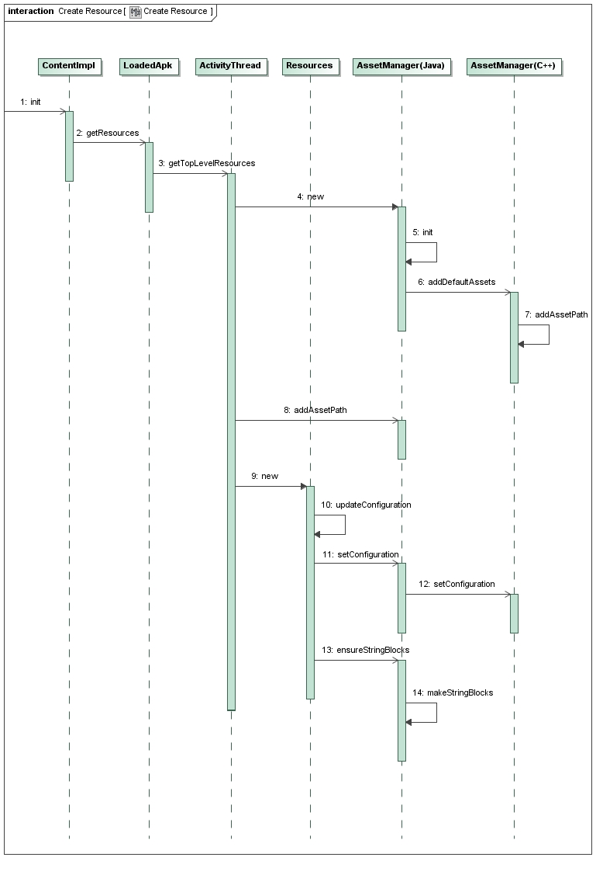
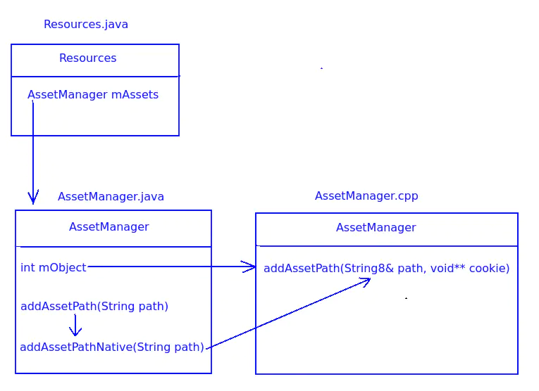
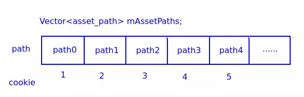

链接：https://www.jianshu.com/p/af9b9f841799

https://blog.csdn.net/luoshengyang/article/details/8791064

应用程序的每一个Activity组件都关联有一个ContextImpl对象，这个ContextImpl对象就是用来描述Activity组件的运行上下文环境的。Activity组件是从Context类继承下来的，而ContextImpl同样是从Context类继承下来的。我们在Activity组件调用的大部分成员函数都是转发给与它所关联的一个ContextImpl对象的对应的成员函数来处理的，其中就包括用来访问应用程序资源的两个成员函数getResources和getAssets。

        ContextImpl类的成员函数getResources返回的是一个Resources对象，有了这个Resources对象之后，我们就可以通过资源ID来访问那些被编译过的应用程序资源了。ContextImpl类的成员函数getAssets返回的是一个AssetManager对象，有了这个AssetManager对象之后，我们就可以通过文件名来访问那些被编译过或者没有被编译过的应用程序资源文件了。事实上，Resources类也是通过AssetManager类来访问那些被编译过的应用程序资源文件的，不过在访问之前，它会先根据资源ID查找得到对应的资源文件名。
    
        我们知道，在Android系统中，一个进程是可以同时加载多个应用程序的，也就是可以同时加载多个APK文件。每一个APK文件在进程中都对应有一个全局的Resourses对象以及一个全局的AssetManager对象。其中，这个全局的Resourses对象保存在一个对应的ContextImpl对象的成员变量mResources中，而这个全局的AssetManager对象保存在这个全局的Resourses对象的成员变量mAssets中。


ContextImpl：为Activity以及其他应用组件提供基础上下文,常用的Context API的实现
 都在这里

- mPackageInfo：ContextImpl关联的组件所在Package信息
- mResourcesManager：单列对象，管理应用内部多个Resources包

LoadedApk：管理一个加载的apk包

- mResources：apk包对应的Resources对象
- mResDir：资源存放路径`/data/app/com.jackyperf.assetmanagerdemo-1/base.apk`

ResourcesManager

- mActiveResources：应用使用的Resources包的缓存,mActiveResources指向的是一个HashMap。这个HashMap用来维护在当前应用程序进程中加载的每一个Apk文件及其对应的Resources对象的对应关系.也就是说，给定一个Apk文件路径，ActivityThread类的成员函数getTopLevelResources可以在成员变量mActiveResources中检查是否存在一个对应的Resources对象。如果不存在，那么就会新建一个，并且保存在ActivityThread类的成员变量mActiveResources中。

Resources：提供高级别的访问应用的资源的API

- mSystem：系统Resources对象
- mAssets：AssetManager对象

AssetManager：提供低级别的访问应用资源的API

- sSystem：系统AssetMananger对象
- mObject：指向Native层AssetManager
  

链接：https://www.jianshu.com/p/a1e2a8d32fe6

涉及源码（Android 4.4.2）：
 /frameworks/base/core/java/android/app/ResourcesManager.java
 /frameworks/base/core/jni/android_util_AssetManager.cpp
 /core/java/android/content/res/AssetManager.java
 /frameworks/base/libs/androidfw/AssetManager.cpp

我们从ActivityThread的performLaunchActivity开始分析。

```cpp
private Activity performLaunchActivity(ActivityClientRecord r, Intent customIntent) {
    ...
    java.lang.ClassLoader cl = r.packageInfo.getClassLoader();
    activity = mInstrumentation.newActivity(
            cl, component.getClassName(), r.intent);
    ...
    Application app = r.packageInfo.makeApplication(false, mInstrumentation);
    ...
    Context appContext = createBaseContextForActivity(r, activity, r.displayId);
    ...
}
代码位于/android/frameworks/base/core/java/android/app/ActivityThread.java
```

- 在performLaunchActivity中首先通过反射创建Activity对象
- 调用LoadedApk对象的makeApplication(),获取Activity所属应用的Application对象
- 为Activity创建Base Context也就是ContextImpl对象，AssetManager对象就是
   在这里创建的。

接下来，我们分析createBaseContextForActivity()的实现。

```java
private Context createBaseContextForActivity(ActivityClientRecord r,
        final Activity activity, int activityDisplayId) {
    ...
    ContextImpl appContext = ContextImpl.createActivityContext(
            this, r.packageInfo, displayId, r.overrideConfig/* { Multi-Window */, r.token/* Multi-Window } */);
    appContext.setOuterContext(activity);
    ...
}
代码位于/android/frameworks/base/core/java/android/app/ActivityThread.java
```

- 调用ContextImpl的静态方法createActivityContext()创建ContextImpl对象,然后将Activity
   保存到ContextImpl的mOuterContext中。

createActivityContext()的实现计较简单，就是调用ContextImpl的构造函数，在
 ContextImpl的构造函数函数中会调用LoadedApk对象的getResouces()创建Resources对象，**注意LoadedApk有
 两个构造函数，一个用于系统包，一个用于普通的应用包**。在getResources()中最终调用ResourcesManager的getTopLevelResources()

我们知道，如果我们希望使用或者得到某些资源，我们通常的做法是使用Context的getXXX方法，例如:

```java
public final Drawable getDrawable(int id) {
    return getResources().getDrawable(id, getTheme());
}
```

可以看到它首先需要获取到Resources资源对象，从资源对象中得到想要的资源。当我们使用Context的getResources方法来获取Resources对象的时候，最终调用的是ResourcesManager的getTopLevelResources方法来获取到对应的Resources对象。

ResourcesManager采用的是单例模式，这就保证了所有的Context调用的都是同一个ResourcesManager对象的getTopLevelResources方法，所以不同Context的getResources方法获取是同一套资源对象。

> /frameworks/base/core/java/android/app/Resources.java

```java
// 单例模式获取ResourcesManager对象
public static ResourcesManager getInstance() {  
    synchronized (ResourcesManager.class) {  
        if (sResourcesManager == null) {  
            sResourcesManager = new ResourcesManager();  
        }  
        return sResourcesManager;  
    }  
} 
```

再来分析下Resources的构造函数。

```cpp
public Resources(AssetManager assets, DisplayMetrics metrics, Configuration config,
        CompatibilityInfo compatInfo) {
    mAssets = assets;
    ...
    updateConfiguration(config, metrics);
    assets.ensureStringBlocks();
}
```

- 在Reosurces的构造函数中，首先将之前创建的AssetManager对象保存到mAssets中。
- 调用updateConfiguration()更新设备配置信息,如设备屏幕信息、国家地区网络信息以及键盘配置信息等，最终会将这些信息
   保存到Native层的AssetManager对象中去。
- 调用ensureStringBlocks将系统资源表以及应用资源表中的字符串资源池地址保存到AssetManager的mStringBlocks中。

下面来看看ResourcesManager的getTopLevelResources方法

> /frameworks/base/core/java/android/app/ResourcesManager.java

```java
// 资源对象存放在ArrayMap的集合中，并且对象使用的是弱引用
final ArrayMap<ResourcesKey, WeakReference<Resources> > mActiveResources
            = new ArrayMap<ResourcesKey, WeakReference<Resources> >();
            
public Resources getTopLevelResources(String resDir, int displayId,
        Configuration overrideConfiguration, CompatibilityInfo compatInfo, IBinder token) {
    final float scale = compatInfo.applicationScale;
    // 1、通过传入的参数确定资源对象的key值
    ResourcesKey key = new ResourcesKey(resDir, displayId, overrideConfiguration, scale,
            token);
    Resources r;
    synchronized (this) {
        // 2、通过key值，从mActiveResources Map集合中获取对应的资源对象
        WeakReference<Resources> wr = mActiveResources.get(key);
        r = wr != null ? wr.get() : null;
        // 3、如果资源对象不为空，直接将其返回，否则执行步骤4
        if (r != null && r.getAssets().isUpToDate()) {
            return r;
        }
    }

    // 4、创建AssetManager对象，并且将资源目录（实际为apk文件路径）加入资源路径
    AssetManager assets = new AssetManager();
    if (assets.addAssetPath(resDir) == 0) {
        return null;
    }

    DisplayMetrics dm = getDisplayMetricsLocked(displayId);
    Configuration config;
    boolean isDefaultDisplay = (displayId == Display.DEFAULT_DISPLAY);
    final boolean hasOverrideConfig = key.hasOverrideConfiguration();
    if (!isDefaultDisplay || hasOverrideConfig) {
        config = new Configuration(getConfiguration());
        if (!isDefaultDisplay) {
            applyNonDefaultDisplayMetricsToConfigurationLocked(dm, config);
        }
        if (hasOverrideConfig) {
            config.updateFrom(key.mOverrideConfiguration);
        }
    } else {
        config = getConfiguration();
    }
    
    // 5、创建资源对象
    r = new Resources(assets, dm, config, compatInfo, token);
    
    // 6、如果mActiveResources Map集合没有该资源对象，则将其加入，并将资源对象返回
    synchronized (this) {
        WeakReference<Resources> wr = mActiveResources.get(key);
        Resources existing = wr != null ? wr.get() : null;
        if (existing != null && existing.getAssets().isUpToDate()) {
            r.getAssets().close();
            return existing;
        }

        mActiveResources.put(key, new WeakReference<Resources>(r));
        return r;
    }
}
```

从上面可以总结以下几点：
 1、Resources对象使用了一个ArrayMap对象进行缓存，因此表明其内部可能包含多个Resources对象。
 2、Resources对象中包含一个AssetManager对象，资源的添加工作是通过该对象的addAssetPath完成的。

下面就来看看具体的资源资源添加的过程

#### AssetManager的创建

```java
//core/java/android/content/res/AssetManager.java
public AssetManager() {
    synchronized (this) {
        // 1、调用init初始化方法
        init();
        // 2、保证系统资源对象的存在
        ensureSystemAssets();
    }
}
```

##### 1、调用init初始化方法

init方法是一个native方法，它最终调用的是android_util_AssetManager.cpp中的android_content_AssetManager_init方法，下面就进入native层进行操作了，前面的操作都是在java层处理的。

```cpp
//frameworks/base/core/jni/android_util_AssetManager.cpp
static void android_content_AssetManager_init(JNIEnv* env, jobject clazz)
{   
    // 1、创建一个AssetManager对象
    AssetManager* am = new AssetManager();
    // 2、添加默认的资源
    am->addDefaultAssets();
    // 3、将AssetManager对象(C++对象)的引用保存在Java层AssetManager对象的mObject中
    env->SetIntField(clazz, gAssetManagerOffsets.mObject, (jint)am);
}
```

(1) 添加系统默认资源操作

```cpp
//frameworks/base/libs/androidfw/AssetManager.cpp
static const char* kSystemAssets = "framework/framework-res.apk";  
bool AssetManager::addDefaultAssets()
{
    // 1、得到系统目录/system/
    const char* root = getenv("ANDROID_ROOT");
    String8 path(root);
    // 2、得到系统资源的完整路径/system/framework/framework-res.apk
    path.appendPath(kSystemAssets);
    // 3、将系统资源添加到资源路径
    return addAssetPath(path, NULL);
}
```

从上面可以看到，默认会将系统资源添加到资源路径，这也是我们应用可以访问到系统资源的原因。

在addDefaultAssets()中首先创建系统资源路径，一般ANDROID_ROOT环境变量为"/system"，kSystemAssets为
 "framework/framework-res.apk"，所以系统资源路径为"/system/framework/framework-res.apk"。然后调用addAssetPath()。

在addAssetPath()中，首先检查mAssetPaths中是否已经包含了当前资源路径对应的asset_path对象，如果已经存在，返回asset_path在
 mAssetPaths中的索引值+1,所以*cookie的值从1开始。

否则，将asset_path添加到mAssetPaths中，同时给*cookie赋值。

如果资源表不为NULL，将asset_path添加到资源表。


###### (2)添加AssetManager对象(C++对象)引用到Java层AssetManager对象的mObject上的操作

其实就是要弄清楚gAssetManagerOffsets.mObject的什么东西？

下面来看看android_util_AssetManager.cpp中register_android_content_AssetManager方法。

> /frameworks/base/core/jni/android_util_AssetManager.cpp

```cpp
int register_android_content_AssetManager(JNIEnv* env)
{
    // 1、获取到java层的AssetManager类
    jclass assetManager = env->FindClass("android/content/res/AssetManager");
    // 2、获取java层的AssetManager类的mObject字段，并将其保存在gAssetManagerOffsets.mObject中
    gAssetManagerOffsets.mObject
        = env->GetFieldID(assetManager, "mObject", "I");
    return AndroidRuntime::registerNativeMethods(env,
            "android/content/res/AssetManager", gAssetManagerMethods, NELEM(gAssetManagerMethods));
}
```

从上面就可以知道，gAssetManagerOffsets.mObject对应就是java层的AssetManager类的mObject字段。

##### 2、保证系统资源对象的存在

> /core/java/android/content/res/AssetManager.java


```java
private static void ensureSystemAssets() {  
    synchronized (sSync) {  
        if (sSystem == null) {  
            AssetManager system = new AssetManager(true);  
            system.makeStringBlocks(false);  
            sSystem = system;  
        }  
    }  
} 
```

sSystem是一个静态的AssetManager对象，在Zygote启动时已经赋值了，主要就是初次启动的时候会执行，供系统使用，上面创建AssetManager对象，创建过程跟前面相同。

上面类之间的关系如下图所示：



#### 资源路径的添加

从上图可以看到，在java层的AssetManager类中，addAssetPath方法会调用addAssetPathNative方法，addAssetPathNative方法是一个native方法，它对应的就是android_util_AssetManager.cpp中的android_content_AssetManager_addAssetPath方法。

> /frameworks/base/core/jni/android_util_AssetManager.cpp


```cpp
static jint android_content_AssetManager_addAssetPath(JNIEnv* env, jobject clazz,
                                                       jstring path)
{
    ScopedUtfChars path8(env, path);
    if (path8.c_str() == NULL) {
        return 0;
    }
    // 1、得到C++对象AssetManager对象
    AssetManager* am = assetManagerForJavaObject(env, clazz);
    if (am == NULL) {
        return 0;
    }

    void* cookie;
    // 2、执行addAssetPath方法
    bool res = am->addAssetPath(String8(path8.c_str()), &cookie);

    return (res) ? (jint)cookie : 0;
}
```

assetManagerForJavaObject方法就是拿到前面存放在java层的AssetManager类的mObject字段的值，它就是一个AssetManager的C++对象引用


```cpp
AssetManager* assetManagerForJavaObject(JNIEnv* env, jobject obj)
{
    AssetManager* am = (AssetManager*)env->GetIntField(obj, gAssetManagerOffsets.mObject);
    if (am != NULL) {
        return am;
    }
    jniThrowException(env, "java/lang/IllegalStateException", "AssetManager has been finalized!");
    return NULL;
}
```

> /frameworks/base/libs/androidfw/AssetManager.cpp


```cpp
// 资源路径存放在一个Vector集合中
Vector<asset_path> mAssetPaths;

// 存放资源路径的结构体
struct asset_path
{
    String8 path;  // 路径名
    FileType type; // 文件类型
    String8 idmap;
};
```


```cpp
bool AssetManager::addAssetPath(const String8& path, void** cookie)
{
    AutoMutex _l(mLock);

    asset_path ap;

    // 1、构造一个asset_path结构体，其实就是确定路径名和文件类型，并保存在结构体中
    String8 realPath(path);
    if (kAppZipName) {
        realPath.appendPath(kAppZipName);
    }
    ap.type = ::getFileType(realPath.string());
    if (ap.type == kFileTypeRegular) {
        ap.path = realPath;
    } else {
        ap.path = path;
        ap.type = ::getFileType(path.string());
        if (ap.type != kFileTypeDirectory && ap.type != kFileTypeRegular) {
            ALOGW("Asset path %s is neither a directory nor file (type=%d).",
                 path.string(), (int)ap.type);
            return false;
        }
    }

    // 2、如果该路径已经添加到集合中，则直接设置cookie为(索引+1)并返回，否则进入步骤3
    for (size_t i=0; i<mAssetPaths.size(); i++) {
        if (mAssetPaths[i].path == ap.path) {
            if (cookie) {
                *cookie = (void*)(i+1);
            }
            return true;
        }
    }
    // 3、将路径结构体添加到集合中
    mAssetPaths.add(ap);

    // 4、将该路径的集合size(索引+1)作为cookie的值
    if (cookie) {
        *cookie = (void*)mAssetPaths.size();
    }

    // 5、资源替换的过程，这个暂不关注
    // (Java) package manager
    if (strncmp(path.string(), "/system/framework/", 18) == 0) {
        // When there is an environment variable for /vendor, this
        // should be changed to something similar to how ANDROID_ROOT
        // and ANDROID_DATA are used in this file.
        String8 overlayPath("/vendor/overlay/framework/");
        overlayPath.append(path.getPathLeaf());
        if (TEMP_FAILURE_RETRY(access(overlayPath.string(), R_OK)) == 0) {
            asset_path oap;
            oap.path = overlayPath;
            oap.type = ::getFileType(overlayPath.string());
            bool addOverlay = (oap.type == kFileTypeRegular); // only .apks supported as overlay
            if (addOverlay) {
                oap.idmap = idmapPathForPackagePath(overlayPath);

                if (isIdmapStaleLocked(ap.path, oap.path, oap.idmap)) {
                    addOverlay = createIdmapFileLocked(ap.path, oap.path, oap.idmap);
                }
            }
            if (addOverlay) {
                mAssetPaths.add(oap);
            } else {
                ALOGW("failed to add overlay package %s\n", overlayPath.string());
            }
        }
    }

    return true;
}
```

如下图所示：

