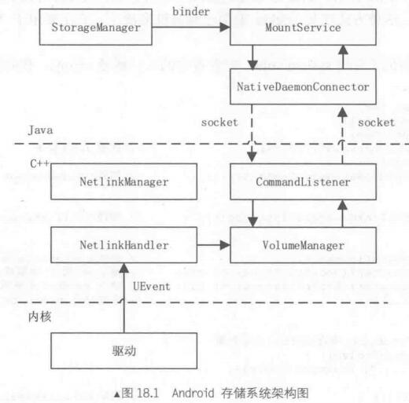
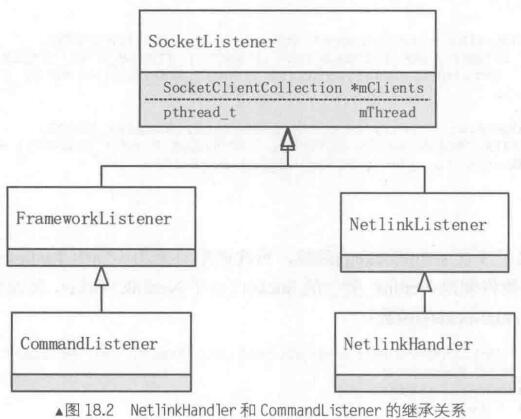
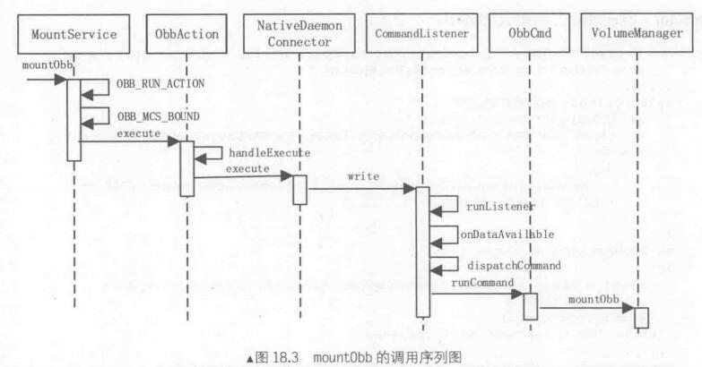

​																	**Android存储系统**

​		Android的存储系统主要由SystemServer进程的MountService和Vold进程的VolumeManager组成。它们管理系统的存储设备，执行各种操作，如mount、unmount、format等。



​		在Android存储系统中，MountService是为应用提供服务的Binder类，运行在SystemServer中，而StorageManager是MountServer的代理，在用户进程中使用的。Vold是一个守护进程，负责和底层存储系统驱动交互。MountService和Vold之间通过socket进行通信，这个通信过程是双向的。

​		Vold进程的主体是VolumeManager，它负责管理系统底层所有的Volume对象，试下各种存储相关的操作。Vold中的CommandListener负责和MountService中的NativeDeamonConnector进行Socket通信，而NetLinkHandler则负责监听来自驱动的Netlink Socket消息。

​		NetlinkManager主要作用是创建3个NetlinkHandler对象，除此外，NetlinkManager在系统运行中几乎毫无作用。


# 1. 管理存储设备--vold守护进程

​		Vold全称Volume Daemon，用来管理各种存储设备，包括外置USB、SD卡，MountService通过Vold进程查询和操作这些存储设备。如果外部存储设别发生变化，入插入USB设备，Vold将接收到内核的UEvent消息并转发给MountService。

## 1.1 Vold 的启动

Vold由init进程启动

```shell
service vold /system/bin/vold
     class core
     socket vold stream 0660 root mount
     ioprio be 2
```

vold服务放在core分组，这意味着系统启动启动时，他会被init进程启动。同时要注意，这里面定义了一个socket，该socket主要用于Vold和Java层的MountService通讯。先看入口函数main()：

```c++
//system/vold/main.cpp
int main() {

    VolumeManager *vm;
    CommandListener *cl;
    NetlinkManager *nm;
    DevPathListen *dpl;

    CommandListener *cl0,*cl1,*cl2,*cl3,*cl4;
    CommandListener *clasec;
    CommandListener *clobb;
    CommandListener *clcryptfs;

    SLOGI("Vold 2.1 (the revenge) firing up");

    char value[PROPERTY_VALUE_MAX] = {0};
    FILE * fb = NULL;
    char cmd_buf[100] = {0};
    char tmp[256] = {0};
    property_get("service.vold.status", value, "Normal");
    if ( 0 == strcmp(value, "Normal") ) {
            property_set("service.vold.status", "Crashed");
    }
    else {
            property_set("service.mountservice.reset", "1");
    }
    DB_LOG("the service.vold.status is %s", value);

    mkdir("/dev/block/vold", 0755);       //创建vold目录

    /* Create our singleton managers */
    if (!(vm = VolumeManager::Instance())) {      //创建VolumeManager对象
        SLOGE("Unable to create VolumeManager");
        exit(1);
    };

    if (!(nm = NetlinkManager::Instance())) {			 //创建NetlinkManager对象
        SLOGE("Unable to create NetlinkManager");
        exit(1);
    };

    if (!(dpl = DevPathListen::Instance())) {		//创建DevPathListen对象
        SLOGE("Unable to create DevPathListen");
        exit(1);
    };

    cl = new CommandListener();							//创建CommandListener对象
    vm->setBroadcaster((SocketListener *) cl);			//建立vm和cl的联系
    nm->setBroadcaster((SocketListener *) cl);			//建立nm和cl的联系

    if (vm->start()) {									//启动VolumeManager
        SLOGE("Unable to start VolumeManager (%s)", strerror(errno));
        exit(1);
    }
	//创建/vold.fstab中定义的Volume对象
    if (process_config(vm)) {
        SLOGE("Error reading configuration (%s)... continuing anyways", strerror(errno));
    }

    //    coldboot("/sys/class/switch");
    
    //开始监听Frameworkdesocket

    /*
     * Now that we're up, we can respond to commands
     */
    if (cl->startListener()) {
        SLOGE("Unable to start CommandListener (%s)", strerror(errno));
        exit(1);
    }

    if ( NULL == (cl0 = new CommandListener(CMD_HAVE_VOLUME_SLOW, "vold0")) || cl0->startListener() ) {
        SLOGE("Unable to start CommandListener0 (%s)", strerror(errno));
        exit(1);
    }
    if ( NULL == (cl1 = new CommandListener(CMD_HAVE_VOLUME_SLOW, "vold1")) || cl1->startListener() ) {
        SLOGE("Unable to start CommandListener1 (%s)", strerror(errno));
        exit(1);
    }
    if ( NULL == (cl2 = new CommandListener(CMD_HAVE_VOLUME_SLOW, "vold2")) || cl2->startListener() ) {
        SLOGE("Unable to start CommandListener2 (%s)", strerror(errno));
        exit(1);
    }
    if ( NULL == (cl3 = new CommandListener(CMD_HAVE_VOLUME_SLOW, "vold3")) || cl3->startListener() ) {
        SLOGE("Unable to start CommandListener3 (%s)", strerror(errno));
        exit(1);
    }
    if ( NULL == (cl4 = new CommandListener(CMD_HAVE_VOLUME_SLOW, "vold4")) || cl4->startListener() ) {
        SLOGE("Unable to start CommandListener4 (%s)", strerror(errno));
        exit(1);
    }

    if ( NULL == (clasec = new CommandListener(CMD_HAVE_ASEC, "voldasec")) || clasec->startListener() ) {
        SLOGE("Unable to start CommandListener asec (%s)", strerror(errno));
        exit(1);
    }

    if ( NULL == (clobb = new CommandListener(CMD_HAVE_OBB, "voldobb")) || clobb->startListener() ) {
        SLOGE("Unable to start CommandListener obb (%s)", strerror(errno));
        exit(1);
    }

    if ( NULL == (clcryptfs = new CommandListener(CMD_HAVE_CRYPTFS, "voldcryptfs")) || clcryptfs->startListener() ) {
        SLOGE("Unable to start CommandListener cryptfs (%s)", strerror(errno));
        exit(1);
    }

     property_get("persist.sys.qb.enable", value, "false");
     if (0 == strcmp(value,"true")) {

        while(1) {
            property_get("persist.sys.qb.flag", value, "true");
            if ( 0 == strcmp(value, "false") ) {
                sleep(2);
            }else {
                 char tmp[PROPERTY_VALUE_MAX] = {0};
                 property_get("sys.boot_completed", tmp, "0");
                 if ( 0 == strcmp(tmp,"1"))
                        break ;
                 sleep(2);
            }
        }
    }

    if (nm->start()) {							//启动NetlinkManager
        SLOGE("Unable to start NetlinkManager (%s)", strerror(errno));
        exit(1);
    }

    SLOGE(" Vold is Running \n");
    coldboot("/sys/block");					//创建/sys/block下的节点文件

    // Eventually we'll become the monitoring thread
    while(1) {
        /* add CD-ROM */
        if(vm->getCdrom()) {
            while(access(CDROM_DEV ,F_OK)) {
                sleep(3);
            }
            sprintf(cmd_buf,"/system/bin/blkid %s",CDROM_DEV);
            if((fb = popen(cmd_buf,"r"))!= NULL){
                if(fgets(tmp,sizeof(tmp),fb)!= NULL){
                    if(Cdrom::isMountpointMounted(CDROM_POINT)) {
                        sleep(3);
                    }else {
                        Cdrom::doMount(CDROM_DEV,CDROM_POINT);
                        Cdrom::ueventCdrom(CDROM_UEVENT);
                    }
                    pclose(fb);
                }else {
                    sleep(1);
                }
            }else {
                sleep(1);
            }
        }else {
            sleep(5);
        }
    }

    SLOGI("Vold exiting");
    exit(0);
}
```

​		main函数主要工作是创建了3个对象：VolumeManager、NetLinkManager、CommandListener。同时将CommandListener对象分别设置到了VolumeManager对象和NetLinkManager中。CommandListener对象用于和Java层的NativeDaemonConnector对象进行socket通信，因此，无论VolumeManager、NetLinkManager都需要拥有CommandListener的引用。

## 1.2 监听驱动发出的消息--Vold的NetLinkManager对象

​		NetLinkManager主要工作是监听驱动发出的uevent消息。main函数中调用NetLinkManager类的静态函数Instance来创建NetLinkManager对象：

```c++
private:
    static NetlinkManager *sInstance;

NetlinkManager *NetlinkManager::Instance() {
    if (!sInstance)
        sInstance = new NetlinkManager();
    return sInstance;
}
```

​		Instance创建了一个NetLinkManager对象，并通过静态变量sInstance来引用，在vold进程中只有一个NetLinkManager对象。NetLinkManager构造函数：

```c++
private:
    SocketListener       *mBroadcaster;

NetlinkManager::NetlinkManager() {
    mBroadcaster = NULL;
}
```

​		NetlinkManager的构造函数只是对变量mBroadcaster进行初始化。main函数中会调用NetlinkManager的setBroadcaster函数来给变量mBroadcaster重新赋值。

```c++
nm->setBroadcaster((SocketListener *) cl);
```

main函数中调用NetlinkManager的start方法：

```c++
if (nm->start()) {
        SLOGE("Unable to start NetlinkManager (%s)", strerror(errno));
        exit(1);
}
```

```c++
int NetlinkManager::start() {
    struct sockaddr_nl nladdr;
    int sz = 64 * 1024;
    int on = 1;

    memset(&nladdr, 0, sizeof(nladdr));
    nladdr.nl_family = AF_NETLINK;
    nladdr.nl_pid = getpid();
    nladdr.nl_groups = 0xffffffff;   //指定加入的组播组

    if ((mSock = socket(PF_NETLINK,
                        SOCK_DGRAM,NETLINK_KOBJECT_UEVENT)) < 0) {
        SLOGE("Unable to create uevent socket: %s", strerror(errno));
        return -1;
    }
	//设置缓存区大小为64KB
    if (setsockopt(mSock, SOL_SOCKET, SO_RCVBUFFORCE, &sz, sizeof(sz)) < 0) {
        SLOGE("Unable to set uevent socket SO_RCVBUFFORCE option: %s", strerror(errno));
        goto out;
    }
	//设置允许控制消息的接收
    if (setsockopt(mSock, SOL_SOCKET, SO_PASSCRED, &on, sizeof(on)) < 0) {
        SLOGE("Unable to set uevent socket SO_PASSCRED option: %s", strerror(errno));
        goto out;
    }
	//绑定socket地址
    if (bind(mSock, (struct sockaddr *) &nladdr, sizeof(nladdr)) < 0) {
        SLOGE("Unable to bind uevent socket: %s", strerror(errno));
        goto out;
    }
	//创建NetlinkHandler对象来监听socket
    mHandler = new NetlinkHandler(mSock);
    if (mHandler->start()) {
        SLOGE("Unable to start NetlinkHandler: %s", strerror(errno));
        goto out;
    }
    return 0;
out:
    close(mSock);
    return -1;
}
```

​		start函数中使用了三个不同的NetLink协议作为参数，并创建一个NETLINK类型的socket，创建完socket之后，还创建了一个NetlinkHandler对象来监听和接受socket数据。

## 1.3 处理block类型的uevent

​		main函数中创建了CommandListener对象，NetlinkManager的start函数又创建了NetlinkHandler对象，其实CommandListener类和NetlinkHandler类都是SocketListener类派生的。



​		处于最底层的SocketListener类的作用是监听socket的数据，接收到数据后分别交给FrameworkListener和NetlinkListener，并分别对来自Framework和驱动的数据进行分析，分析后根据命令再分别调用CommandListener类和NetlinkHandler类中的函数。

NetlinkHandler的构造函数：

```c++
NetlinkHandler::NetlinkHandler(int listenerSocket) :
                NetlinkListener(listenerSocket) {
}
```

start函数：

```c++
int NetlinkHandler::start() {
    return this->startListener();
}
```

start函数只是调用了SocketListener的startListener：

```c++
int SocketListener::startListener() {
    if (!mSocketName && mSock == -1) {
        SLOGE("Failed to start unbound listener");
        errno = EINVAL;
        return -1;
    } else if (mSocketName) {   //只有CommandListener中会设置mSocketName
        if ((mSock = android_get_control_socket(mSocketName)) < 0) {
            SLOGE("Obtaining file descriptor socket '%s' failed: %s",
                 mSocketName, strerror(errno));
            return -1;
        }
        SLOGV("got mSock = %d for %s", mSock, mSocketName);
    }

    if (mListen && listen(mSock, 4) < 0) {   //CommandListener中的mListen为true
        SLOGE("Unable to listen on socket (%s)", strerror(errno));
        return -1;
    } else if (!mListen)          //NetlinkHandler中的mListen为false
        mClients->push_back(new SocketClient(mSock, false, mUseCmdNum));

    if (pipe(mCtrlPipe)) {      //创建管道，用于退出监听线程
        SLOGE("pipe failed (%s)", strerror(errno));
        return -1;
    }
	//创建一个监听线程
    if (pthread_create(&mThread, NULL, SocketListener::threadStart, this)) {
        SLOGE("pthread_create (%s)", strerror(errno));
        return -1;
    }

    return 0;
}
```

​		startListener函数将开始监听socket，这个函数在NetlinkHandler和CommandListener中会被调用。startListener首先判断变量mSocketName是否有值，只有CommandListener会对这个变量赋值，它的值是在init.rc中定义的socket字符串。调用android_get_control_socket的目的是为了从环境变量中取到socket的值。这样CommandListener对象得到了它需要监听的socket。而对于NetlinkHandler，它的mSocket不为NULL，前面已经创建出了socket。

​		startListener接下来会根据成员变量mListen来判断是否需要调用listen来监听socket。mListen在对象构造时根据参数来初始化。对于CommandListener，mListen为true，NetlinkHandler的mListen为false。这是因为CommandListener与SystemServer通讯，它需要监听socket连接，而NetlinkHandler则不用。

​		再接下来startListener会创建一个管道，来通知线程停止监听。这个线程就是startListener最后创建的监听线程，它的运行函数是threadStart：

```c++
void *SocketListener::threadStart(void *obj) {
    SocketListener *me = reinterpret_cast<SocketListener *>(obj);

    me->runListener();
    pthread_exit(NULL);
    return NULL;
}
```

threadStart中又调用了runListener

```c++
void SocketListener::runListener() {

    SocketClientCollection *pendingList = new SocketClientCollection();

    while(1) {
        SocketClientCollection::iterator it;
        fd_set read_fds;
        int rc = 0;
        int max = -1;

        FD_ZERO(&read_fds);

        if (mListen) {   //如果需要监听
            max = mSock;
            FD_SET(mSock, &read_fds);  //把mSock加入read_fds
        }

        FD_SET(mCtrlPipe[0], &read_fds);  //把管道mCtrlPipe[0]也加入到read_fds
        if (mCtrlPipe[0] > max)
            max = mCtrlPipe[0];

        pthread_mutex_lock(&mClientsLock);   
        //mClients中保存的是NetlinkHandler的socket，或者CommandListener接入的socket
        //把它也加入read_fds
        for (it = mClients->begin(); it != mClients->end(); ++it) {
            int fd = (*it)->getSocket();
            FD_SET(fd, &read_fds);
            if (fd > max)
                max = fd;
        }
        pthread_mutex_unlock(&mClientsLock);
        SLOGV("mListen=%d, max=%d, mSocketName=%s", mListen, max, mSocketName);
        //执行select调用，开始等待socket上的数据到来
        if ((rc = select(max + 1, &read_fds, NULL, NULL, NULL)) < 0) {
            if (errno == EINTR)
                continue;    //因为中断退出select，继续
            SLOGE("select failed (%s) mListen=%d, max=%d", strerror(errno), mListen, max);
            sleep(1);
            continue;
        } else if (!rc)  //如果fd上没有数据到达，继续
            continue;
		//如果是管道上有数据到达，退出循环，结束监听
        if (FD_ISSET(mCtrlPipe[0], &read_fds))
            break;    
        if (mListen && FD_ISSET(mSock, &read_fds)) { //如果是CommandListener上有连接请求
            struct sockaddr addr;
            socklen_t alen;
            int c;

            do {
                alen = sizeof(addr);
                c = accept(mSock, &addr, &alen);   //接入连接请求
                SLOGV("%s got %d from accept", mSocketName, c);
            } while (c < 0 && errno == EINTR);  //如果是中断导致失败，重新接入
            if (c < 0) {			//接入发生错误，继续循环
                SLOGE("accept failed (%s)", strerror(errno));
                sleep(1);
                continue;
            }
            pthread_mutex_lock(&mClientsLock);
            //把接入的socket连接加入到mClients，这样再循环时就会监听它的数据到达
            mClients->push_back(new SocketClient(c, true, mUseCmdNum));
            pthread_mutex_unlock(&mClientsLock);
        }

        /* Add all active clients to the pending list first */
        pendingList->clear();
        pthread_mutex_lock(&mClientsLock);
        for (it = mClients->begin(); it != mClients->end(); ++it) {
            int fd = (*it)->getSocket();
            if (FD_ISSET(fd, &read_fds)) {
                //如果mClients中某个socket上有数据，把它加入到pendingList列表中
                pendingList->push_back(*it);
            }
        }
        pthread_mutex_unlock(&mClientsLock);

        /* Process the pending list, since it is owned by the thread,
         * there is no need to lock it */
        while (!pendingList->empty()) {    //处理pendingList
            /* Pop the first item from the list */
            it = pendingList->begin();
            SocketClient* c = *it;
            pendingList->erase(it);  //把处理过的socket从pendingList中移除
            /* Process it, if false is returned and our sockets are
             * connection-based, remove and destroy it */
            if (!onDataAvailable(c) && mListen) {  //调用onDataAvailable处理数据
                /* Remove the client from our array */
                SLOGV("going to zap %d for %s", c->getSocket(), mSocketName);
                pthread_mutex_lock(&mClientsLock);
                //如果socket是listen接入的，而且onDataAvailable返回false，表示不需要这个连接了，把该socket从mClients中移除
                for (it = mClients->begin(); it != mClients->end(); ++it) {
                    if (*it == c) {
                        mClients->erase(it);
                        break;
                    }
                }
                pthread_mutex_unlock(&mClientsLock);
                /* Remove our reference to the client */
                c->decRef();
            }
        }
    }
    delete pendingList;
}
```

​		这段是标准的处理混合socket连接的代码，runListener函数接收到从驱动或者MountService传递的数据后，调用onDataAvailable来处理，FrameworkListener类都会重载这个函数。先看NetlinkLIstener类的onDataAvailable：

```c++
bool NetlinkListener::onDataAvailable(SocketClient *cli)
{
    int socket = cli->getSocket();
    ssize_t count;
    uid_t uid = -1;

    count = TEMP_FAILURE_RETRY(uevent_kernel_multicast_uid_recv(
                                       socket, mBuffer, sizeof(mBuffer), &uid));
    if (count < 0) {  //如果count < 0，进行错误处理
        if (uid > 0)
            LOG_EVENT_INT(65537, uid);
        SLOGE("recvmsg failed (%s)", strerror(errno));
        return false;
    }

    NetlinkEvent *evt = new NetlinkEvent();
    if (!evt->decode(mBuffer, count, mFormat)) {
        SLOGE("Error decoding NetlinkEvent");
    } else {
        onEvent(evt);
    }

    delete evt;
    return true;
}

```

​		NetlinkListener::onDataAvailable函数首先调用 uevent_kernel_multicast_uid_recv来接收uevent消息。接收到消息后，创建NetlinkEvent对象，然后调用它的decode对消息进行解码，然后用得到的消息数据给NetlinkEvent对象的成员变量赋值。最后调用onEvent继续处理消息，onEvent代码：

```c++
void NetlinkHandler::onEvent(NetlinkEvent *evt) {
    VolumeManager *vm = VolumeManager::Instance();
    const char *subsys = evt->getSubsystem();

    if (!subsys) {
        SLOGW("No subsystem found in netlink event");
        return;
    }

    if (!strcmp(subsys, "block")) {   //如果event类型是block
        evt->dump();
        vm->handleBlockEvent(evt);   //调用VolumeManager的handleBlockEvent来处理
    }
}
```

​		NetlinkHandler::onEvent中会判断event属于哪个子系统的，如果是“block”，则调用VolumeManager的handleBlockEvent来处理：

```c++
void VolumeManager::handleBlockEvent(NetlinkEvent *evt) {
    const char *devpath = evt->findParam("DEVPATH");

    // lookup a DirVolume to handle this device first
    VolumeCollection::iterator itDir;
    for (itDir = mDirVolumes->begin(); itDir != mDirVolumes->end(); ++itDir) {
        (*itDir)->handleBlockEvent(evt); //对DirectVolume对象，调用其handleBlockEvent来处理event
    }

    /* Lookup a volume to handle this device */
    VolumeCollection::iterator it;
    bool hit = false;   //如果某个对象处理了event，则返回
    for (it = mVolumes->begin(); it != mVolumes->end(); ++it) {
        if (!(*it)->handleBlockEvent(evt)) {
            DB_LOG("Device '%s' event handled by volume %s", devpath, (*it)->getLabel());
            hit = true;
            break;
        }
    }

    if (!hit) {
        //DB_LOG("No volumes handled block event for '%s'", devpath);
    }
}
```

​		VolumeManager::handleBlockEvent会调用它管理的所有DirectVolume对象的handleBlockEvent函数，如果函数中处理了event，会返回0，handleBlockEvent将结束处理并返回。详见1.5节

## 1.4 处理MountService的命令

CommandListener对象如何从MountService发送命令数据呢？下面分析Framework的onDataAvailable：

```c++
bool FrameworkListener::onDataAvailable(SocketClient *c) {
    char buffer[CMD_BUF_SIZE];
    int len;
	//从socket中读数据
    len = TEMP_FAILURE_RETRY(read(c->getSocket(), buffer, sizeof(buffer)));
    if (len < 0) {
        SLOGE("read() failed (%s)", strerror(errno));
        return false;
    } else if (!len) {
        return false;
    } else if (buffer[len-1] != '\0') {
        SLOGW("String is not zero-terminated");
        android_errorWriteLog(0x534e4554, "29831647");
        c->sendMsg(500, "Command too large for buffer", false);
        mSkipToNextNullByte = true;
        return false;
    }

    int offset = 0;
    int i;

    for (i = 0; i < len; i++) {
        if (buffer[i] == '\0') {
            /* IMPORTANT: dispatchCommand() expects a zero-terminated string */
            if (mSkipToNextNullByte) {
                mSkipToNextNullByte = false;
            } else {
                dispatchCommand(c, buffer + offset);  //分发命令
            }
            offset = i + 1;
        }
    }

    mSkipToNextNullByte = false;
    return true;
}
```

​		onDataAvailable从socket中读取数据，这些数据是一个或者多个以0结尾的字符串，每个字符串都是一条命令。然后调用dispatchCommand来分发命令：

```c++
void FrameworkListener::dispatchCommand(SocketClient *cli, char *data) {
	......
    for (i = mCommands->begin(); i != mCommands->end(); ++i) {
        FrameworkCommand *c = *i;

        if (!strcmp(argv[0], c->getCommand())) {
            if (c->runCommand(cli, argc, argv)) {
                SLOGW("Handler '%s' error (%s)", c->getCommand(), strerror(errno));
            }
            goto out;
        }
    }
    cli->sendMsg(500, "Command not recognized", false);
    ......
}

```

​		dispatchCommand前面代码都是在检查命令格式是否正确。最后检查mCommands中是否存在和命令匹配的FrameworkCommand对象，如果存在，则调用它的runCommand。那么mCommands中的FrameworkCommand对象是如何创建的呢？看看CommandListener的构造函数就知道了。

```c++
CommandListener::CommandListener( int iHave, const char * pName ) :
                 FrameworkListener(pName, true) {
    if ( iHave & CMD_HAVE_DUMP )
        registerCmd(new DumpCmd());
    if ( iHave & CMD_HAVE_VOLUME_ALL )
        registerCmd(new VolumeCmd(iHave));
	if ( iHave & CMD_HAVE_ASEC )
	    registerCmd(new AsecCmd());
	if ( iHave & CMD_HAVE_OBB )
	    registerCmd(new ObbCmd());
	if ( iHave & CMD_HAVE_STORAGE )
	    registerCmd(new StorageCmd());
	if ( iHave & CMD_HAVE_XWARP )
	    registerCmd(new XwarpCmd());
	if ( iHave & CMD_HAVE_CRYPTFS )
	    registerCmd(new CryptfsCmd());
	if ( iHave & CMD_HAVE_ISO )
	    registerCmd(new IsoMountCmd());
	if ( iHave & CMD_FSTRIM_FILE )
        registerCmd(new FstrimCmd());
}
```

​		CommandListener的构造函数中注册了很多的命令，registerCmd的作用是把命令对象加入mCommands列表中：

```c++
void FrameworkListener::registerCmd(FrameworkCommand *cmd) {
    mCommands->push_back(cmd);
}
```

其中，VolumeCmd命令的处理函数runCommand：

```
int CommandListener::VolumeCmd::runCommand(SocketClient *cli,
                                                      int argc, char **argv) {
    dumpArgs(argc, argv, -1);

    if ( 0 == (mHave & CMD_HAVE_VOLUME_ALL) ) {
        SLOGE("CommandListener::VolumeCmd : I can do nothing (mHave = %d)", mHave);
        cli->sendMsg(ResponseCode::CommandSyntaxError, "Missing Argument", false);
        return 0;
    }

    if (argc < 2) {
        cli->sendMsg(ResponseCode::CommandSyntaxError, "Missing Argument", false);
        return 0;
    }

    VolumeManager *vm = VolumeManager::Instance();
    int rc = 0;

    if (!strcmp(argv[1], "list")) {  //处理list命令
        if ( mHave & CMD_HAVE_VOLUME_QUICK ) {
            return vm->listVolumes(cli);
        }
        else {
            SLOGE("CommandListener::VolumeCmd: I can not do volume %s", argv[1]);
            cli->sendMsg(ResponseCode::CommandSyntaxError, "Missing Argument", false);
            return 0;
        }
    } else if (!strcmp(argv[1], "debug")) {
        if ( 0 == (mHave & CMD_HAVE_VOLUME_QUICK) ) {
            SLOGE("CommandListener::VolumeCmd: I can not do volume %s", argv[1]);
            cli->sendMsg(ResponseCode::CommandSyntaxError, "Missing Argument", false);
            return 0;
        }
        if (argc != 3 || (argc == 3 && (strcmp(argv[2], "off") && strcmp(argv[2], "on")))) {
            cli->sendMsg(ResponseCode::CommandSyntaxError, "Usage: volume debug <off/on>", false);
            return 0;
        }
        vm->setDebug(!strcmp(argv[2], "on") ? true : false);
    } else if (!strcmp(argv[1], "mount")) {
        if ( 0 == (mHave & CMD_HAVE_VOLUME_SLOW) ) {
            SLOGE("CommandListener::VolumeCmd: I can not do volume %s", argv[1]);
            cli->sendMsg(ResponseCode::CommandSyntaxError, "Missing Argument", false);
            return 0;
        }
        if (argc != 3) {
            cli->sendMsg(ResponseCode::CommandSyntaxError, "Usage: volume mount <path>", false);
            return 0;
        }
        rc = vm->mountVolume(argv[2]);
	} else if (!strcmp(argv[1], "unmount")) {
		if(!strcmp(argv[2],"/mnt/sr0/sr01")) {
			Cdrom::cdEject(argv[2]);
			cli->sendMsg(ResponseCode::CommandSyntaxError, "Missing Argument", false);
			return 0;
		}
        if ( 0 == (mHave & CMD_HAVE_VOLUME_SLOW) ) {
            SLOGE("CommandListener::VolumeCmd: I can not do volume %s", argv[1]);
            cli->sendMsg(ResponseCode::CommandSyntaxError, "Missing Argument", false);
            return 0;
        }
        if (argc < 3 || argc > 4 ||
           ((argc == 4 && strcmp(argv[3], "force")) &&
            (argc == 4 && strcmp(argv[3], "force_and_revert")))) {
            cli->sendMsg(ResponseCode::CommandSyntaxError, "Usage: volume unmount <path> [force|force_and_revert]", false);
            return 0;
        }

        bool force = false;
        bool revert = false;
        if (argc >= 4 && !strcmp(argv[3], "force")) {
            force = true;
        } else if (argc >= 4 && !strcmp(argv[3], "force_and_revert")) {
            force = true;
            revert = true;
        }
        rc = vm->unmountVolume(argv[2], force, revert);
    } else if (!strcmp(argv[1], "unmount_bad")) {
        if ( 0 == (mHave & CMD_HAVE_VOLUME_SLOW) ) {
            SLOGE("CommandListener::VolumeCmd: I can not do volume %s", argv[1]);
            cli->sendMsg(ResponseCode::CommandSyntaxError, "Missing Argument", false);
            return 0;
        }
        if (argc < 3 || argc > 4 ||
           ((argc == 4 && strcmp(argv[3], "force")) &&
            (argc == 4 && strcmp(argv[3], "force_and_revert")))) {
            cli->sendMsg(ResponseCode::CommandSyntaxError, "Usage: volume unmount <path> [force|force_and_revert]", false);
            return 0;
        }

        bool force = false;
        bool revert = false;
        if (argc >= 4 && !strcmp(argv[3], "force")) {
            force = true;
        } else if (argc >= 4 && !strcmp(argv[3], "force_and_revert")) {
            force = true;
            revert = true;
        }
        rc = vm->unmountVolume(argv[2], force, revert, true);
    } else if (!strcmp(argv[1], "format")) {
        if (argc < 3 || argc > 4 ||
            (argc == 4 && strcmp(argv[3], "wipe"))) {
            cli->sendMsg(ResponseCode::CommandSyntaxError, "Usage: volume format <path> [wipe]", false);
            return 0;
        }
        bool wipe = false;
        if (argc >= 4 && !strcmp(argv[3], "wipe")) {
            wipe = true;
        }
        rc = vm->formatVolume(argv[2], wipe);
    } else if (!strcmp(argv[1], "share")) {
        if ( 0 == (mHave & CMD_HAVE_VOLUME_SLOW) ) {
            SLOGE("CommandListener::VolumeCmd: I can not do volume %s", argv[1]);
            cli->sendMsg(ResponseCode::CommandSyntaxError, "Missing Argument", false);
            return 0;
        }
        if (argc != 4) {
            cli->sendMsg(ResponseCode::CommandSyntaxError,
                    "Usage: volume share <path> <method>", false);
            return 0;
        }
        rc = vm->shareVolume(argv[2], argv[3]);
    } else if (!strcmp(argv[1], "unshare")) {
        if ( 0 == (mHave & CMD_HAVE_VOLUME_SLOW) ) {
            SLOGE("CommandListener::VolumeCmd: I can not do volume %s", argv[1]);
            cli->sendMsg(ResponseCode::CommandSyntaxError, "Missing Argument", false);
            return 0;
        }
        if (argc != 4) {
            cli->sendMsg(ResponseCode::CommandSyntaxError,
                    "Usage: volume unshare <path> <method>", false);
            return 0;
        }
        rc = vm->unshareVolume(argv[2], argv[3]);
    } else if (!strcmp(argv[1], "shared")) {
        if ( 0 == (mHave & CMD_HAVE_VOLUME_QUICK) ) {
            SLOGE("CommandListener::VolumeCmd: I can not do volume %s", argv[1]);
            cli->sendMsg(ResponseCode::CommandSyntaxError, "Missing Argument", false);
            return 0;
        }
        bool enabled = false;
        if (argc != 4) {
            cli->sendMsg(ResponseCode::CommandSyntaxError,
                    "Usage: volume shared <path> <method>", false);
            return 0;
        }

        if (vm->shareEnabled(argv[2], argv[3], &enabled)) {
            cli->sendMsg(
                    ResponseCode::OperationFailed, "Failed to determine share enable state", true);
        } else {
            cli->sendMsg(ResponseCode::ShareEnabledResult,
                    (enabled ? "Share enabled" : "Share disabled"), false);
        }
        return 0;
    } else if (!strcmp(argv[1], "mkdirs")) {
        if (argc != 3) {
            cli->sendMsg(ResponseCode::CommandSyntaxError, "Usage: volume mkdirs <path>", false);
            return 0;
        }
        rc = vm->mkdirs(argv[2]);
    } else {
        cli->sendMsg(ResponseCode::CommandSyntaxError, "Unknown volume cmd", false);
    }

    if (!rc) {
        cli->sendMsg(ResponseCode::CommandOkay, "volume operation succeeded", false);
    } else {
        int erno = errno;
        rc = ResponseCode::convertFromErrno();
        cli->sendMsg(rc, "volume operation failed", true);
    }

    return 0;
}
```

​		VolumeCmd的runCommand通过比较参数argv[1]来区分不同的命令，这些命令都和磁盘处理有关，而命令的处理则由VolumeManager中的函数完成。

## 1.5 VolumeManager的作用--创建实例对象

​		vold的main函数中调用了VolumeManager的Instance来创建实例对象：

```c++
VolumeManager *VolumeManager::Instance() {
    if (!sInstance){
        sInstance = new VolumeManager();
        sInstance->BindDefaultEmulatedStorage();
    }
    return sInstance;
}
```

​		和NetlinkManager一样，VolumeManager也只能创建一个对象。在main函数中还调用了process_config:

```c++
static int process_config(VolumeManager *vm) {
    FILE *fp;
    int n = 0;
    char line[TMP_BUF_SIZE];
    FLASH_TYPE flash_type = check_flash_type();
    if ( flash_type == NAND_TYPE) {
        if (!(fp = fopen("/etc/vold.fstab", "r"))) {
            return -1;
        }
    }
    else if ( flash_type == EMMC_TYPE) {
        if (!(fp = fopen("/etc/vold.emmc.fstab", "r"))) {
            return -1;
        }
    }else {
        SLOGE("error!!, Can't find flash_type vold.fstab ...\n");
        return -1;
    }

    while(fgets(line, sizeof(line), fp)) {
        const char *delim = " \t";
        char *save_ptr;
        char *type, *label, *mount_point, *mount_flags, *sysfs_path;
        int flags;

        n++;
        line[strlen(line)-1] = '\0';

        if (line[0] == '#' || line[0] == '\0')
            continue;

        if (!(type = strtok_r(line, delim, &save_ptr))) {
            SLOGE("Error parsing type");
            goto out_syntax;
        }
        if (!(label = strtok_r(NULL, delim, &save_ptr))) {
            SLOGE("Error parsing label");
            goto out_syntax;
        }
        if (!(mount_point = strtok_r(NULL, delim, &save_ptr))) {
            SLOGE("Error parsing mount point");
            goto out_syntax;
        }

        if (!strcmp(type, "dev_mount")) {
            DirectVolume *dv = NULL;
            char *part;
            char tmp_sysfs[TMP_BUF_SIZE]={0};

            if (!(part = strtok_r(NULL, delim, &save_ptr))) {
                SLOGE("Error parsing partition");
                goto out_syntax;
            }
            if (strcmp(part, "auto") && atoi(part) == 0) {
                SLOGE("Partition must either be 'auto' or 1 based index instead of '%s'", part);
                goto out_syntax;
            }

            if (!strcmp(part, "auto")) {
                dv = new DirectVolume(vm, label, mount_point, -1);
            } else {
                dv = new DirectVolume(vm, label, mount_point, atoi(part));
            }

            if (sysfs_path = strtok_r(NULL, delim, &save_ptr)) {
                strcpy(tmp_sysfs,sysfs_path);
                if(flash_type == EMMC_TYPE){
                    memset(tmp_sysfs,0,TMP_BUF_SIZE);
                    if(emmc_change_by_name(sysfs_path,tmp_sysfs)){
                        strcpy(tmp_sysfs,sysfs_path);
                    };
                    FSD_id_change(tmp_sysfs);
                }
                DB_LOG("sysfs=%s",tmp_sysfs);
                if (dv->addPath(tmp_sysfs)) {
                    SLOGE("Failed to add devpath %s to volume %s", sysfs_path,
                            label);
                    goto out_fail;
                }
            }

            /* If sysfs_path is non-null at this point, then it contains
             * the optional flags for this volume
             */
            if (sysfs_path)
                flags = parse_mount_flags(tmp_sysfs);
            else
                flags = 0;
            dv->setFlags(flags);

            /*
             * self parameter
             */

            if(flash_type == NAND_TYPE){
                char * p = NULL ;
                char p_name[20]={0};
                if (p=strtok_r(NULL, delim, &save_ptr)) {
                    if(ubi_change_by_name(p,p_name)){
                        strcpy(p_name,p);
                    }
                    DB_LOG("p_name=%s",p_name);
                    dv->setUbiName(p_name);
                    SLOGD("ubiName=%s",dv->getUbiName());
                }
            }

            vm->addVolume(dv);   //把DirectVolume对象加入VolumeManager中
        } else if (!strcmp(type, "multi_mount")) {
            DB_LOG("multi_mount!");
            DirVolume *dirv = NULL;
            char *part;

            // I don't care about the part
            part = strtok_r(NULL, delim, &save_ptr);
            dirv = new DirVolume(vm, label, mount_point, -1);
            while ((sysfs_path = strtok_r(NULL, delim, &save_ptr))) {
                if ( 0 == strncmp( sysfs_path, PROGRAM_PREFIX, strlen(PROGRAM_PREFIX) ) ) {
                    dirv->addProgram( sysfs_path + strlen(PROGRAM_PREFIX) );
                    continue;
                }
                if (*sysfs_path != '/') {
                    /* If the first character is not a '/', it must be flags */
                    break;
                }
                if (dirv->addPath(sysfs_path)) {
                    SLOGE("Failed to add devpath %s to volume %s", sysfs_path,
                            label);
                    goto out_fail;
                }
            }
            vm->addVolumeDir(dirv);
            DB_LOG("multi_mount!!");
        } else if (!strcmp(type, "map_mount")) {

        } else if(!strcmp(type, "dev_listen")){
            //char  *sysfs_path;
            DevPathListen *dplistener;
            DB_LOG("dev listen was found");
            if (!(dplistener = DevPathListen::Instance())) {
                DB_LOG("Unable to create DevPathListen");
                exit(1);
            };
            // SLOGD("============dev listen was found2 =========");
            //while((sysfs_path = strsep(&next, " \t"))) {
            while ((sysfs_path = strtok_r(NULL, delim, &save_ptr))) {
                DB_LOG("dev listen was found3 path : %s", sysfs_path);
                 if (*sysfs_path != '/') {
                     DB_LOG("dev listen was found3 path : %s", sysfs_path);
                     break;
                 }
                if (dplistener->addPath(sysfs_path)) {
                    SLOGE("Failed to add devpath %s to volume %s", sysfs_path, label);
                    goto out_fail;
                }
            }
            if(dplistener->startListen()){
                SLOGE("Unable to start dev path listener (%s)", strerror(errno));
                exit(1);
            }
        } else {
            SLOGE("Unknown type '%s'", type);
            goto out_syntax;
        }
    }

    fclose(fp);
    return 0;

out_syntax:
    SLOGE("Syntax error on config line %d", n);
    errno = -EINVAL;
out_fail:
    fclose(fp);
    return -1;   
}

```

​		process_config首先会读取fstab文件，然后根据文件中每行定义的存储器属性创建DirectVolume对象，所有对象都将加入到VolumeManager中。

​		前面1.3节讲，NetlinkHandler中接收到从驱动来的消息，会调用VolumeManager中各种DirectVolume对象的handleBlockEvent来处理：

```c++
int DirectVolume::handleBlockEvent(NetlinkEvent *evt) {
    const char *dp = evt->findParam("DEVPATH");

    PathCollection::iterator  it;
    for (it = mPaths->begin(); it != mPaths->end(); ++it) {
        if (!strncmp(dp, *it, strlen(*it))) {
            /* We can handle this disk */
            int action = evt->getAction();
            const char *devtype = evt->findParam("DEVTYPE");

            if (action == NetlinkEvent::NlActionAdd) { //add消息
                int major = atoi(evt->findParam("MAJOR"));
                int minor = atoi(evt->findParam("MINOR"));
                char nodepath[255];

                snprintf(nodepath,
                         sizeof(nodepath), "/dev/block/vold/%d:%d",
                         major, minor);
                if (createDeviceNode(nodepath, major, minor)) {  //创建设备节点
                    SLOGE("Error making device node '%s' (%s)", nodepath,
                                                               strerror(errno));
                }
                getUUIDInternal(nodepath);
                if (!strcmp(devtype, "disk")) {
                    handleDiskAdded(dp, evt);
                } else {
                    handlePartitionAdded(dp, evt);
                }
                /* Send notification iff disk is ready (ie all partitions found) */
                if (getState() == Volume::State_Idle) {
                    char msg[255];
					//通知Java层由sd卡插入
                    snprintf(msg, sizeof(msg),
                             "Volume %s %s disk inserted (%d:%d)", getLabel(),
                             getMountpoint(), mDiskMajor, mDiskMinor);
                    mVm->getBroadcaster()->sendBroadcast(ResponseCode::VolumeDiskInserted,
                                                         msg, false);
                }
            } else if (action == NetlinkEvent::NlActionRemove) { //remove消息
                if (!strcmp(devtype, "disk")) {
                    handleDiskRemoved(dp, evt);
                } else {
                    handlePartitionRemoved(dp, evt);
                }
            } else if (action == NetlinkEvent::NlActionPRemove) {
                if (!strcmp(devtype, "disk")) {
                    handleDiskRemoved(dp, evt);//this is for handling the non partion disk
                }
                else {
                    handlePartitionRemoved(dp, evt);
                }
            } else if (action == NetlinkEvent::NlActionChange) {  //change消息
                if (!strcmp(devtype, "disk")) {
                    handleDiskChanged(dp, evt);
                } else {
                    handlePartitionChanged(dp, evt);
                }
            } else {
                    SLOGW("Ignoring non add/remove/change event");
            }

            return 0;
        }
    }
    errno = ENODEV;
    return -1;
}
```

​		从驱动发送的消息有3类：NlActionAdd、NlActionRemove、NlActionChange。handleBlockEvent会比较消息中的DEVPATH参数和DirectVolume路径参数，相等才会处理。底层发送这3种消息时机：如插入或移除SD卡，就会触发驱动发送消息通知vold模块。对于每种消息，根据设备类型是Disk还是Partition，最后一共有6种处理函数：

- handleDiskAdded

- handlePartitionAdded

- handleDiskRemoved

- handlePartitionChanged

- handleDiskChanged

  下面以handleDiskAdded为例，看看DirectVolume如何处理Event：

  ```c++
  void DirectVolume::handleDiskAdded(const char *devpath, NetlinkEvent *evt) {
      mDiskMajor = atoi(evt->findParam("MAJOR"));  //得到主设备号
      mDiskMinor = atoi(evt->findParam("MINOR"));	//得到次设备号
  
      const char *tmp = evt->findParam("NPARTS");	//得到分区数量
      if (tmp) {
          mDiskNumParts = atoi(tmp);
      } else {
          SLOGW("Kernel block uevent missing 'NPARTS'");
          mDiskNumParts = 1;
      }
  
      int partmask = 0;
      int i;
      for (i = 1; i <= mDiskNumParts; i++) {
          partmask |= (1 << i);
      }
      mPendingPartMap = partmask;
  
      if (mDiskNumParts == 0) {
  #ifdef PARTITION_DEBUG
          SLOGD("Dv::diskIns - No partitions - good to go son!");
  #endif
          setState(Volume::State_Idle); //如果分区数量为0，设备状态可以现在就设置为Idle状态
      } else { //如果分区数量不为0，设备需要等待分区准备好才能设置为Idle状态
  #ifdef PARTITION_DEBUG
          SLOGD("Dv::diskIns - waiting for %d partitions (mask 0x%x)",
               mDiskNumParts, mPendingPartMap);
  #endif
          setState(Volume::State_Pending); //先设置成pending状态
      }
  }
  ```

  ​		handleDiskAdded主要工作是设置DirectVolume对象的状态，让它和底层的硬件状态保持一致，这样当上层软件进行查询时，返回的结果能够和硬件实际状态一致。handleDiskAdded从消息中得到了磁盘的分区数量，如果分区数量是0，设备状态马上可以变成State_Idle，这样上层软件就可以使用这个设备了，如果分区数量不为0，还需要等到增加分区的消息到来后才能让设备变为State_Idle，当前只能线将设备状态改为State_Pending。

  ​		现在来看VolumeManager如何处理MountService调用。前面1.4节说道，对来自MountService的消息，最后将调用Volumemanager来处理。

  ​		以格式化分区命令为例分析VolumeService的处理流程。VolumeManager中执行格式化的函数是formatVolume：

  ```c++
  int VolumeManager::formatVolume(const char *label, bool wipe) {
      Volume *v = lookupVolume(label); //根据lable找到对应的DirectVolume对象
  
      if (!v) {
          errno = ENOENT;
          return -1;
      }
  
      if (mVolManagerDisabled) {
          errno = EBUSY;
          return -1;
      }
  
      return v->formatVol(wipe);  //调用DirectVolume对象的formatVol
  }
  ```

  VolumeManager处理这一类命令的模式都相同，通过lookupVolume和参数lable找到对应的DirectVolume对象，然后调用DirectVolume对象中对应的处理函数：   

  ```c++
  int Volume::formatVol(bool wipe) {
  
      if (getState() == Volume::State_NoMedia) {
          errno = ENODEV;
          return -1;		//如果设备中没有插入卡，返回
      } else if (getState() != Volume::State_Idle) {
          errno = EBUSY;	//如果设备没有准备好，返回
          return -1;
      }
  
      if (isMountpointMounted(getMountpoint())) {
          SLOGW("Volume is idle but appears to be mounted - fixing");
          setState(Volume::State_Mounted);
          // mCurrentlyMountedKdev = XXX
          errno = EBUSY; 	//如果分区还没挂载，返回
          return -1;
      }
  
     FORMAT_TYPE enFormatType = mFormat;
  
      bool formatEntireDevice = (mPartIdx == -1);
      char devicePath[255];
      dev_t diskNode = getDiskDevice();
      dev_t partNode =
          MKDEV(MAJOR(diskNode),
                MINOR(diskNode) + (formatEntireDevice ? 1 : mPartIdx));
  
      setState(Volume::State_Formatting);
  
      int ret = -1;
      // Only initialize the MBR if we are formatting the entire device
      // not change the MBR
      if ( DEV_TYPE_FLASH == getDevType() ) {
          sprintf(devicePath, "/dev/block/vold/c%d:%d",
                  90, 2*MINOR(diskNode));
      }
      else {
          sprintf(devicePath, "/dev/block/vold/%d:%d",
                  MAJOR(diskNode), MINOR(diskNode));
      }
  
      DB_LOG("vold : Formatting volume %s (%s)", getLabel(), devicePath);
      if (mDebug) {
          SLOGI("Formatting volume %s (%s)", getLabel(), devicePath);
      }
  
      if ( DEV_TYPE_FLASH == getDevType() ) {
          if (Yaffs::format(devicePath, 0)) { //调用底层格式化函数
              SLOGE("Failed to format (%s)", strerror(errno));
              goto err;
          }
      }
      else {
          switch (enFormatType){
              case FORMAT_TYPE_NTFS:
                  {
                      if (Ntfs::format(devicePath, 0)) {
                          SLOGE("Failed to format (%s)", strerror(errno));
                          goto err;
                      }
                  }
                  break;
  
              case FORMAT_TYPE_EXT4:
                  {
                      if (Ext4::format(devicePath,getMountpoint())) {
                          SLOGE("Failed to format (%s)", strerror(errno));
                          goto err;
                      }
                  }
                  break;
              case FORMAT_TYPE_FAT:
              default :
                  {
                      if (Fat::format(devicePath, 0, wipe)) {
                          SLOGE("Failed to format (%s)", strerror(errno));
                          goto err;
                      }
                  }
                  break;
          }
      }
  
      ret = 0;
  
  err:
      setState(Volume::State_Idle);
      return ret;
  }
  ```

  ​		formatVol函数先检查设备的状态，包括设备中是否已经插入卡（外置SD)，设备状态是否处于State_Idle，分区是否已经挂载。检查通过后，如果格式化得是整个设备，还需要调用底层来创建mbr块，最后调用底层format函数来格式化磁盘。

  

# 2. 对存储设备操作--MountService服务

​		MountService作为SystemServer中的一个Binder服务，它的作用是让用户进程能通过它的接口对系统的存储设备进行各种操作，包括mount、unmount、format等，这些实际是在Vold进程中完成的，MountService至少把命令发送到了Vold进程。

## 2.1 MountService启动

​		MountService是在SystemServer中启动的：

```java
try {
	mountService = new MountService(context);
	ServiceManager.addService("mount", mountService);
}catch (Throwable e){
	......
}
```

​		SystemServer中创建了MountService对象，并把它加入到ServiceManager中，ServiceManager构造函数：

```java
 public MountService(Context context) {
        mContext = context;

        synchronized (mVolumesLock) {
            readStorageListLocked();
        }
        // XXX: This will go away soon in favor of IMountServiceObserver
        mPms = (PackageManagerService) ServiceManager.getService("package");

        HandlerThread hthread = new HandlerThread(TAG);
        hthread.start();
        mHandler = new MountServiceHandler(hthread.getLooper());

        // Watch for user changes 监听用户变化的Intent
        final IntentFilter userFilter = new IntentFilter();
        userFilter.addAction(Intent.ACTION_USER_ADDED);
        userFilter.addAction(Intent.ACTION_USER_REMOVED);
        mContext.registerReceiver(mUserReceiver, userFilter, null, mHandler);

        // Watch for USB changes on primary volume 监听USB状态的变化
        final StorageVolume primary = getPrimaryPhysicalVolume();
        if (primary != null && primary.allowMassStorage()) {
            mContext.registerReceiver(
                    mUsbReceiver, new IntentFilter(UsbManager.ACTION_USB_STATE), null, mHandler);
        }

        // Watch for idle maintenance changes
        IntentFilter idleMaintenanceFilter = new IntentFilter();
        idleMaintenanceFilter.addAction(Intent.ACTION_IDLE_MAINTENANCE_START);
        mContext.registerReceiverAsUser(mIdleMaintenanceReceiver, UserHandle.ALL,
                idleMaintenanceFilter, null, mHandler);

        // Add OBB Action Handler to MountService thread. 创建OBB action的处理对象
        mObbActionHandler = new ObbActionHandler(IoThread.get().getLooper());
		//创建和Vold连接的NativeDaemonConnector对象和底层的连接
        /*
         * Create the connection to vold with a maximum queue of twice the
         * amount of containers we'd ever expect to have. This keeps an
         * "asec list" from blocking a thread repeatedly.
         */
        mConnectorAsec = new NativeDaemonConnector(mFakeCallback, "voldasec", 10, VOLD_TAG, 25);
        Thread thread = new Thread(mConnectorAsec, VOLD_TAG);
        thread.start();
        mConnectorObb = new NativeDaemonConnector(mFakeCallback, "voldobb", 10, VOLD_TAG, 25);
        thread = new Thread(mConnectorObb, VOLD_TAG);
        thread.start();
        mConnectorCryptfs = new NativeDaemonConnector(mFakeCallback, "voldcryptfs", 10, VOLD_TAG, 25);
        thread = new Thread(mConnectorCryptfs, VOLD_TAG);
        thread.start();

        for ( int i = 0; i < 5; i ++ ) {
                mConnectorSpec[i] = new NativeDaemonConnector(mFakeCallback, "vold"+i, 10, VOLD_TAG, 25);
                thread = new Thread(mConnectorSpec[i], VOLD_TAG); //开启线程处理NativeDaemonConnector对象和底层的连接
                thread.start();
        }
        mConnector = new NativeDaemonConnector(this, "vold", MAX_CONTAINERS * 2, VOLD_TAG, 25);

        thread = new Thread(mConnector, VOLD_TAG);
        thread.start();

        // Add ourself to the Watchdog monitors if enabled.
        if (WATCHDOG_ENABLE) {
            Watchdog.getInstance().addMonitor(this); //加入到Watchdog的监控列表
        }

        for(int i=0;i < 23;i++)
        {
            mDiskLableList.add(new DiskLable(false,""));
        }
    }
```

​		MountService的构造方法的工作：

1、获得PMS的引用，因为底层存储系统的变化会导致PMS重新扫描存储器，因此，当存储器发生变化时，MountService收到底层的消息会通知PMS重新扫描。

2、监听几个Intent，包括用户发生变化的Intent：ACTION_USER_ADDED、ACTION_USER_REMOVED；USB状态发生变化的Intent：ACTION_USB_STATE；以及系统空闲的Intent：ACTION_IDLE_MAINTENANCE_START。

3、创建ObbActionHandler对象，用户处理和Obb文件系统相关的消息。

4、创建NativeDaemonConnector对象，用于和底层的Vold进程进行socket通讯。

5、创建线程，线程的执行函数是NativeDaemonConnector的run方法。

## 2.2  进行socket通讯--NativeDaemonConnector

​		NativeDaemonConnector对象用于和底层的Vold进程进行socket通讯，它的构造方法：

```java
private String mSocket;
NativeDaemonConnector(INativeDaemonConnectorCallbacks callbacks, String socket,
            int responseQueueSize, String logTag, int maxLogSize) {
        mCallbacks = callbacks;  //这个callbacks就是MountService
        mSocket = socket;
        mResponseQueue = new ResponseQueue(responseQueueSize);
        mSequenceNumber = new AtomicInteger(0);
        TAG = logTag != null ? logTag : "NativeDaemonConnector";
        mLocalLog = new LocalLog(maxLogSize);
    }
```

​		NativeDaemonConnector的构造函数只是对成员变量进行初始化，这里的mSocket是一个String类型的变量，它的值是通过参数传进来的，构造NativeDaemonConnector对象时传递的参数是“vold”。此外，callbacks就是MountService的引用，下面的函数会用到它。

​		NativeDaemonConnector的run方法，它是MountService的构造中所启动线程的运行方法：

```java
@Override
    public void run() {
        mCallbackHandler = new Handler(FgThread.get().getLooper(), this);

        while (true) {
            try {
                listenToSocket();
            } catch (Exception e) {
                loge("Error in NativeDaemonConnector: " + e);
                SystemClock.sleep(5000);
            }
        }
    }
```

​		run方法进入了一个无限循环，反复调用listenToSocket：

```java
private void listenToSocket() throws IOException {
        LocalSocket socket = null;

        try {
            socket = new LocalSocket();
            LocalSocketAddress address = determineSocketAddress(); //得到socket地址

            socket.connect(address);  //连接Vold进程的socket

            InputStream inputStream = socket.getInputStream();  //得到Input对象
            synchronized (mDaemonLock) {
                mOutputStream = socket.getOutputStream();  //得到output对象
            }

            mCallbacks.onDaemonConnected(); //调用MountService的onDaemonConnected

            byte[] buffer = new byte[BUFFER_SIZE];
            int start = 0;

            while (true) {
                //从socket中读取数据，没数据时线程会挂起
                int count = inputStream.read(buffer, start, BUFFER_SIZE - start);
                if (count < 0) {
                    loge("got " + count + " reading with start = " + start);
                    break;
                }

                // Add our starting point to the count and reset the start.
                count += start;
                start = 0;

                for (int i = 0; i < count; i++) {
                    if (buffer[i] == 0) { //每条Vold发送的消息是以0结尾的字符串
                        final String rawEvent = new String(
                                buffer, start, i - start, StandardCharsets.UTF_8);
                        log("RCV <- {" + rawEvent + "}");

                        try { //解析命令
                            final NativeDaemonEvent event = NativeDaemonEvent.parseRawEvent(
                                    rawEvent);
                            if (event.isClassUnsolicited()) {
                                // TODO: migrate to sending NativeDaemonEvent instances
                                //如果收到的是底层的通知消息，转发给MountService
                                mCallbackHandler.sendMessage(mCallbackHandler.obtainMessage(
                                        event.getCode(), event.getRawEvent()));
                            } else {
                                //如果收到的是返回结果，放到mResponseQueue
                                mResponseQueue.add(event.getCmdNumber(), event);
                            }
                        } catch (IllegalArgumentException e) {
                            log("Problem parsing message: " + rawEvent + " - " + e);
                        }

                        start = i + 1;
                    }
                }
                if (start == 0) {
                    final String rawEvent = new String(buffer, start, count, StandardCharsets.UTF_8);
                    log("RCV incomplete <- {" + rawEvent + "}");
                }

                // We should end at the amount we read. If not, compact then
                // buffer and read again.
                if (start != count) {
                    final int remaining = BUFFER_SIZE - start;
                    System.arraycopy(buffer, start, buffer, 0, remaining);
                    start = remaining;
                } else {
                    start = 0;
                }
            }
        } catch (IOException ex) {
            loge("Communications error: " + ex);
            throw ex;
        } finally {
            synchronized (mDaemonLock) {
                if (mOutputStream != null) {
                    try {
                        loge("closing stream for " + mSocket);
                        mOutputStream.close();
                    } catch (IOException e) {
                        loge("Failed closing output stream: " + e);
                    }
                    mOutputStream = null;
                }
            }

            try {
                if (socket != null) {
                    socket.close();
                }
            } catch (IOException ex) {
                loge("Failed closing socket: " + ex);
            }
        }
    }
```

​		listenToSocket调用determineSocketAddress来得到Vold的socket地址，而Vold进程的socket值是放在环境变量中的，这里通过参数“vold”来得到socket的值，并创建LocalSocketAddress对象用于监听。

​		和Vold进程中的socket连接后，listenToSocket进入一个无限循环，在循环中读取socket中的数据，收到的数据格式是以0结尾的字符串。这些字符串命令经parseRawEvent解析成NativeDaemonEvent对象。从Vold中收到的消息有两种：1、从Vold进程中主动发送的通知消息，如USB设备插入消息，2、对MountService发往Vold进程消息的回复，也就是发给Vold消息的返回结果。对这两种消息，通过isClassUnsolicited可以区分，如果是Vold主动发送的消息，则通过mCallbackHandler把消息对象发送出去。如果是回复消息，先放到mResponseQueue队列中，在NativeDaemonConnector的execute方法结束时会把消息作为返回值返回。

​		mCallbackHandler发送的消息会在NativeDaemonConnector的handleMessage中处理：

```java
@Override
    public boolean handleMessage(Message msg) {
        String event = (String) msg.obj;
        try {
            if (!mCallbacks.onEvent(msg.what, event, NativeDaemonEvent.unescapeArgs(event))) {
                log(String.format("Unhandled event '%s'", event));
            }
        } catch (Exception e) {
            loge("Error handling '" + event + "': " + e);
        }
        return true;
    }
```

​		handleMessage处理消息就是调用mCallbacks的onEvent方法，这个mCallbacks实际上是MountService对象，这样从Vold中发送过来的消息就传递到了MountService中。

## 2.3 Obb文件系统

​		Obb文件系统全名是Opaque Binary Blob。Android应用体积越来越大，如果文件超过一定的限度就会安装失败。很多app主要是资源文件占用较大的空间，对于这类，可以把资源文件放到一个后缀为obb的文件中单独下载，需要使用资源时通过mount方式把文件挂载进系统，挂载到系统的文件只能由本应用访问。

​	MountService中提供的与obb相关的接口：

- public String getMountedObbPath(String rawPath)  通过obb文件名来取得挂载的obb文件路径
- public boolean isObbMounted(String rawPath) 判断某个obb文件是否已经挂载
- public void mountObb( String rawPath, String canonicalPath, String key, IObbActionListener token, int nonce) 挂载obb文件进系统
- public void unmountObb(String rawPath, boolean force, IObbActionListener token, int nonce) 卸载obb

以mountObb为例，分析MountService到VolumeManager之间的数据传递过程：

```java
 @Override
    public void mountObb(
            String rawPath, String canonicalPath, String key, IObbActionListener token, int nonce) {
        Preconditions.checkNotNull(rawPath, "rawPath cannot be null");
        Preconditions.checkNotNull(canonicalPath, "canonicalPath cannot be null");
        Preconditions.checkNotNull(token, "token cannot be null");

        final int callingUid = Binder.getCallingUid();
        final ObbState obbState = new ObbState(rawPath, canonicalPath, callingUid, token, nonce);
        final ObbAction action = new MountObbAction(obbState, key, callingUid);
        mObbActionHandler.sendMessage(mObbActionHandler.obtainMessage(OBB_RUN_ACTION, action));

        if (DEBUG_OBB)
            Slog.i(TAG, "Send to OBB handler: " + action.toString());
    }
```

​		mountObb创建一个ObbState对象和一个MountObbAction对象，然后通过mObbActionHandler发送一条OBB_RUN_ACTION消息。这条消息处理方法是ObbActionHandler类的handleMessage

```java
@Override
        public void handleMessage(Message msg) {
            switch (msg.what) {
                case OBB_RUN_ACTION: {
                    final ObbAction action = (ObbAction) msg.obj;

                    if (DEBUG_OBB)
                        Slog.i(TAG, "OBB_RUN_ACTION: " + action.toString());

                    // If a bind was already initiated we don't really
                    // need to do anything. The pending install
                    // will be processed later on.
                    if (!mBound) {	 //如果没有连接
                        // If this is the only one pending we might
                        // have to bind to the service again.
                        if (!connectToService()) { //连接服务DefaultContainerService
                            Slog.e(TAG, "Failed to bind to media container service");
                            action.handleError();
                            return;  //连接不成功返回
                        }
                    }

                    mActions.add(action);  //把参数中的ObbAction对象加入mActions列表
                    break;
                }
                case OBB_MCS_BOUND: {
                    if (DEBUG_OBB)
                        Slog.i(TAG, "OBB_MCS_BOUND");
                    if (msg.obj != null) { // 保存IMediaContainerService对象
                        mContainerService = (IMediaContainerService) msg.obj;
                    }
                    if (mContainerService == null) {
                        // Something seriously wrong. Bail out
                        Slog.e(TAG, "Cannot bind to media container service");
                        for (ObbAction action : mActions) {
                            // Indicate service bind error
                            action.handleError();
                        }
                        mActions.clear();
                    } else if (mActions.size() > 0) {
                        final ObbAction action = mActions.get(0);
                        if (action != null) {
                            action.execute(this);  //执行Action
                        }
                    } else {
                        // Should never happen ideally.
                        Slog.w(TAG, "Empty queue");
                    }
                    break;
                }
                case OBB_MCS_RECONNECT: {
                    if (DEBUG_OBB)
                        Slog.i(TAG, "OBB_MCS_RECONNECT");
                    if (mActions.size() > 0) {
                        if (mBound) {
                            disconnectService();
                        }
                        if (!connectToService()) {
                            Slog.e(TAG, "Failed to bind to media container service");
                            for (ObbAction action : mActions) {
                                // Indicate service bind error
                                action.handleError();
                            }
                            mActions.clear();
                        }
                    }
                    break;
                }
                case OBB_MCS_UNBIND: {
                    if (DEBUG_OBB)
                        Slog.i(TAG, "OBB_MCS_UNBIND");

                    // Delete pending install
                    if (mActions.size() > 0) {
                        mActions.remove(0);
                    }
                    if (mActions.size() == 0) {
                        if (mBound) {
                            disconnectService();
                        }
                    } else {
                        // There are more pending requests in queue.
                        // Just post MCS_BOUND message to trigger processing
                        // of next pending install.
                        mObbActionHandler.sendEmptyMessage(OBB_MCS_BOUND);
                    }
                    break;
                }
                case OBB_FLUSH_MOUNT_STATE: {
                    final String path = (String) msg.obj;

                    if (DEBUG_OBB)
                        Slog.i(TAG, "Flushing all OBB state for path " + path);

                    synchronized (mObbMounts) {
                        final List<ObbState> obbStatesToRemove = new LinkedList<ObbState>();

                        final Iterator<ObbState> i = mObbPathToStateMap.values().iterator();
                        while (i.hasNext()) {
                            final ObbState state = i.next();

                            /*
                             * If this entry's source file is in the volume path
                             * that got unmounted, remove it because it's no
                             * longer valid.
                             */
                            if (state.canonicalPath.startsWith(path)) {
                                obbStatesToRemove.add(state);
                            }
                        }

                        for (final ObbState obbState : obbStatesToRemove) {
                            if (DEBUG_OBB)
                                Slog.i(TAG, "Removing state for " + obbState.rawPath);

                            removeObbStateLocked(obbState);

                            try {
                                obbState.token.onObbResult(obbState.rawPath, obbState.nonce,
                                        OnObbStateChangeListener.UNMOUNTED);
                            } catch (RemoteException e) {
                                Slog.i(TAG, "Couldn't send unmount notification for  OBB: "
                                        + obbState.rawPath);
                            }
                        }
                    }
                    break;
                }
            }
        }
```

​		handleMessage处理OBB_RUN_ACTION消息时，先判断mBound是否为false，如果是false，说明还没有和组件服务DefaultContainerService建立连接，于是调用connectToService来建立连接，连接建立后，在onServiceConnected中发送OBB_MCS_BOUND消息。

```java
 class DefaultContainerConnection implements ServiceConnection {
        public void onServiceConnected(ComponentName name, IBinder service) {
            if (DEBUG_OBB)
                Slog.i(TAG, "onServiceConnected");
            IMediaContainerService imcs = IMediaContainerService.Stub.asInterface(service);
            mObbActionHandler.sendMessage(mObbActionHandler.obtainMessage(OBB_MCS_BOUND, imcs));
        }
    }
```

​		对于OBB_MCS_BOUND消息的处理就是去除放在mActions中的ObbAction对象，然后调用它的execute方法：

```java
public void execute(ObbActionHandler handler) {
            try {
                if (DEBUG_OBB)
                    Slog.i(TAG, "Starting to execute action: " + toString());
                mRetries++;
                if (mRetries > MAX_RETRIES) {
                    Slog.w(TAG, "Failed to invoke remote methods on default container service. Giving up");
                    mObbActionHandler.sendEmptyMessage(OBB_MCS_UNBIND);
                    handleError();
                    return;
                } else {
                    handleExecute();  //继续执行
                    if (DEBUG_OBB)
                        Slog.i(TAG, "Posting install MCS_UNBIND");
                    mObbActionHandler.sendEmptyMessage(OBB_MCS_UNBIND); //发送断开服务连接的消息
                }
            } catch (RemoteException e) {
                if (DEBUG_OBB)
                    Slog.i(TAG, "Posting install MCS_RECONNECT");
                mObbActionHandler.sendEmptyMessage(OBB_MCS_RECONNECT);
            } catch (Exception e) {
                if (DEBUG_OBB)
                    Slog.d(TAG, "Error handling OBB action", e);
                handleError();
                mObbActionHandler.sendEmptyMessage(OBB_MCS_UNBIND);
            }
        }
```

​		execute调用handleExecute继续执行，然后发送消息OBB_MCS_UNBIND来断开和组件DefaultContainerService的连接（连接这个服务其实没有调用它的任何接口），这样如果再有OBB_RUN_ACTION消息到来，就不会因为mBound已经变成true而中断流程了。

```java
public void handleExecute() throws IOException, RemoteException {
            waitForReady();
            warnOnNotMounted();

            final ObbInfo obbInfo = getObbInfo();

            if (!isUidOwnerOfPackageOrSystem(obbInfo.packageName, mCallingUid)) {
                Slog.w(TAG, "Denied attempt to mount OBB " + obbInfo.filename
                        + " which is owned by " + obbInfo.packageName);
                sendNewStatusOrIgnore(OnObbStateChangeListener.ERROR_PERMISSION_DENIED);
                return;
            }

            final boolean isMounted;
            synchronized (mObbMounts) {
                isMounted = mObbPathToStateMap.containsKey(mObbState.rawPath);
            }
            if (isMounted) {
                Slog.w(TAG, "Attempt to mount OBB which is already mounted: " + obbInfo.filename);
                sendNewStatusOrIgnore(OnObbStateChangeListener.ERROR_ALREADY_MOUNTED);
                return;
            }

            final String hashedKey;
            if (mKey == null) {
                hashedKey = "none";
            } else {
                try {
                    SecretKeyFactory factory = SecretKeyFactory.getInstance("PBKDF2WithHmacSHA1");

                    KeySpec ks = new PBEKeySpec(mKey.toCharArray(), obbInfo.salt,
                            PBKDF2_HASH_ROUNDS, CRYPTO_ALGORITHM_KEY_SIZE);
                    SecretKey key = factory.generateSecret(ks);
                    BigInteger bi = new BigInteger(key.getEncoded());
                    hashedKey = bi.toString(16);
                } catch (NoSuchAlgorithmException e) {
                    Slog.e(TAG, "Could not load PBKDF2 algorithm", e);
                    sendNewStatusOrIgnore(OnObbStateChangeListener.ERROR_INTERNAL);
                    return;
                } catch (InvalidKeySpecException e) {
                    Slog.e(TAG, "Invalid key spec when loading PBKDF2 algorithm", e);
                    sendNewStatusOrIgnore(OnObbStateChangeListener.ERROR_INTERNAL);
                    return;
                }
            }

            int rc = StorageResultCode.OperationSucceeded;
            try { //想Vold发送消息
                mConnectorObb.execute("obb", "mount", mObbState.voldPath, new SensitiveArg(hashedKey),
                        mObbState.ownerGid);
            } catch (NativeDaemonConnectorException e) {
                int code = e.getCode();
                if (code != VoldResponseCode.OpFailedStorageBusy) {
                    rc = StorageResultCode.OperationFailedInternalError;
                }
            }

            if (rc == StorageResultCode.OperationSucceeded) {
                if (DEBUG_OBB)
                    Slog.d(TAG, "Successfully mounted OBB " + mObbState.voldPath);

                synchronized (mObbMounts) {
                    addObbStateLocked(mObbState);
                }

                sendNewStatusOrIgnore(OnObbStateChangeListener.MOUNTED);
            } else {
                Slog.e(TAG, "Couldn't mount OBB file: " + rc);

                sendNewStatusOrIgnore(OnObbStateChangeListener.ERROR_COULD_NOT_MOUNT);
            }
        }
```

​		handleExecute中调用了mConnectorObb.execute，它的类型是NativeDaemonConnector，execute代码：

```java
public NativeDaemonEvent[] execute(int timeout, String cmd, Object... args)
            throws NativeDaemonConnectorException {
        final long startTime = SystemClock.elapsedRealtime();

        final ArrayList<NativeDaemonEvent> events = Lists.newArrayList();

        final StringBuilder rawBuilder = new StringBuilder();
        final StringBuilder logBuilder = new StringBuilder();
        final int sequenceNumber = mSequenceNumber.incrementAndGet();

        makeCommand(rawBuilder, logBuilder, sequenceNumber, cmd, args);

        final String rawCmd = rawBuilder.toString();
        final String logCmd = logBuilder.toString();

        log("SND -> {" + logCmd + "}");

        synchronized (mDaemonLock) {
            if (mOutputStream == null) {
                throw new NativeDaemonConnectorException("missing output stream");
            } else {
                try {
                    mOutputStream.write(rawCmd.getBytes(StandardCharsets.UTF_8));
                } catch (IOException e) {
                    throw new NativeDaemonConnectorException("problem sending command", e);
                }
            }
        }

        NativeDaemonEvent event = null;
        do {
            event = mResponseQueue.remove(sequenceNumber, timeout, logCmd);
            if (event == null) {
                loge("timed-out waiting for response to " + logCmd);
                throw new NativeDaemonFailureException(logCmd, event);
            }
            log("RMV <- {" + event + "}");
            events.add(event);
        } while (event.isClassContinue());

        final long endTime = SystemClock.elapsedRealtime();
        if (endTime - startTime > WARN_EXECUTE_DELAY_MS) {
            loge("NDC Command {" + logCmd + "} took too long (" + (endTime - startTime) + "ms)");
        }

        if (event.isClassClientError()) {
            throw new NativeDaemonArgumentException(logCmd, event);
        }
        if (event.isClassServerError()) {
            throw new NativeDaemonFailureException(logCmd, event);
        }

        return events.toArray(new NativeDaemonEvent[events.size()]);
    }
```

​		NativeDaemonConnector的execute方法使用mOutputStream对象发送消息到Vold进程中，这个mOutputStream是在前介绍的listenToSocket中创建的。发送完消息之后，execute方法会循环检查mResponseQueue队列中是否有Event，如果有，就将mResponseQueue队列中所有的Event对象返回。如果读线程中读到了回复消息，会放到mResponseQueue队列，这样execute也就能返回了。

​		前面已经介绍了Vold进程中消息如何到达CommandListener对象，再来看CommandListener对象如何处理mountObb消息。这个消息交给了ObbCmd的runCommand来处理：

```java
int CommandListener::ObbCmd::runCommand(SocketClient *cli,
                                                      int argc, char **argv) {
    if (argc < 2) {
        cli->sendMsg(ResponseCode::CommandSyntaxError, "Missing Argument", false);
        return 0;
    }

    VolumeManager *vm = VolumeManager::Instance();
    int rc = 0;

    if (!strcmp(argv[1], "list")) {  //list消息
        dumpArgs(argc, argv, -1);

        rc = vm->listMountedObbs(cli);
    } else if (!strcmp(argv[1], "mount")) { //mount消息
            dumpArgs(argc, argv, 3);
            if (argc != 5) {
                cli->sendMsg(ResponseCode::CommandSyntaxError,
                        "Usage: obb mount <filename> <key> <ownerGid>", false);
                return 0;
            }
            rc = vm->mountObb(argv[2], argv[3], atoi(argv[4])); //调用VolumeManager处理函数
    } else if (!strcmp(argv[1], "unmount")) {
        dumpArgs(argc, argv, -1);
        if (argc < 3) {
            cli->sendMsg(ResponseCode::CommandSyntaxError, "Usage: obb unmount <source file> [force]", false);
            return 0;
        }
        bool force = false;
        if (argc > 3 && !strcmp(argv[3], "force")) {
            force = true;
        }
        rc = vm->unmountObb(argv[2], force);
    } else if (!strcmp(argv[1], "path")) {
        dumpArgs(argc, argv, -1);
        if (argc != 3) {
            cli->sendMsg(ResponseCode::CommandSyntaxError, "Usage: obb path <source file>", false);
            return 0;
        }
        char path[255];

        if (!(rc = vm->getObbMountPath(argv[2], path, sizeof(path)))) {
            cli->sendMsg(ResponseCode::AsecPathResult, path, false);
            return 0;
        }
    } else {
        dumpArgs(argc, argv, -1);
        cli->sendMsg(ResponseCode::CommandSyntaxError, "Unknown obb cmd", false);
    }

    if (!rc) {
        cli->sendMsg(ResponseCode::CommandOkay, "obb operation succeeded", false);
    } else {
        rc = ResponseCode::convertFromErrno();
        cli->sendMsg(rc, "obb operation failed", true);
    }

    return 0;
}
```

​		从ObbCmd的runCommand可以看出，对应的mount消息处理最后交给了VolumeManager的mountObb来完成，这个函数是调用Linux底层的mount来完成。



# 3. 其他存储相关服务

SystemServer中还有两个和存储相关服务：DeviceStorageMonitorService、DiskStateService。

## 3.1 监视存储设备大小--DeviceStorageMonitorService

​		DeviceStorageMonitorService用来监视存储设备空间大小，如低于阈值，则广播警告。这个服务是在SystemServer中加入ServerManager的：

```
try {
	Slog.i(TAG, "Device Storage Monitor");
	ServiceManager.addService(DeviceStorageMonitorService.SERVICE,
                        new DeviceStorageMonitorService(context));
} catch (Throwable e) {
	reportWtf("starting DeviceStorageMonitor service", e);
}
```

DeviceStorageMonitorService的构造方法：

```java
/**
    * Constructor to run service. initializes the disk space threshold value
    * and posts an empty message to kickstart the process.
    */
    public DeviceStorageMonitorService(Context context) {
        mLastReportedFreeMemTime = 0;
        mContext = context;
        mResolver = mContext.getContentResolver();
       //create StatFs object 创建3个StatFs对象，分别用于获取data目录、system目录、cache目录的信息
        mDataFileStats = new StatFs(DATA_PATH.getAbsolutePath());
        mSystemFileStats = new StatFs(SYSTEM_PATH.getAbsolutePath());
        mCacheFileStats = new StatFs(CACHE_PATH.getAbsolutePath());
        //initialize total storage on device   //极端data分区的尺寸
        mTotalMemory = (long)mDataFileStats.getBlockCount() *
                        mDataFileStats.getBlockSize();
        //创建4类用于通知存储器空间不足的Intent
        mStorageLowIntent = new Intent(Intent.ACTION_DEVICE_STORAGE_LOW);
        mStorageLowIntent.addFlags(Intent.FLAG_RECEIVER_REGISTERED_ONLY_BEFORE_BOOT);
        mStorageOkIntent = new Intent(Intent.ACTION_DEVICE_STORAGE_OK);
        mStorageOkIntent.addFlags(Intent.FLAG_RECEIVER_REGISTERED_ONLY_BEFORE_BOOT);
        mStorageFullIntent = new Intent(Intent.ACTION_DEVICE_STORAGE_FULL);
        mStorageFullIntent.addFlags(Intent.FLAG_RECEIVER_REGISTERED_ONLY_BEFORE_BOOT);
        mStorageNotFullIntent = new Intent(Intent.ACTION_DEVICE_STORAGE_NOT_FULL);
        mStorageNotFullIntent.addFlags(Intent.FLAG_RECEIVER_REGISTERED_ONLY_BEFORE_BOOT);

        // cache storage thresholds 得到存储空间低和存储空间满两个阈值
        final StorageManager sm = StorageManager.from(context);
        mMemLowThreshold = sm.getStorageLowBytes(DATA_PATH);
        mMemFullThreshold = sm.getStorageFullBytes(DATA_PATH);

        mMemCacheStartTrimThreshold = ((mMemLowThreshold*3)+mMemFullThreshold)/4;
        mMemCacheTrimToThreshold = mMemLowThreshold
                + ((mMemLowThreshold-mMemCacheStartTrimThreshold)*2);
        mFreeMemAfterLastCacheClear = mTotalMemory;
        checkMemory(true); //开始检查

        mCacheFileDeletedObserver = new CacheFileDeletedObserver(); //创建监听删除cache文件的对象
        mCacheFileDeletedObserver.startWatching();
    }
```

​		DeviceStorageMonitorService服务监听data分区的变化并发送广播，判断是否要发送广播有两个阈值：存储空间低mMemLowThreshold和存储空间满mMemFullThreshold。它们的值都是通过MountService得到的，然后调用checkMemory来检查：

```java
  private final void checkMemory(boolean checkCache) {
        //if the thread that was started to clear cache is still running do nothing till its
        //finished clearing cache. Ideally this flag could be modified by clearCache
        // and should be accessed via a lock but even if it does this test will fail now and
        //hopefully the next time this flag will be set to the correct value.
        if(mClearingCache) {
            if(localLOGV) Slog.i(TAG, "Thread already running just skip");
            //make sure the thread is not hung for too long
            long diffTime = System.currentTimeMillis() - mThreadStartTime;
            if(diffTime > (10*60*1000)) {
                Slog.w(TAG, "Thread that clears cache file seems to run for ever");
            }
        } else {
            restatDataDir();  //获取data分区的剩余空间，并保存在mFreeMem中
            if (localLOGV)  Slog.v(TAG, "freeMemory="+mFreeMem);

            //post intent to NotificationManager to display icon if necessary
            if (mFreeMem < mMemLowThreshold) {
                if (checkCache) {
                    // We are allowed to clear cache files at this point to
                    // try to get down below the limit, because this is not
                    // the initial call after a cache clear has been attempted.
                    // In this case we will try a cache clear if our free
                    // space has gone below the cache clear limit.
                    //存储空间低，如果要求清除cache，当低于清理cache的阈值后开始清理
                    if (mFreeMem < mMemCacheStartTrimThreshold) {
                        // We only clear the cache if the free storage has changed
                        // a significant amount since the last time.
                        if ((mFreeMemAfterLastCacheClear-mFreeMem)
                                >= ((mMemLowThreshold-mMemCacheStartTrimThreshold)/4)) {
                            // See if clearing cache helps
                            // Note that clearing cache is asynchronous and so we do a
                            // memory check again once the cache has been cleared.
                            mThreadStartTime = System.currentTimeMillis();
                            mClearSucceeded = false;
                            clearCache(); //清除cache目录
                        }
                    }
                } else {
                    // This is a call from after clearing the cache.  Note
                    // the amount of free storage at this point.
                    //如果没有cache可清理，发送存储空间低的警告广播
                    mFreeMemAfterLastCacheClear = mFreeMem; 
                    if (!mLowMemFlag) {
                        // We tried to clear the cache, but that didn't get us
                        // below the low storage limit.  Tell the user.
                        Slog.i(TAG, "Running low on memory. Sending notification");
                        sendNotification();
                        mLowMemFlag = true;
                    } else {
                        if (localLOGV) Slog.v(TAG, "Running low on memory " +
                                "notification already sent. do nothing");
                    }
                }
            } else {
                //如果存储空间恢复到超过阈值，停止发送广播
                mFreeMemAfterLastCacheClear = mFreeMem; 
                if (mLowMemFlag) {
                    Slog.i(TAG, "Memory available. Cancelling notification");
                    cancelNotification();
                    mLowMemFlag = false;
                }
            }
            //如果存储空间少于空间满的阈值，发送存储空间满的警告广播
            if (mFreeMem < mMemFullThreshold) {
                if (!mMemFullFlag) {
                    sendFullNotification();
                    mMemFullFlag = true;
                }
            } else { //如果存储空间恢复到超过阈值，停止发送广播
                if (mMemFullFlag) {
                    cancelFullNotification();
                    mMemFullFlag = false;
                }
            }
        }
        if(localLOGV) Slog.i(TAG, "Posting Message again");
        //keep posting messages to itself periodically 发送一条延时消息，60s后再次检查
        postCheckMemoryMsg(true, DEFAULT_CHECK_INTERVAL);
    }
```

​		checkMemory中调用restatDataDir来更新mFreeMem、mFreeSystem、mFreeCache，它们分别表示data、system和cache分区的剩余空间。

​		接下来判断存储空间低或者满是通过mFreeMem来进行的（这也表示只关心data分区），如果空间低，会调用clearCache来释放一部分空间。clearCache会调用PackageManagerService中的方法来清除安装apk文件时产生的临时文件。如果空间的确不足了，则调用sendNotification或者sendFukkNotification来广播相应的Intent，这路广播是粘性广播。

​	checkMemory最后发送一条延时60s的消息，对这条消息的处理就是再调用checkMemory，这样就能每隔60s检查一次存储器变化。

## 3.2 打印分区信息--DiskStateService

​		DiskStateService服务是用来打印输出系统分区信息，它也是SystemService中加入到ServiceManager：

```java
try {
	Slog.i(TAG, "DiskStats Service");
	ServiceManager.addService("diskstats", new DiskStatsService(context));
} catch (Throwable e) {
	reportWtf("starting DiskStats Service", e);
}
```

​		但是DiskStatsService目前只实现了一个protected的dump方法，用来打印data、cache、system目录的信息：

```java
/**
 * This service exists only as a "dumpsys" target which reports
 * statistics about the status of the disk.
 */
public class DiskStatsService extends Binder {
    private static final String TAG = "DiskStatsService";

    private final Context mContext;

    public DiskStatsService(Context context) {
        mContext = context;
    }

    @Override
    protected void dump(FileDescriptor fd, PrintWriter pw, String[] args) {
        mContext.enforceCallingOrSelfPermission(android.Manifest.permission.DUMP, TAG);

        // Run a quick-and-dirty performance test: write 512 bytes
        byte[] junk = new byte[512];
        for (int i = 0; i < junk.length; i++) junk[i] = (byte) i;  // Write nonzero bytes

        File tmp = new File(Environment.getDataDirectory(), "system/perftest.tmp");
        FileOutputStream fos = null;
        IOException error = null;

        long before = SystemClock.uptimeMillis();
        try {
            fos = new FileOutputStream(tmp);
            fos.write(junk);
        } catch (IOException e) {
            error = e;
        } finally {
            try { if (fos != null) fos.close(); } catch (IOException e) {}
        }

        long after = SystemClock.uptimeMillis();
        if (tmp.exists()) tmp.delete();

        if (error != null) {
            pw.print("Test-Error: ");
            pw.println(error.toString());
        } else {
            pw.print("Latency: ");
            pw.print(after - before);
            pw.println("ms [512B Data Write]");
        }

        reportFreeSpace(Environment.getDataDirectory(), "Data", pw);
        reportFreeSpace(Environment.getDownloadCacheDirectory(), "Cache", pw);
        reportFreeSpace(new File("/system"), "System", pw);

        // TODO: Read /proc/yaffs and report interesting values;
        // add configurable (through args) performance test parameters.
    }

    private void reportFreeSpace(File path, String name, PrintWriter pw) {
        try {
            StatFs statfs = new StatFs(path.getPath());
            long bsize = statfs.getBlockSize();
            long avail = statfs.getAvailableBlocks();
            long total = statfs.getBlockCount();
            if (bsize <= 0 || total <= 0) {
                throw new IllegalArgumentException(
                        "Invalid stat: bsize=" + bsize + " avail=" + avail + " total=" + total);
            }

            pw.print(name);
            pw.print("-Free: ");
            pw.print(avail * bsize / 1024);
            pw.print("K / ");
            pw.print(total * bsize / 1024);
            pw.print("K total = ");
            pw.print(avail * 100 / total);
            pw.println("% free");
        } catch (IllegalArgumentException e) {
            pw.print(name);
            pw.print("-Error: ");
            pw.println(e.toString());
            return;
        }
    }
}
```


