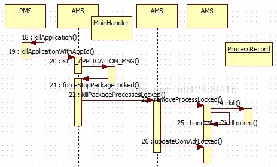

## 1, 概述

​	在系统内存较低时就会杀死一些进程,最明显的在卸载一个apk之前会杀死该apk所在的进程。

​	在PMS的deletePackageLI方法中会调用killApplication方法杀死进程。

因此,本文以killApplication方法为例来论述杀死进程的过程。

## 2, 进程终止

流程图如下,




PMS的killApplication方法如下:

```java
private void killApplication(String pkgName, int appId, String reason) {
	//Request the ActivityManager to kill the process(only for existing packages)
	//so that we do not end up in a confused state while the user is still using the older
	// version of the application while the new one gets installed.
 	IActivityManager am = ActivityManagerNative.getDefault();
 	if (am != null) {
 		try {
 			am.killApplicationWithAppId(pkgName, appId, reason);
 		} catch (RemoteException e) {
 		}
 	}
}
```

直接调用AMS的killApplicationWithAppId方法,三个参数,分别是apk的包名,ID号以及杀死进程的原因。

```java
@Override
public void killApplicationWithAppId(String pkg, int appid, String reason) {
 	if (pkg == null) {
 		return;
 	}
 	// Make sure the uid is valid.
 	if (appid < 0) {
 		Slog.w(TAG, "Invalid appid specified for pkg : " + pkg);
 		return;
 	}
 	int callerUid = Binder.getCallingUid();
 	// Only the system server can kill an application
 	if (UserHandle.getAppId(callerUid) == Process.SYSTEM_UID) {
 		// Post an aysnc message to kill the application
 		Message msg = mHandler.obtainMessage(KILL_APPLICATION_MSG);
 		msg.arg1 = appid;
 		msg.arg2 = 0;
 		Bundle bundle = new Bundle();
 		bundle.putString("pkg", pkg);
 		bundle.putString("reason", reason);
 		msg.obj = bundle;
 		mHandler.sendMessage(msg);
 	} else {
 		throw new SecurityException(callerUid + " cannot kill pkg: " + pkg);
 	}
}
```

发送KILL_APPLICATION_MSG消息,内部类MainHandler对该消息处理如下,

```
case KILL_APPLICATION_MSG: {
 	synchronized (ActivityManagerService.this) {
 	int appid = msg.arg1;
 	boolean restart = (msg.arg2 == 1);
 	Bundle bundle = (Bundle)msg.obj;
 	String pkg = bundle.getString("pkg");
 	String reason = bundle.getString("reason");
 	forceStopPackageLocked(pkg, appid, restart, false, true, false,
 							false, UserHandle.USER_ALL, reason);
 	}
} break;
```


调用forceStopPackageLocked的方法,发送消息实质就是切换一下线程,到主线程中终止进程。killPackageProcessesLocked逻辑简单。

## 3、主要功能如下:

### 1,调用killPackageProcessesLocked方法杀死进程。

```java
boolean didSomething = killPackageProcessesLocked(packageName, appId, userId,
                -100, callerWillRestart, true, doit, evenPersistent,
                packageName == null ? ("stop user " + userId) : ("stop " + packageName));
```

### 2,清理四大组件

  调用ActivityStackSupervisor的finishDisabledPackageActivitiesLocked方法清理apk所涉及的Activity

if (mStackSupervisor.finishDisabledPackageActivitiesLocked(
                packageName, null, doit, evenPersistent, userId)) {
            if (!doit) {
                return true;
            }
            didSomething = true;
        }
调用ActiveServices的bringDownDisabledPackageServicesLocked方法清理apk所涉及的Services

     if (mServices.bringDownDisabledPackageServicesLocked(
                packageName, null, userId, evenPersistent, true, doit)) {
            if (!doit) {
                return true;
            }
            didSomething = true;
        }
调用ProviderMap的collectPackageProvidersLocked方法搜集apk所涉及的Provider,

然后调用removeDyingProviderLocked方法清除

```java
 if (packageName == null) {
            // Remove all sticky broadcasts from this user.
            mStickyBroadcasts.remove(userId);
        }
  ArrayList<ContentProviderRecord> providers = new ArrayList<>();
  if (mProviderMap.collectPackageProvidersLocked(packageName, null, doit, evenPersistent,
                userId, providers)) {
            if (!doit) {
                return true;
            }
            didSomething = true;
        }
        for (i = providers.size() - 1; i >= 0; i--) {
            removeDyingProviderLocked(null, providers.get(i), true);
        }
```

调用removeUriPermissionsForPackageLocked方法清理权限

   removeUriPermissionsForPackageLocked(packageName, userId, false);
调用BroadcastQueue的cleanupDisabledPackageReceiversLocked方法清理apk所涉及的Broadcast

 ```
if (doit) {
            for (i = mBroadcastQueues.length - 1; i >= 0; i--) {
                didSomething |= mBroadcastQueues[i].cleanupDisabledPackageReceiversLocked(
                        packageName, null, userId, doit);
            }
}
 ```

forceStopPackageLocked方法中清理四大组件调用的方法如下,


| Activity  | ActivityStackSupervisor | finishDisabledPackageActivitiesLocked  |
| :-------: | ----------------------- | -------------------------------------- |
| Services  | ActiveServices          | bringDownDisabledPackageServicesLocked |
| Provider  | ProviderMap             | collectPackageProvidersLocked          |
| Broadcast | BroadcastQueue          | cleanupDisabledPackageReceiversLocked  |

首先看killPackageProcessesLocked方法

```java
private final boolean killPackageProcessesLocked(String packageName, int appId,
            int userId, int minOomAdj, boolean callerWillRestart, boolean allowRestart,
            boolean doit, boolean evenPersistent, String reason) {
        ArrayList<ProcessRecord> procs = new ArrayList<>();
   // Remove all processes this package may have touched: all with the
    // same UID (except for the system or root user), and all whose name
    // matches the package name.
    final int NP = mProcessNames.getMap().size();
    for (int ip=0; ip<NP; ip++) {
        SparseArray<ProcessRecord> apps = mProcessNames.getMap().valueAt(ip);
        final int NA = apps.size();
        for (int ia=0; ia<NA; ia++) {
            ProcessRecord app = apps.valueAt(ia);
            if (app.persistent && !evenPersistent) {
                // we don't kill persistent processes
                continue;
            }
            if (app.removed) {
                if (doit) {
                    procs.add(app);
                }
                continue;
            }
            // Skip process if it doesn't meet our oom adj requirement.
            if (app.setAdj < minOomAdj) {
                continue;
            }
            // If no package is specified, we call all processes under the
            // give user id.
            if (packageName == null) {
                if (userId != UserHandle.USER_ALL && app.userId != userId) {
                    continue;
                }
                if (appId >= 0 && UserHandle.getAppId(app.uid) != appId) {
                    continue;
                }
            // Package has been specified, we want to hit all processes
            // that match it.  We need to qualify this by the processes
            // that are running under the specified app and user ID.
            } else {
                final boolean isDep = app.pkgDeps != null
                        && app.pkgDeps.contains(packageName);
                if (!isDep && UserHandle.getAppId(app.uid) != appId) {
                    continue;
                }
                if (userId != UserHandle.USER_ALL && app.userId != userId) {
                    continue;
                }
                if (!app.pkgList.containsKey(packageName) && !isDep) {
                    continue;
                }
            }
 
            // Process has passed all conditions, kill it!
            if (!doit) {
                return true;
            }
            app.removed = true;
            procs.add(app);
        }
    }
 
    int N = procs.size();
    for (int i=0; i<N; i++) {
        removeProcessLocked(procs.get(i), callerWillRestart, allowRestart, reason);
    }
    updateOomAdjLocked();
    return N > 0;
}
```
该方法会遍历当前所有运行中的进程mProcessNames，筛选出被杀的目标进程：(也就是说满足以下任一条件都可以免死)

1.persistent进程：

2.进程setAdj < minOomAdj(默认为-100)：

3.非UserHandle.USER_ALL同时, 且进程的userId不相等：多用户模型下，不同用户下不能相互杀；

4.进程没有依赖该packageName, 且进程的AppId不相等;

5.进程没有依赖该packageName, 且该packageName没有运行在该进程.

 

通俗地来说就是：

•forceStop不杀系统persistent进程；

•当指定用户userId时，不杀其他用户空间的进程；

 

除此之外，以下情况则必然会成为被杀进程：

•进程已标记remove=true的进程，则会被杀；

•进程的pkgDeps中包含该packageName，则会被杀；

•进程的pkgList中包含该packageName，且该进程与包名所指定的AppId相等则会被杀；

 

进程的pkgList是在启动组件或者创建进程的过程向该队列添加的，代表的是该应用下有组件运行在该进程。

筛选出即将杀死的进程之后,首先调用removeProcessLocked杀死进程,然后调用updateOomAdjLocked方法更新其他进程的优先级。

removeProcessLocked方法如下,

```java
private final boolean removeProcessLocked(ProcessRecord app,
 	boolean callerWillRestart, boolean allowRestart, String reason) {
 	final String name = app.processName;
 	final int uid = app.uid;
 	if (DEBUG_PROCESSES) Slog.d(TAG_PROCESSES,
            "Force removing proc " + app.toShortString() + " (" + name + "/" + uid + ")");
 	removeProcessNameLocked(name, uid);
    if (mHeavyWeightProcess == app) {
        mHandler.sendMessage(mHandler.obtainMessage(CANCEL_HEAVY_NOTIFICATION_MSG,
                mHeavyWeightProcess.userId, 0));
        mHeavyWeightProcess = null;
    }
    boolean needRestart = false;
    if (app.pid > 0 && app.pid != MY_PID) {
        int pid = app.pid;
        synchronized (mPidsSelfLocked) {
            mPidsSelfLocked.remove(pid);
            mHandler.removeMessages(PROC_START_TIMEOUT_MSG, app);
        }
        mBatteryStatsService.noteProcessFinish(app.processName, app.info.uid);
        if (app.isolated) {
            mBatteryStatsService.removeIsolatedUid(app.uid, app.info.uid);
        }
        boolean willRestart = false;
        if (app.persistent && !app.isolated) {
            if (!callerWillRestart) {
                willRestart = true;
            } else {
                needRestart = true;
            }
        }
        app.kill(reason, true); //杀掉该进程
        handleAppDiedLocked(app, willRestart, allowRestart); //清理该进程相关的信息
        if (willRestart) {
            removeLruProcessLocked(app); //对于persistent进程,则需要重新启动该进程
            addAppLocked(app.info, false, null /* ABI override */);
        }
    } else {
        mRemovedProcesses.add(app);
    }
 
    return needRestart;
}
```
调用app.kill()来杀进程会同时调用Process.kill和Process.killProcessGroup。

调用handleAppDiedLocked()来清理进程相关的信息。

4.4.2 hisi:

```java
private final boolean removeProcessLocked(ProcessRecord app,
             boolean callerWillRestart, boolean allowRestart, String reason) {
 	final String name = app.processName;
 	final int uid = app.uid;
 	if (DEBUG_PROCESSES) Slog.d(
 		TAG, "Force removing proc " + app.toShortString() + " (" + name
 		 + "/" + uid + ")");

 	mProcessNames.remove(name, uid);
 	mIsolatedProcesses.remove(app.uid);
 	if (mHeavyWeightProcess == app) {
 		mHandler.sendMessage(mHandler.obtainMessage(CANCEL_HEAVY_NOTIFICATION_MSG,
 							mHeavyWeightProcess.userId, 0));
 		mHeavyWeightProcess = null;
 	}
 	boolean needRestart = false;
 	if (app.pid > 0 && app.pid != MY_PID) {
        int pid = app.pid;
        synchronized (mPidsSelfLocked) {
            mPidsSelfLocked.remove(pid);
            mHandler.removeMessages(PROC_START_TIMEOUT_MSG, app);
 		}
        killUnneededProcessLocked(app, reason);
        handleAppDiedLocked(app, true, allowRestart);
        removeLruProcessLocked(app);

        if (app.persistent && !app.isolated) {
            if (!callerWillRestart) {
                addAppLocked(app.info, false);
            } else {
                needRestart = true;
            }
        }
 	} else {
 		mRemovedProcesses.add(app);
 	}
 	return needRestart;
}
```


```java
private void killUnneededProcessLocked(ProcessRecord pr, String reason) {
 	//modify for cmcc and telecom apk white list begin
 	boolean shouldIngore = isInCmccWhiteList(pr.processName) || 					     isInTelecomWhiteList(pr.processName);
 	if (!pr.killedByAm && shouldIngore == false) {
        //modify for cmcc and telecom apk white list end
        Slog.i(TAG, "Killing " + pr.toShortString() + " (adj " + pr.setAdj + "): " + reason);
        EventLog.writeEvent(EventLogTags.AM_KILL, pr.userId, pr.pid,
        pr.processName, pr.setAdj, reason);
        pr.killedByAm = true;
        if (pr.processName.equals("com.android.browser")) {
            Slog.d(TAG, "Sorry, the browser is killed unexpectedly!...");
            android.webkit.WebView.resetCursorMode();
        }
 		Process.killProcessQuiet(pr.pid);
 	}
}
```

Process.killProcessQuiet(pr.pid);的实现也是执行：

```c++
kill(pid, sig);
```


```java
/**
 * Main function for removing an existing process from the activity manager
 * as a result of that process going away.  Clears out all connections
 * to the process.
 */
 private final void handleAppDiedLocked(ProcessRecord app,
 		boolean restarting, boolean allowRestart) {
 	cleanUpApplicationRecordLocked(app, restarting, allowRestart, -1, false 					/*replacingPid*/);
 	if (!restarting) {
 		removeLruProcessLocked(app);
 	}

 	if (mProfileProc == app) {
 		clearProfilerLocked();
 	}

 	// Remove this application's activities from active lists.
 	boolean hasVisibleActivities = mStackSupervisor.handleAppDiedLocked(app);

 	app.activities.clear();

 	if (app.instrumentationClass != null) {
 		Slog.w(TAG, "Crash of app " + app.processName
   		 + " running instrumentation " + app.instrumentationClass);
 		Bundle info = new Bundle();
 		info.putString("shortMsg", "Process crashed.");
 		finishInstrumentationLocked(app, Activity.RESULT_CANCELED, info);
 	}

 	if (!restarting) {
        if (!mStackSupervisor.resumeTopActivitiesLocked()) {
            // If there was nothing to resume, and we are not already
            // restarting this process, but there is a visible activity that
            // is hosted by the process...  then make sure all visible
            // activities are running, taking care of restarting this
            // process.
            if (hasVisibleActivities) {
                mStackSupervisor.ensureActivitiesVisibleLocked(null, 0);
            }
        }
 	}
}
```

```java
final void removeLruProcessLocked(ProcessRecord app) {
 	int lrui = mLruProcesses.lastIndexOf(app);
 	if (lrui >= 0) {
 		if (lrui <= mLruProcessActivityStart) {
 			mLruProcessActivityStart--;
 		}
 	if (lrui <= mLruProcessServiceStart) {
 		mLruProcessServiceStart--;
 	}
 	mLruProcesses.remove(lrui);
 	}
}
```


————————————————
原文链接：https://blog.csdn.net/u012439416/article/details/61645271